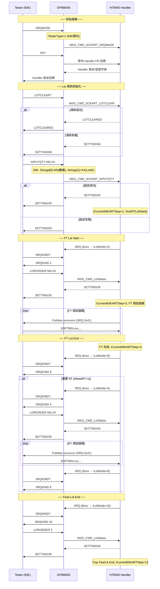

# Advantest 93K ART 通訊協定詳細規格

> 來源：`ART on HT-9xxx - With GPIB log.pptx`（Steven Chou，2017.01.26，Rework 2022.09.06）
> 程式碼版本：`GPIB_Code_32Site_V12.13.900.0_20260331` / `HT9011UC_Code_V3.33.900.0_20260331`

---

## 1. ART 指令完整說明

### 初始連線指令

| 指令 | 方向 | GPIB 端處理 | Handler 回應 | 說明 |
|------|------|------------|-------------|------|
| `FR?` | T→H | 等待 Handler 回應 | Handler 版本字串（VERSION）| 初始時 Tester 查詢 Handler |
| `SRQMASK` | T→H | `iTesterType=1`, 送 MSG_CMD_SCKART_SRQMASK | — | 設定為 93K 模式 |
| `LOTSTATUS?` | T→H | `iTesterType=0`, 送 MSG_CMD_SCKART_LOTSTATUS | 狀態字串 | 查詢 ART 狀態 |

### Lot 資訊初始化

| 指令 | 方向 | GPIB 端處理 | Handler 回應 | 說明 |
|------|------|------------|-------------|------|
| `LOTCLEAR?` | T→H | 送 `MSG_CMD_SCKART_LOTCLEAR` | `LOTCLEARED` 或 `SETTINGNG` | 清除 Lot 資料 |
| `LOTRETESTCLEAR?` | T→H | 送 `MSG_CMD_SCKART_LOTRTCLEAR` | — | 清除 RT Lot 資料 |
| `INPUTQTY NN,XX[,stepcode]` | T→H | 解析後送 `MSG_CMD_SCKART_INPUTQTY` | `SETTINGOK` / `SETTINGNG` | 設定 Lot 數量與 ID |

> **93K 與 Flex 的 INPUTQTY 格式差異**：
> - **93K（iTesterType=1）**：`INPUTQTY NN,XX[,stepcode]` → Strings[0]=NN, Strings[1]=XX
> - **Flex（iTesterType=0）**：`INPUTQTY XX,NN` → Strings[0]=XX, Strings[1]=NN
> - Flex 另回覆 `ECHOQTY` 格式

### 測試流程控制

| 指令 | 方向 | GPIB 端處理 | Handler 回應 | 說明 |
|------|------|------------|-------------|------|
| `SRQKIND?` | T→H | 回傳 `SRQKIND {iLotModeGPIB}\r\n` | — | 查詢當前 SRQ 種類 |
| `LORORDER NN,XX` | T→H | 送 `MSG_CMD_LotStatus`（含 cReturn 字串）| `SETTINGOK` | FT/RT 批次命令 |
| `LORORDER 2` | T→H | 送 `MSG_CMD_LotStatus` | `SETTINGOK` | 告知執行 ART 或 Clean Out |

---

## 2. SRQKIND 代碼定義（iLotModeGPIB）

| 代碼 | 名稱 | 說明 | HT9045 觸發條件 |
|------|------|------|-----------------|
| `2` | FT Lot Start | 第一次 Lot 開始（FT） | `bFirstTestAutoRetestGPIB=true` / `iLotMode=2` |
| `4` | RT Lot Start | RT 批次開始 | `bWaitStartLotAutoRetestGPIB=true` / `iLotMode=4` |
| `8` | Lot End | FT 或 RT 批次結束 | `bEndLotAutoRetestGPIB=true` / `iLotMode=8` |
| `10` | Final Lot End | 最終批次結束（RT 全部完成）| `iLotMode=10` |

---

## 3. iCurrent93KARTStep 狀態機

| Step | LED 名稱 | 說明 |
|------|---------|------|
| 0 | `aledInitART` | 初始化（尚未開始）|
| 1 | `aledFTLotStart` | FT Lot 已接收 |
| 2 | `aledWaitingTestercommand1` | 等待 Tester 指令1（SRQ 後等待 SRQKIND? 或 LORORDER）|
| 3 | `aledFTTesting` | FT 測試進行中 |
| 4 | `aledFTLotEnd` | FT Lot 結束 |
| 5 | `aledWaitingTestercommand2` | 等待 Tester 指令2（第一次 RT，`iFTRTCount==1 && iNeedRT==1`）|
| 6 | `aledRTLotStart` | RT Lot 開始 |
| 7 | `aledWaitingTestercommand3` | 等待 Tester 指令3 |
| 8 | `aledRTTesting` | RT 測試進行中 |
| 9 | `aledRTLotEnd` | RT Lot 結束 |
| 10 | `aledWaitingTestercommand4` | 等待 Tester 指令4（後續 RT 或 Final Lot End）|
| 11 | `aledARTFinish` | ART 完成 |
| 12 | `aledMoveTrayToLoader` | 移動 RT Tray 至 Loader |

---

## 4. ART 完整流程（Mermaid Sequence）

---

## 5. PPTX 各階段流程摘要（Slide 2–8）

| Slide | 主題 | 重點 |
|-------|------|------|
| 2 | General Flow | Handler → Lot Info → FT End → RT（可能多次）→ Final Lot End |
| 3 | Initial Tester Connection | `FR?` 初始握手 |
| 4 | Initial Lot Information | LOTCLEAR? → INPUTQTY → SETTINGOK/SETTINGNG |
| 5 | FT Lot Start | SRQ → SRQKIND 2 → LORORDER NN,XX → SETTINGOK |
| 6 | Lot End | SRQ → SRQKIND 8 → LORORDER 2 → Need RT？ |
| 7 | RT Lot Start | SRQ → SRQKIND 4 → RT 測試 |
| 8 | Final Lot End | SRQ → SRQKIND 10 → LORORDER 2 → SETTINGOK → Tray Feed |

---

## 6. CheckNeedRT 判斷邏輯

| 條件 | iNeedRT | 說明 |
|------|---------|------|
| `iFTRTCount > iSCKART_TryCnt` | 0 | 超過重試次數，不再 RT |
| `iFTRTCount == iSCKART_TryCnt` | 2 | 達到次數上限，執行 Final ART |
| `iFTRTCount < iSCKART_TryCnt && dCurrYield < dSCKART_Yield` | 1 | 次數未到且 Yield 仍低，繼續 RT |
| `dCurrYield >= dSCKART_Yield && iNeedRT != 2` | 2 | Yield 已達標，執行一次 Final ART |
| Low Yield Alarm（K_TRAY_FEED）| 0 | Tray Feed 選項，不用 RT |

- `iFTRTCount == 1 && iNeedRT == 1` → `iCurrent93KARTStep = 5`（第一次 RT）
- `iFTRTCount >  1 && iNeedRT == 1` → `iCurrent93KARTStep = 10`（後續 RT）

---

## 7. 相關 MSG_CMD

| MSG_CMD | 功能 |
|---------|------|
| `MSG_CMD_SCKART_LOTCLEAR` | Handler 清除 Lot 資料，回傳 LOTCLEARED/SETTINGNG |
| `MSG_CMD_SCKART_LOTRTCLEAR` | Handler 清除 RT Lot 資料 |
| `MSG_CMD_SCKART_INPUTQTY` | Handler 設定 LotID 與 Qty（觸發 DoARTLotStart）|
| `MSG_CMD_SCKART_LOTSTATUS` | Handler 回傳 Lot 狀態字串 |
| `MSG_CMD_SCKART_SRQMASK` | 設定 93K 模式 |
| `MSG_CMD_SCKART_QTY` | Handler 回傳目前 Qty |
| `MSG_CMD_SCKART_Alarm` | Handler 回傳 Alarm 清單 |
| `MSG_CMD_SCKART_INITIAL` | Handler 初始化 ART |
| `MSG_CMD_LotStatus` | Handler 處理 LORORDER/LOTORDER 訊息 |

---

## 8. DummyART 模擬器

當 `LastSet.bDummyART==true` 時：
- `SRQKIND?` 回應強制為 `SRQKIND 2\r\n`（模擬 FT 開始）
- `INPUTQTY` 不寫入 GPIB，僅回傳 `ECHOQTY{Str}`
- 相關模擬器：`TfDummyART`（`DummyArt.cpp`），支援 HP93KART / FLEXART 兩種模擬

---

## 9. 相關原始碼位置

| 元件 | 檔案 | 說明 |
|------|------|------|
| ART UI / 主邏輯 | `Automation/SCK_ART.h/.cpp` | `TfSCKART`, `iCurrent93KARTStep`, `DoARTLotStart()`, `CheckNeedRT()` |
| RENESAS FT-CT ART | `Automation/uRENESAS_Server.cpp` | CMD=10/20/30/40/50/70 處理，與 93K ART 共用 `iCurrent93KARTStep` |
| HANA ART | `Automation/HANA_ART.cpp/.h` | Hana 專屬 ART，共用 `fSCKART->iCurrent93KARTStep` |
| GPIB 指令解析 | `Main.cpp (GPIB9045)` | `LOTCLEAR?`, `INPUTQTY`, `SRQKIND?`, `LORORDER`, `FR?` 解析 |
| DummyART 模擬 | `DummyArt.cpp` | 93K ART / FLEX ART 無 Tester 模擬 |
| SRQ 觸發 | `ainarm9045.cpp`, `aoutarm.cpp` | `if(bCanRunSCKART==true)` 條件下觸發 ART SRQ |
| ART 設定 | `Automation/SCK_ART.ini` | ART 啟用、Yield 門檻、RT 次數等設定 |

---

## 10. 常見問題排查

| 問題 | 可能原因 | 確認位置 |
|------|---------|---------|
| INPUTQTY 收到但未啟動 ART | `bCanRunSCKART=false` 或 `chkEnableART` 未勾 | `SCK_ART.cpp::FormShow()` |
| SRQKIND? 永遠回 SRQKIND 2 | `LastSet.bDummyART=true`（DummyART 模式）| `Main.cpp` SRQKIND 處理 |
| LORORDER 沒有 SETTINGOK 回應 | `MSG_CMD_LotStatus` 未送達或 ART Step 不對應 | `Main.cpp` line ~5223 |
| LOTCLEAR 回 SETTINGNG | Handler 機台正在運作中，無法清除 | `SCK_ART.cpp::ClearLotInfo()` |
| RT 不觸發（iNeedRT 永遠=0）| `iSCKART_RTUnitCount=0`（無需重測 IC）| `SCK_ART.cpp::CheckNeedRT()` |
| iCurrent93KARTStep 停在某步驟 | 確認對應 MSG_CMD 是否有正確送達 | `SCK_ART.cpp` step LED 更新 Timer |
| 93K 模式沒有啟用 | `SRQMASK` 未被 Tester 送出，`iTesterType=0` | `Main.cpp` SRQMASK handler |
