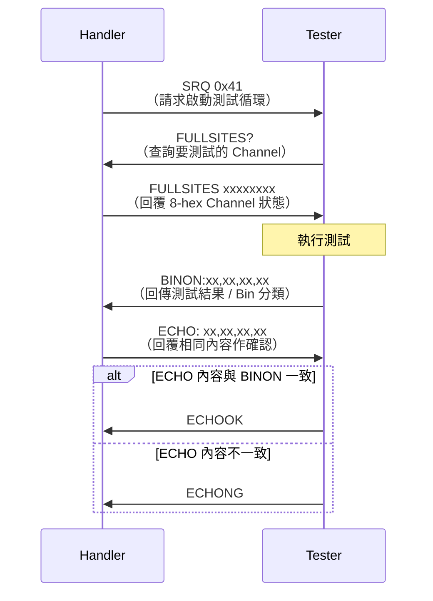
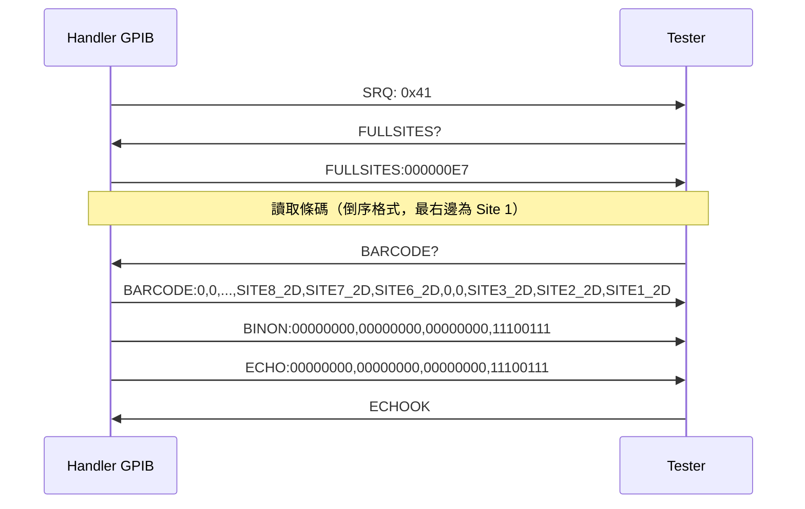
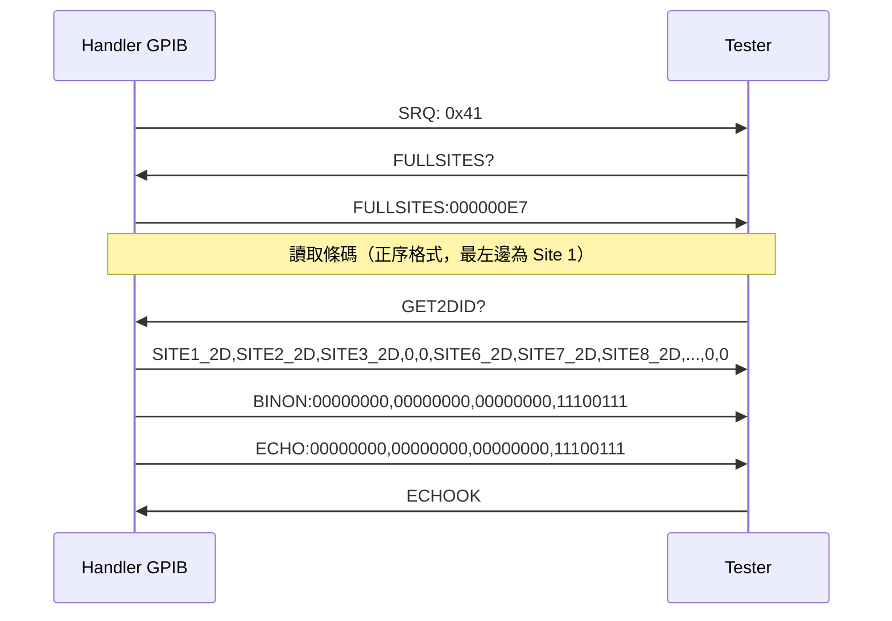
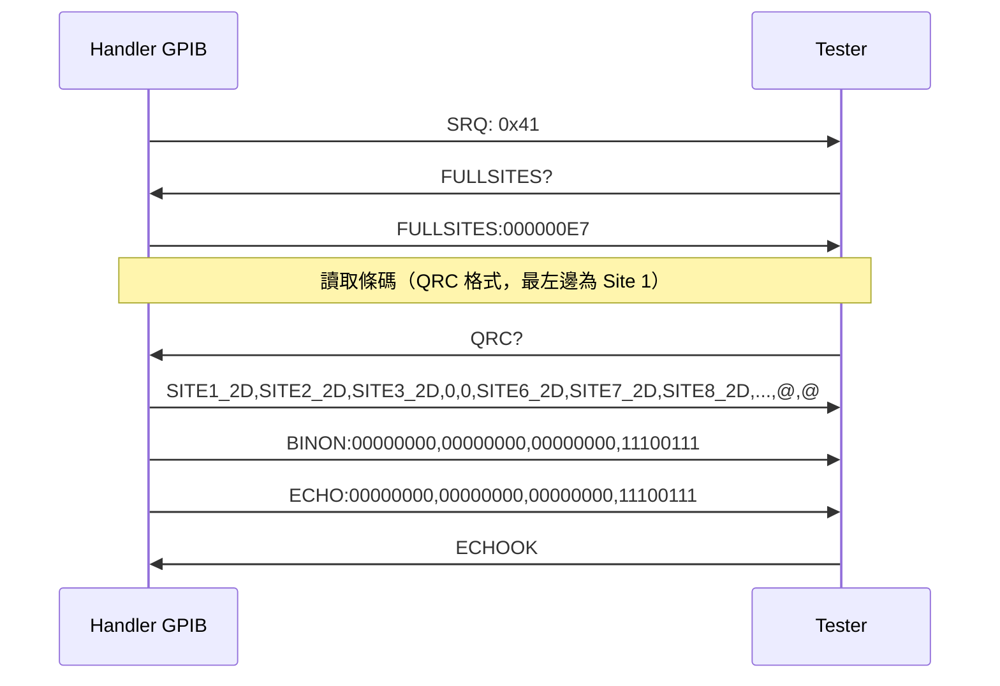

# Standard GPIB Command

> 原始來源：`HT9xxx GPIB_Command_FullVersion_V12.13.884.docx`

---

## 通訊流程



---

## 1. SRQ 0x41

Handler is asking tester to initial a test cycle.

---

## 2. FULLSITES?

Tester requests handler for the channels to be tested.

---

## 3. FULLSITES xxxxxxxx

Handler replies tester the channels to be tested.

`xxxxxxxx` 為 8 位 16 進位數字，每 4 個 Channel 合成一個 Hex digit（Binary bit 表示是否使用）。

**範例**：Handler 有 8 個 Site，回覆 `FULLSITES 000000E7`

```
E = 1110,  7 = 0111
→ E7 = 1110 0111
→ Channel 1,2,3,6,7,8 啟用（共 6 個 device 等待測試）
```

---

## 4. BINON

Tester sends test result to handler.

### 4.1 Site Mapping（FULLSITES → BINON 對應）

BINON 的 Channel 對應由右至左排列（Ch1 在最右邊，Ch32 在最左邊）：

```
BINON:  0  0  0  0  …  1  1  1  0  0  1  1  1
Site:  32 31 30 29  …  8  7  6  5  4  3  2  1
```

**範例**：`BINON:00000000,00000000,00000000,11100111`
→ Channel 1,2,3,6,7,8 有結果

### 4.2 Close Site 規則

關閉（未使用）的 Channel，字元只能是 `0` 或 `A`。

### 4.3 Bin Mapping

依 Bin 模式不同，字元對照表如下：

#### 4.3.1 Advan Type 1（0~15 BIN）

- 支援：HT-9xxx ✓ / HT-7xxx, HT-1xxx ✓
- 每 Channel 佔 **1 byte**，每 8 bytes 加逗號分隔

| BIN       | 0 | 1 | 2 | 3 | 4 | 5 | 6 | 7 | 8 | 9 | 10 | 11 | 12 | 13 | 14 | 15 |
|-----------|---|---|---|---|---|---|---|---|---|---|----|----|----|----|----|-----|
| Character | 0 | 1 | 2 | 3 | 4 | 5 | 6 | 7 | 8 | 9 | A  | B  | C  | D  | E  | F   |

#### 4.3.2 16 BIN（0~16）

- 支援：HT-9xxx ✓ / HT-7xxx, HT-1xxx ✓
- 每 Channel 佔 **1 byte**，每 8 bytes 加逗號分隔

| BIN       | 0 | 1 | 2 | 3 | 4 | 5 | 6 | 7 | 8 | 9 | 10 | 11 | 12 | 13 | 14 | 15 | 16 |
|-----------|---|---|---|---|---|---|---|---|---|---|----|----|----|----|----|----|----|
| Character | 0 | 1 | 2 | 3 | 4 | 5 | 6 | 7 | 8 | 9 | A  | B  | C  | D  | E  | F  | G  |

#### 4.3.3 32 BIN（0~32）

- 支援：HT-9xxx ✓ / HT-7xxx, HT-1xxx ✓
- 每 Channel 佔 **1 byte**，每 8 bytes 加逗號分隔

| BIN       | 0 | 1 | 2 | 3 | 4 | 5 | 6 | 7 | 8 | 9 | 10 | 11 | 12 | 13 | 14 | 15 |
|-----------|---|---|---|---|---|---|---|---|---|---|----|----|----|----|----|-----|
| Character | 0 | 1 | 2 | 3 | 4 | 5 | 6 | 7 | 8 | 9 | A  | B  | C  | D  | E  | F  |

| BIN       | 16 | 17 | 18 | 19 | 20 | 21 | 22 | 23 | 24 | 25 | 26 | 27 | 28 | 29 | 30 | 31 | 32 |
|-----------|----|----|----|----|----|----|----|----|----|----|----|----|----|----|----|----|-----|
| Character | G  | H  | I  | J  | K  | L  | M  | N  | O  | P  | Q  | R  | S  | T  | U  | V  | W  |

#### 4.3.4 254 BIN

- 支援：HT-9xxx ✓ / HT-7xxx, HT-1xxx ✓
- 每 Channel 佔 **3 bytes**，每 24 bytes 加逗號分隔

| BIN       | 0   | 1   | 2   | … | 253 | 254 |
|-----------|-----|-----|-----|---|-----|-----|
| Character | 000 | 001 | 002 | … | 253 | 254 |

> ⚠️ BIN 255 表示 **Error Bin**

> **範例**：`BINON:000000000000000000000000,000000000000000000000000,000000000000000000000000,001001001000000001001001`

#### 4.3.5 GS16 BIN

- 支援：HT-9xxx ✓ / HT-7xxx, HT-1xxx ✓
- 每 Channel 佔 **1 byte**，**每個 Channel 各自用逗號分隔**

| BIN       | 0 | 1 | 2 | 3 | 4 | 5 | 6 | 7 | 8 | 9 | 10 | 11 | 12 | 13 | 14 | 15 | 16 | Reject |
|-----------|---|---|---|---|---|---|---|---|---|---|----|----|----|----|----|----|----|--------|
| Character | 0 | 1 | 2 | 3 | 4 | 5 | 6 | 7 | 8 | 9 | B  | C  | D  | E  | F  | G  | H  | A      |

> **範例**：`BINON:0,0,0,0,0,0,0,0,0,0,0,0,0,0,0,0,0,0,0,0,0,0,0,0,1,1,1,0,0,1,1,1`

#### 4.3.6 GS32 BIN

- 支援：HT-9xxx ✓ / HT-7xxx, HT-1xxx ✓
- 每 Channel 佔 **1 或 2 bytes**，**每個 Channel 各自用逗號分隔**

| BIN       | 0 | 1 | 2 | 3 | 4 | 5 | 6 | 7 | 8 | 9 | 10 | 11 | 12 | 13 | 14 | 15 | 16 |
|-----------|---|---|---|---|---|---|---|---|---|---|----|----|----|----|----|----|----|
| Character | 0 | 1 | 2 | 3 | 4 | 5 | 6 | 7 | 8 | 9 | B  | C  | D  | E  | F  | 10 | 11 |

| BIN       | 17 | 18 | 19 | 20 | 21 | 22 | 23 | 24 | 25 | 26 | 27 | 28 | 29 | 30 | 31 | 32 | Reject |
|-----------|----|----|----|----|----|----|----|----|----|----|----|----|----|----|----|----|--------|
| Character | 12 | 13 | 14 | 15 | 16 | 17 | 18 | 19 | 1A | 1B | 1C | 1D | 1E | 1F | 20 | 21 | A      |

#### 4.3.7 Advan T6577 BIN（after V3.28.588）

- 支援：HT-9xxx ✓ / HT-7xxx, HT-1xxx ✓
- 每 Channel 佔 **1 byte**，每 8 bytes 加逗號分隔

| BIN       | 0 | 1 | 2 | 3 | 4 | 5 | 6 | 7 | 8 | 9 | 10 | 11 | 12 | 13 | 14 | 15 | Reject |
|-----------|---|---|---|---|---|---|---|---|---|---|----|----|----|----|----|----|----|
| Character | 0 | 1 | 2 | 3 | 4 | 5 | 6 | 7 | 8 | 9 | B  | C  | D  | E  | F  | G  | A      |

---

## 5. ECHO

Handler 收到 BINON 後，需回傳相同內容給 Tester。

**格式**：`ECHO: <BINON 內容>`

**範例**：
```
Tester 送出：BINON:00000000,00000000,00000000,11100111
Handler 回覆：ECHO: 00000000,00000000,00000000,11100111
```

---

## 6. ECHOOK / ECHONG

Tester 比對 BINON 與 ECHO 的資料：

| 比對結果 | Tester 回覆 |
|---------|------------|
| 資料相同 | `ECHOOK` |
| 資料不同 | `ECHONG` |

---

## GPIB Command with 2DID

共有 4 個指令可讓 Tester 取得每個 Device 的 2D ID。

### 1. BARCODE?

- 支援：HT-9xxx ✓ / HT-7xxx, HT-1xxx ✓
- 回傳 32 筆條碼資料，以逗號分隔，關閉 Site 資料為 `0`
- **排列順序：最右邊為 Site 1（倒序）**

**通訊流程**：



---

### 2. GET2DID?

- 支援：HT-9xxx ✓ / HT-7xxx, HT-1xxx ✓
- 回傳 32 筆條碼資料，以逗號分隔，關閉 Site 資料為 `0`
- **排列順序：最左邊為 Site 1（正序）**

**通訊流程**：



---

### 3. QRC?

- 支援：HT-9xxx ✓ / HT-7xxx, HT-1xxx ✓
- 回傳 32 筆條碼資料，以逗號分隔
- **排列順序：最左邊為 Site 1（正序）**
- Site 無值時以特殊符號代替：

| 情況 | 符號 |
|------|------|
| Part not present | `@` |
| Value not read   | `$` |
| Read failure     | `#` |

**通訊流程**：



---

### 4. GETBARCODENUMBER

- 支援：HT-9xxx ✓ / HT-7xxx, HT-1xxx ✓
- 回傳格式：`<DataLength><Site1_2D,Site2_2D,...,SiteN_2D><Checksum>`

| 欄位 | 說明 |
|------|------|
| DataLength | `Site1_2D,Site2_2D,...,SiteN_2D` 的字串長度（3 位數補零）|
| Checksum | 所有 Site 2D 資料的 checksum（1 byte, char）|

**範例**（Site1=`D12345678`，Site2=`D23456789`，Site3/4 未使用）：

```
Tester → Handler：016GETBARCODENUMBER
Handler → Tester：025D12345678,D23456789,NA,NA<checksum>
```

- DataLength = 025（`D12345678,D23456789,NA,NA` 共 25 字元）
- NA 表示該 Site 無資料
