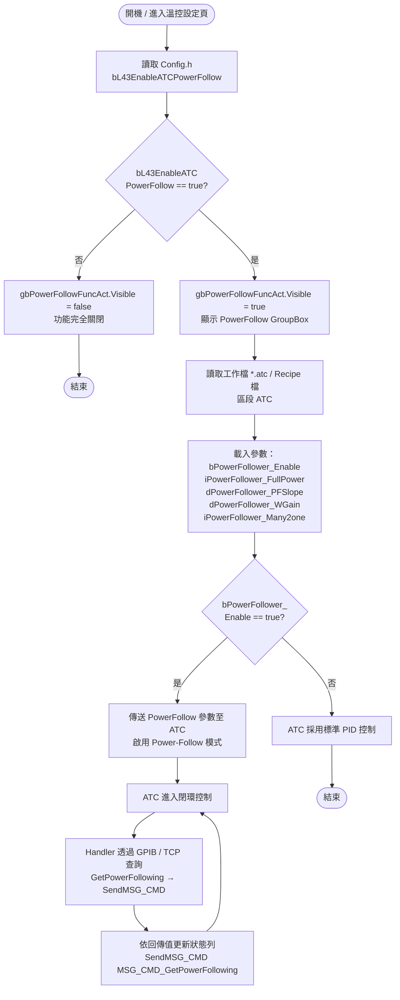
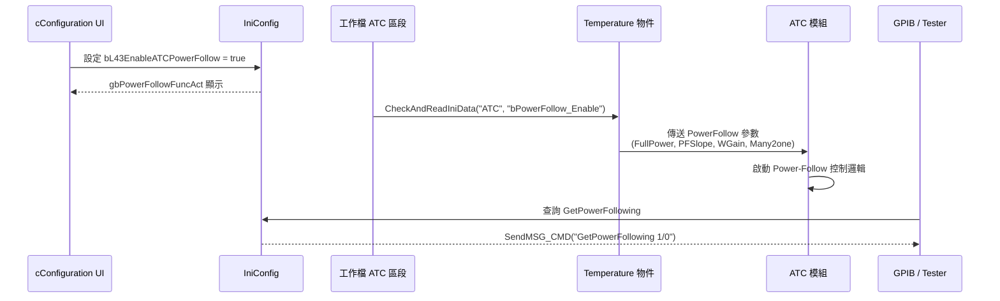

> 保存來源：`.claude/skills/ht9045-config/references/flowcharts/L/L43-power-follow.md`，main `f57d93f15`。原文機型、版本與日期維持原標註；原程式碼行號僅為歷史定位，新查證依function／關鍵變數；目前共同項與差異先看 [共用對照](../../../../common.md)。

<!-- preserved-content:start -->
# [L43] ATC Power Follow 流程圖

> **群組**：[L] Temperature  
> **區段**：L43  
> **Caption**：Enable ATC Power Follow  
> **IniConfig 主開關**：`bL43EnableATCPowerFollow`  
> **作者來源**：Hmy 20240207、KenHsieh 20240216  
> **相關客戶代碼**：通用功能（無 CC_ 限制）

---

## 1. 功能概述

`L43 ATC Power Follow` 是 **Handler ↔ ATC 的功率跟隨控制功能**：
當啟用時，Handler 會將 PowerFollow 參數（Slope / FullPower / WGain / Many2one）
傳送給 ATC 模組，由 ATC 依據功率回授動態調整溫度控制。

---

## 2. 涉及的 IniConfig 變數

| 變數 | 型別 | 來源檔 | 說明 |
|------|------|--------|------|
| `bL43EnableATCPowerFollow` | bool | Config.h / IniConfig | L43 主開關（控制 UI 顯示與功能啟用） |
| `Temperature.bPowerFollower_Enable` | bool | uTemp_Set.cpp | 工作檔 `[ATC]` 區塊讀取的執行開關 |
| `Temperature.iPowerFollower_FullPower` | int | uTemp_Set.cpp | Full Power 上限值（預設 1000） |
| `Temperature.dPowerFollower_PFSlope` | double | uTemp_Set.cpp | PF Slope 斜率（預設 0.0） |
| `Temperature.dPowerFollower_WGain` | double | uTemp_Set.cpp | W Gain 權重 |
| `Temperature.iPowerFollower_Many2one` | int | uTemp_Set.cpp | Many to One 整合計數 |

---

## 3. 涉及的 UI 元件（uTemp_Set.dfm）

| 元件 | 型別 | 用途 |
|------|------|------|
| `gbPowerFollowFuncAct` | TGroupBox | 整體功能容器，由 `bL43EnableATCPowerFollow` 控制顯示 |
| `cbPowerFollow_Enable` | TCheckBox | 工作檔層級啟用開關 |
| `edtPowerFollower_PFSlope` | TEdit | PF Slope 數值輸入 |
| `edtPowerFollow_FullPower` | TEdit | Full Power 數值輸入 |
| `edtPowerFollower_WGain` | TEdit | W Gain 數值輸入 |
| `edtPowerFollower_Many2one` | TEdit | Many2one 整合計數輸入 |

---

## 4. 控制流程

---

## 5. Handler ↔ ATC 互動序列

---

## 6. 啟用條件總結

| 層級 | 條件 | 控制目的 |
|------|------|----------|
| **L1 機台層** | `bL43EnableATCPowerFollow == true` | 機台是否「擁有」此功能（UI 顯示與否） |
| **L2 工作檔層** | `bPowerFollower_Enable == true` | 該批次是否「啟用」此功能 |
| **L3 ATC 層** | 已收到參數 | ATC 才會切換至 Power-Follow 控制模式 |

> **L1 / L2 / L3 三層必須同時滿足**，PowerFollow 才會實際運作。

---

## 7. 相關函式

| 函式 | 檔案 | 行 | 用途 |
|------|------|----|------|
| `TfMain::GetPowerFollowing()` | Command.cpp | ~14629 | 對外回報 PowerFollow 狀態 |
| `(讀取工作檔)` | uTemp_Set.cpp | ~2863-2865 | `CheckAndReadIniData` 讀入 ATC 區段參數 |
| `gbPowerFollowFuncAct->Visible = ...` | uTemp_Set.cpp | ~1313 | UI 顯示控制 |

---

## 8. 除錯建議

1. **UI 不顯示 PowerFollow 區塊** → 檢查 `IniConfig.bL43EnableATCPowerFollow`（[L43] 區段）
2. **參數無效** → 檢查工作檔 `[ATC]` 區段是否有 `bPowerFollow_Enable=1`
3. **ATC 無回應** → 用 `GetPowerFollowing` GPIB 指令確認傳送是否完成
4. **斜率不對** → 確認 `dPowerFollower_PFSlope` > 0.0（預設 0.0 等於關閉）

---

## 9. 相關文件連結

- 主表：[`config-fields-L.md`](../../../../../../ht9045-config/references/config-fields-L.md) → 查 L43 列
- 程式註解：`uTemp_Set.cpp` line 1313, 2863-2865
- ATC 通訊協定：`d:\HT9045\.github\skills\ht9045-atc\SKILL.md`

<!-- preserved-content:end -->
