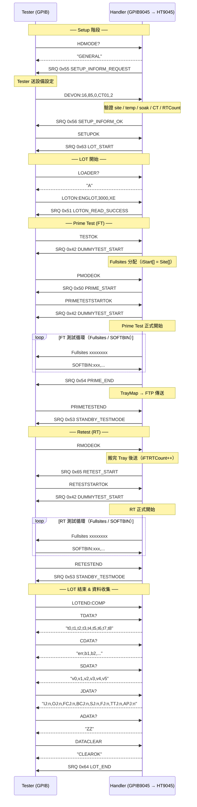

# SKILL: gpib-hana

## 描述

Hana Micron 客製 GPIB 通訊協定（ART：Auto Retest）完整知識庫，
基於 HT9045 `HANA_ART.cpp/.h` 與 GPIB9045 `Main.cpp/Main.h` 原始碼分析，
以及官方規格文件 `Auto_retest_Scenario_HANDLERMAKER_Released_eng_20241218.pdf`。

當使用者詢問 Hana Micron GPIB 指令、ART 流程、SRQ 代碼定義、
DEVON 設定驗證、LOTON 批次起始、TDATA/CDATA/SDATA/JDATA/ADATA 資料格式、
FT/RT（Prime/Retest）切換流程、SMILL 模式、bRunHANA_ART 設定等問題時，
應載入此 SKILL。

關鍵字：Hana, HanaMicron, HANA_ART, ART, Auto Retest, DEVON, LOTON, LOTRT,
TDATA, CDATA, SDATA, JDATA, ADATA, DATACLEAR, SRQ0x55, SRQ0x56, SRQ0x57,
LOT_START, LOT_END, PRIME_START, PRIME_END, RETEST_START, RETEST_END,
DUMMYTEST_START, STANDBY_TESTMODE, bRunHANA_ART, bTryHANA_ART,
MSG_CMD_HANA_ART, MSG_CMD_RUN_HANA_ART, CC_HANA_MICRON, InitHANA_ART,
HANA_ART_SMILL, FT, RT, GENERAL, SMILL, LOADER, HDMODE, STEPOK,
PMODEOK, PRIMETESTSTARTOK, PRIMETESTEND, RMODEOK, RETESTSTARTOK, RETESTEND,
LOTEND:COMP, CLEAROK, ID?, MAP?, CT?, TEMPSET?, SOAK?

## 原始文件

| 檔案 | 說明 |
|------|------|
| `d:\GPIB9045\.github\skills\gpib-hana\Auto_retest_Scenario_HANDLERMAKER_Released_eng_20241218.pdf`（二進位規格，不在 git：`D:\GPIB9045` 不是 git repo，只在 GPIB9045 工作區） | **主要規格書**：Hana Micron ART Handler 通訊規格（2024/12/18 Release） |
| `d:\HT9045\HT9011UC_Code_V3.33.900.0_20260331_bk_SW20260331\Automation\HANA_ART.h` | Handler 端 ART 類別定義（uHANA_ART, SRQCode enum, TimeData struct） |
| `d:\HT9045\HT9011UC_Code_V3.33.900.0_20260331_bk_SW20260331\Automation\HANA_ART.cpp` | Handler 端完整指令處理邏輯（DoCmdWhenHDStart, DEVON 驗證, FT/RT 切換） |
| `d:\GPIB9045\GPIB_Code_32Site_V12.13.900.0_20260331\Main.h` | GPIB 端 HANA_ART_SMILL struct、SRQCode enum 定義 |
| `d:\GPIB9045\GPIB_Code_32Site_V12.13.900.0_20260331\Main.cpp` | GPIB 端 MSG_CMD_HANA_ART 處理、InitHANA_ART、DoSendCommand、InitializeSRQCodeMap |

---

## 通訊架構

```
Hana Tester (GPIB)
        │ GPIB 字串命令 / ibrsv SRQ
        ▼
GPIB9045 (H9046_32GPIB.exe)
        │ WM_COPYDATA (MSG_CMD_HANA_ART / MSG_CMD_RUN_HANA_ART)
        ▼
HT9045 (HandlerSys.exe)
```

- **Tester → Handler**：Tester 透過 GPIB 寫入字串，GPIB9045 解析後以 `MSG_CMD_HANA_ART` 轉發
- **Handler → Tester（SRQ）**：HT9045 傳 `iLotStatus=1`，GPIB9045 呼叫 `ibrsv(iCmd)` 發送 SRQ
- **Handler → Tester（字串）**：HT9045 傳 `iLotStatus=2`，GPIB9045 呼叫 `MyGPIBWrite(sCmd)` 送出文字

## 相關 MSG_CMD

| MSG_CMD | 功能 |
|---------|------|
| `MSG_CMD_RUN_HANA_ART` | 開啟/關閉 HANA ART 模式（iLotStatus=1:啟用, 0:停用）|
| `MSG_CMD_HANA_ART` | iLotStatus=1: 送 SRQ（iStatus[0]=SRQ碼）/ iLotStatus=2: 送字串 |

## General.ini 設定

```ini
[ART]
bRunHANA_ART=1    ; 啟用 HANA ART 模式（true/false）
bTryHANA_ART=1    ; HANA ART 試運行旗標
```

## 客戶代碼

```cpp
#define CC_HANA_MICRON    865    // cmydef.h & MachineType.h
```
## 詳細參照

> **完整 SRQ 代碼對照表、Tester→Handler 指令說明（DEVON/LOTON/TESTOK/RMODEOK 等）、
> TDATA/CDATA/SDATA/JDATA/ADATA 資料格式、GENERAL/SMILL 流程圖（Mermaid）、
> FT/RT 切換邏輯、原始碼位置、常見問題排查**：
> [references/hana-art-protocol.md](references/hana-art-protocol.md)
---

## SRQ 代碼完整對照表

Handler 向 Tester 發送 SRQ，透過 `ibrsv(iCode)` 傳送：

| 代碼名稱 | Hex | Dec | 說明 |
|---------|-----|-----|------|
| `CLEAR_START_SRQ` | 0x00 | 0 | 清除 |
| `NORMAL_START_SRQ` | 0x41 | 65 | 一般測試開始（Dummy Test 結束時送）|
| `DUMMYTEST_START_SRQ` | 0x42 | 66 | Prime / Retest Dummy Test 開始（觸發 Fullsites 回填）|
| `EQP_MODEL_SRQ` | 0x43 | 67 | 設備型號通知 |
| `PRIME_START_SRQ` | 0x50 | 80 | Prime Test 開始 |
| `LOTON_READ_SUCCESS_SRQ` | 0x51 | 81 | LOTON 讀取成功 |
| `LOTON_READ_FAIL_SRQ` | 0x52 | 82 | LOTON 讀取失敗 |
| `STANDBY_TESTMODE_SRQ` | 0x53 | 83 | 等待 Test Mode（FT/RT 轉換等待點）|
| `PRIME_END_SRQ` | 0x54 | 84 | Prime Test 結束 |
| `SETUP_INFORM_REQUEST_SRQ` | 0x55 | 85 | 請求 Setup 資訊（觸發 Tester 送 DEVON）|
| `SETUP_INFORM_RECEIVE_OK_SRQ` | 0x56 | 86 | DEVON 設置驗證成功 |
| `SETUP_INFORM_RECEIVE_FAIL_SRQ` | 0x57 | 87 | DEVON 設置驗證失敗 |
| `LOT_INFORM_SRQ` | 0x58 | 88 | LOT 資訊通知 |
| `HD_MODE_SRQ` | 0x59 | 89 | Handler 模式通知 |
| `INLINEUPDATE_SRQ` | 0x60 | 96 | 在線更新通知 |
| `LOADER_REQ_SRQ` | 0x61 | 97 | Loader 請求 |
| `INIT_START_SRQ` | 0x62 | 98 | 初始化開始 |
| `LOT_START_SRQ` | 0x63 | 99 | LOT 開始（回應 SETUPOK）|
| `LOT_END_SRQ` | 0x64 | 100 | LOT 結束 |
| `RETEST_START_SRQ` | 0x65 | 101 | Retest 開始（FT→RT 切換後送）|
| `RETEST_END_SRQ` | 0x66 | 102 | Retest 結束 |
| `ERROR_START_SRQ` | 0x67 | 103 | 錯誤開始 |
| `ERROR_END_SRQ` | 0x68 | 104 | 錯誤結束 |
| `ERROR_CLEAR_SRQ` | 0x69 | 105 | 錯誤清除 |
| `FQATEST_START_SRQ` | 0x71 | 113 | FQA Test 開始 |
| `FQATEST_END_SRQ` | 0x72 | 114 | FQA Test 結束 |
| `WPSOCKET_REQ_SRQ` | 0x73 | 115 | WP Socket 請求 |
| `FBIN_MANUAL_REQ_SRQ` | 0x74 | 116 | FBin 手動請求 |
| `REAL_PARA_SEQ_SRQ` | 0x75 | 117 | 實際參數序列 |
| `LOT_INFO_METHOD_SRQ` | 0x76 | 118 | LOT 資訊方法 |
| `RF_ID_SRQ` | 0x77 | 119 | RFID 通知 |
| `SBL_SRQ` | 0x78 | 120 | SBL 通知 |
| `AUTODUMPING_SRQ` | 0x79 | 121 | 自動傾倒通知 |

> **注意**：`DUMMYTEST_START (0x42)` 在 GPIB 端同時處理 Fullsites 分配（`iStart[i]=Site[i]`），会觸發 GPIB 正常測試循環。

---

## Tester → Handler 指令完整說明

以下指令由 Tester 透過 GPIB 寫入，GPIB9045 接收後以 `MSG_CMD_HANA_ART` 轉發至 HT9045 `DoCmdWhenHDStart()` 處理：

### 連線確認

| 指令 | Handler 回應 | 說明 |
|------|-------------|------|
| `HDMODE?` | `GENERAL` 或 `SMILL` | 查詢 Handler 運行模式 |
| `STEPOK?` | `STEPREADY` | 步進確認 |
| `CONTACTOR?` | Arm 狀態字串（`ArmStatusStrings()`）| 查詢 Contactor 狀態 |
| `HDMODEOK` | （無）設定 bHD_MODE_STATUS=true | Tester 確認 HD 模式 OK |
| `HDMODENG` | （無）設定 bHD_MODE_STATUS=false | Tester 通知 HD 模式 NG |

### Setup 資訊

#### `DEVON:site,temp,soak,CT[bin][,rt_count]`

設置驗證指令，Handler 逐項比對，全部通過才送 0x56，任一不符送 0x57。

| 欄位 | 說明 | 範例 |
|------|------|------|
| site | Site 數量（必須與 Handler Socket 配置一致）| `16` |
| temp | 測試溫度 °C（Hot=WorkTemperBase, AmbientHot=WorkTemperBase, Room=25）| `85` |
| soak | Soak 時間（室溫模式必須為 0）| `0` |
| CT[bin] | Pass Bin 配置（由 `GetHD_CT()` 計算格式 `CT0x` 或 `CTxy`）| `CT01` |
| rt_count | （可選）RT Retry 次數，更新 `TestIF_File.iSCKART_TryCnt` | `2` |

範例：`DEVON:16,85,0,CT01,2`

| 指令 | 說明 |
|------|------|
| `SETUPOK` | Setup 完成確認，Handler 送 LOT_START SRQ (0x63) |
| `SETUPSTOP` | Setup 停止（Handler 無動作）|

### LOT 管理

| 指令 | Handler 回應 / 動作 | 說明 |
|------|-----|------|
| `LOADER?` | 字串 `A` | 詢問 Loader 狀態 |
| `LOTON:lotid,size,mode` | SRQ 0x51（成功）或 0x52（失敗）| LOT 開始，解析 Lot ID/數量/Mode |
| `LOTEND:NOLOT` | （無）清除 dummy test 旗標 | 無 LOT 結束 |
| `LOTEND:HDFAIL` | （無）| Handler 故障 LOT 結束 |
| `LOTEND:COMP` | （無）iNeedToRT=2，ART Step=12，更新檔案清單 | LOT 正常結束 |
| `LOTRT:lotid,size,mode` | 字串 `LOTRTOK` | RT LOT 資訊，更新 Process Code |

`LOTON` 格式：`LOTON:ENGLOT,3000,XE`（lot_id,size,mode）

### 測試流程控制

| 指令 | Handler 動作 / 回應 | 說明 |
|------|-----|------|
| `TESTOK` | GENERAL模式：StartPrimeTest()（送SRQ 0x42）/ SMILL模式：送STANDBY_TESTMODE SRQ (0x53) | Tester 準備就緒 |
| `TESTSTOP` | （無動作）| 測試停止 |
| `PMODEOK` | 送 PRIME_START SRQ (0x50)，FT RT 計數歸零 | Prime Mode 準備 OK |
| `PRIMETESTSTARTOK` | StartPrimeTest()，送 DUMMYTEST_START SRQ (0x42) | Prime Test 確認開始 |
| `PRIMETESTEND` | 送 STANDBY_TESTMODE SRQ (0x53)，模式→FT_LotEnd，iNeedToRT=0 | Prime Test 結束 |
| `RMODEOK` | 觸發 RT（`DoRT_START()`送0x65）或設 iNeedToRT=1 | Retest Mode 準備 OK |
| `RETESTSTARTOK` | StartReTest()，送 DUMMYTEST_START SRQ (0x42) | Retest 確認開始 |
| `RETESTSTARTSTOP` | （無動作）| Retest 停止 |
| `RETESTEND` | 送 STANDBY_TESTMODE SRQ (0x53) | Retest 結束 |

### 資料查詢

| 指令 | Handler 回應 | 說明 |
|------|-------------|------|
| `ID?` | `Model,Model_NO,Site`（e.g. `HT9046,HT9046-01,HANA`）| Handler 識別資訊 |
| `MAP?` | Tray Map 字串（SamSung 格式）| Tray 配置圖 |
| `CT?` | Pass Bin 配置（e.g. `CT01`、`CT12`）| 通過 Bin 設定 |
| `TEMPSET?` | 溫度字串（e.g. `85`、`25`）| 溫度設定值 |
| `SOAK?` | Soak 時間字串（SamSung格式）| Soak 時間設定 |
| `TDATA?` | 時間資料 CSV（9個值，詳見TDATA格式）| Handler Time Data |
| `CDATA?` | Bin 計數 CSV（詳見CDATA格式）| HW Bin Count |
| `SDATA?` | Socket 參數 CSV（6個值，詳見SDATA格式）| Contact Tool 參數 |
| `JDATA?` | JAM 計數字串（詳見JDATA格式）| JAM Count by Position |
| `ADATA?` | JAM 代碼字串（預設 `ZZ` = 無JAM）| Generated JAM Code |
| `DATACLEAR` | 字串 `CLEAROK`，並清除 timeData | 清除統計資料 |

---

## 資料格式詳述

### TDATA（Handler Time Data）—— 9 個時間值，以逗號分隔

格式：`t0,t1,t2,t3,t4,t5,t6,t7,t8`

| 索引 | 名稱 | 說明 |
|------|------|------|
| 0 | TD_LOT_START_TO_END | LOT 開始到結束的總時間 |
| 1 | TD_TEST_MODE_TO_END | Test Mode 開始到 MODE END 的時間 |
| 2 | TD_HANDLER_STOP_DURATION | LOT 期間 Handler 停機時間 |
| 3 | TD_RESET_AFTER_JAM_1 | JAM 後按 RESET 的等待時間（即時停止等待時間1）|
| 4 | TD_RESET_AFTER_JAM_2 | 非TD4 JAM 後按 RESET 的等待時間（即時停止等待時間2）|
| 5 | TD_JAM_TO_RESTART | JAM 到重啟的時間（維護或動作時間）|
| 6 | TD_HANDLER_INDEX_TIME | Handler 總 INDEX 時間 |
| 7 | TD_TOTAL_TEST_TIME | 總測試時間 |
| 8 | TD_FIRST_SOT_DURATION | LOT 開始後第一個 SOT 持續時間 |

### CDATA（HW Bin Count）—— Bin 計數，以逗號分隔

格式：`err_count,bin1_count,bin2_count,...`

- 索引 0：ERR_BIN_COUNT（= iBinData32[0][0] + iBinData32[0][iTestBinCount]，含重試失敗數）
- 索引 N（N≥1）：HBIN(N) COUNT（= iBinData32[0][N]）

### SDATA（Contact Tool Socket 參數）—— 6 個浮點值，以逗號分隔

格式：`v0,v1,v2,v3,v4,v5`（fixed-point, 2 decimal places）

| 索引 | 名稱 | 說明 |
|------|------|------|
| 0 | P_FRONT_CONTACTOR_Z | Front Contactor Z 軸位置 |
| 1 | P_BACK_CONTACTOR_Z | Back Contactor Z 軸位置 |
| 2 | P_HANDLER_MODE | Handler 模式 |
| 3 | P_CONTACT_FORCE | Contact 壓力 |
| 4 | P_FORCE_PER_DEVICE | 每個 Device 的壓力 |
| 5 | P_FORCE_PER_PIN | 每個 Pin 的輸入壓力 |

### JDATA（JAM Count by Position）—— 8 個 JAM 計數

格式：`IJ:n,OJ:n,FCJ:n,BCJ:n,SJ:n,FJ:n,TTJ:n,APJ:n`

| 縮寫 | 名稱 | 說明 |
|------|------|------|
| IJ | J_INPUT_PICKER_JAM | Input Picker JAM 次數 |
| OJ | J_OUTPUT_PICKER_JAM | Output Picker JAM 次數 |
| FCJ | J_FRONT_CONTACTOR_JAM | Front Contactor JAM 次數 |
| BCJ | J_REAR_CONTACTOR_JAM | Back/Rear Contactor JAM 次數 |
| SJ | J_INPUT_SHUTTLE_JAM_FRONT | Input Shuttle JAM 次數（Front）|
| FJ | J_OUT_SHUTTLE_JAM_FRONT | Out Shuttle JAM 次數（Front）|
| TTJ | J_TRAY_TRANSFER_JAM | Tray Transfer JAM 次數 |
| APJ | — | Auto Pattern JAM（佔位元）|

> 實際 `HANA_ART.h` 定義的 JDATA enum 包含 14 個項目（索引 0~13），但 `GetHD_JDATA()` 僅輸出前 8 項（JDATAMaxCount=8）。

### ADATA（JAM 代碼字串）

- 固定回傳 `"ZZ"` 表示無 JAM
- 若發生 JAM 則回傳對應 JAM 代碼字串

---

## ART 完整流程（GENERAL 模式）



## ART 流程（SMILL 模式差異）

SMILL 模式與 GENERAL 模式的差異：

| 步驟 | GENERAL | SMILL |
|------|---------|-------|
| `TESTOK` 後 | → StartPrimeTest()，送 SRQ 0x42 | → 送 STANDBY_TESTMODE SRQ (0x53) |
| FT 計數控制 | 由 `iFTRTCount` 控制 RT 切換 | 等待 Tester 直接控制 |

---

## GPIB 端 DUMMYTEST SRQ 特殊處理

當 GPIB9045 收到 `MSG_CMD_HANA_ART` 且 SRQ 碼 = `DUMMYTEST_START (0x42)` 時：

1. 從 `GHandler2Gpib->Site[]` 讀取各 Site ON/OFF 狀態
2. 設定 `iStart[i]` 和 `MY_DUT_PAL[i]->cbSiteOn->Checked`
3. 設定 `IsTest=true`，`bSimulate=false`，`bNeedInital=false`，`bHanaDummyTest=true`
4. 進入正常 GPIB 測試循環（Fullsites 格式送出）

Dummy Test 完成後（`SendCaptureFinish`），若 `bHanaDummyTest==true`，
則回傳 `MSG_CMD_HANA_ART("DUMMY_TEST_0x42_OK")` 給 HT9045，而非走一般 BIN 分類流程。

---

## Handler 模式（HD_MODE）

| 代碼 | 名稱 | 說明 |
|------|------|------|
| 0 | `GENERAL` | 標準 FT→RT 循環，由 Handler 自動控制 RT 切換 |
| 1 | `SMILL` | 特殊模式，TESTOK 後立即進入 STANDBY_TESTMODE，由 Tester 控制測試流程 |

---

## FT/RT 切換邏輯（RMODEOK 處理）

當 Tester 送出 `RMODEOK`：

- **條件 A**（`rsmContinuStart_ART` + 目前為 FT 模式）：
  - `iFTRTCount++`，寫入 ART 檔
  - 執行 `DoRT_START()`（送 SRQ 0x65）
  - 若 `iFTRTCount < iSCKART_TryCnt`：維持 `rsmContinuStart_ART`
  - 若 `iFTRTCount >= iSCKART_TryCnt`：切換至 `rsmContinuRetest_ART`
- **條件 B**（其他情況）：
  - 設 `iNeedToRT=1`，等待 Handler 流程觸發 RT

---

## 相關原始碼位置

| 元件 | 檔案 | 函式/定義 |
|------|------|----------|
| ART 類別定義 | `Automation/HANA_ART.h` | `uHANA_ART`, `SRQCode enum`, `TimeData struct` |
| ART 指令處理 | `Automation/HANA_ART.cpp` | `DoCmdWhenHDStart()`, `DoSetUpInfo()`, `GetHD_TDATA()` 等 |
| GPIB 端 SRQ 定義 | `Main.h` | `HANA_ART_SMILL struct`, `SRQCode enum` |
| GPIB 端 ART 處理 | `Main.cpp` | `MSG_CMD_HANA_ART` handler, `InitHANA_ART()`, `InitializeSRQCodeMap()` |
| SRQ 對應 Map | `Main.cpp` | `TSerialPoll::InitializeSRQCodeMap()` line ~8127 |
| GPIB 設定旗標 | `cmydef.h` | `bRunHANA_ART`, `bTryHANA_ART` (struct LastSet_) |
| 客戶代碼 | `cmydef.h`, `MachineType.h` | `#define CC_HANA_MICRON 865` |
| ART 設定讀取 | `Main.cpp` | `CheckAndReadIniData(asGeneralPath,"ART","bRunHANA_ART")` line ~4376 |

---

## 常見問題排查

| 問題 | 可能原因 | 確認位置 |
|------|---------|---------|
| DEVON 驗證失敗（SRQ 0x57）| Site數/溫度/Soak/PassBin任一不符 | `DoSetUpInfo()` in HANA_ART.cpp |
| LOTON 失敗（SRQ 0x52）| LOT 字串格式不符，非 3 個欄位 | `ParseLOTONStr()` in HANA_ART.cpp |
| DUMMYTEST 後無 BIN 結果 | `bHanaDummyTest=true` 時走內部回調，非一般 BIN flow | `SendCaptureFinish()` in Main.cpp |
| HANA ART 模式不啟用 | `bRunHANA_ART=0` 或 `MSG_CMD_RUN_HANA_ART` 未送 | `General.ini [ART]`, `Main.cpp` line ~3842 |
| SRQ 收不到 | 0x59 (HD_MODE_SRQ) 需先 `ibstop()` 再 `ibrsv()` | `DoSendCommand(int)` + ibstop 修正 |
| Tray Map FTP 傳送失敗 | `EndPrimeTest()` 中呼叫 `SendTrayMapToFTP()`，確認 FTP 設定 | `HANA_ART.cpp` EndPrimeTest() |

---

## 搬移說明（St02 20260926）

本 skill 是從 `D:\GPIB9045\.github\skills\gpib-hana` 複製進 `D:\HT9045\.claude\skills` 的（原處保留）。
下列二進位檔（客戶／廠商文件、手冊、截圖）**沒有一起搬進版控**：main 會同步到 GitHub。要看原檔請到原處：

- `Auto_retest_Scenario_HANDLERMAKER_Released_eng_20241218.pdf`
