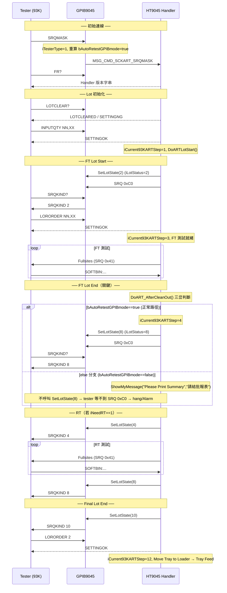

# HT9045 Handler 端 ART 流程詳細規格

> 來源：`ART on HT-9xxx - With GPIB log.pptx`（Steven Chou，2017.01.26，Rework 2022.09.06）
> 程式碼基準：`d:\HT9045\AI_Temp\base_r902`（對應現場 V3.21.902.0）
> 搭配 GPIB 端：`gpib-93k-art` SKILL

---

## 1. Handler 端 ART 完整流程（Mermaid）



---

## 2. DoART_AfterCleanOut() 三岔分支（原始碼結構，base_r902 csystem.cpp）

```cpp
// FT/RT lot 結束、clean out 之後的 lot-end 處理
if(CosFunction.bAutoRetestGPIBmode==true)               // 分支 #1：正常 93K GPIB ART
{
    // ... 視 FT/RT 與 iNeedRT 呼叫：
    //     SetLotState(8);   // FT/RT Lot End
    //     SetLotState(10);  // Final Lot End
    //     SetLotState(4);   // RT Lot Start
}
else if(CosFunction.bUseSCKART && fSCKART->iTesterType==0)  // 分支 #2：TCP / Flex ART
{
    // ... TCP ART 協定處理
}
else                                                    // 分支 #3：★問題分支★
{
    if(IniConfig.bEnable_SECS_GEM)
    {
        // ... SECS/GEM 結批
    }
    else
        ShowMyMessage("Please Print Summary ", "請結批報表");   // ← 截圖的單 OK 鈕對話框
    ret=1; bRet=true;
    // ★ 完全不呼叫 SetLotState(8/10) ★
}
```

**重點**：
- 分支 #1 才會送 FT-lot-end `SetLotState(8)` → GPIB `iLotStatus=8` → `SRQKIND 8` / `SRQ 0xC0`。
- 分支 #3「請結批報表」是 **fallback**，當 `bAutoRetestGPIBmode==false` 且非 TCP 模式時走到，**不送任何 lot 狀態**。

---

## 3. 旗標動態來源（base_r902 main.cpp / CosFunction.cpp）

### CosFunction.cpp 共用預設（所有機台都跑）
```cpp
bUseSCKART = true;                       // SCK ART 模組總開關，預設啟用
if(fSCKART->iTesterType==1)
    bAutoRetestGPIBmode = true;          // 93K GPIB ART
else
    bAutoRetestGPIBmode = false;         // Flex / TCP
```
> `FUNC_CC_DoosanTesna()`（客戶碼 843）只額外設 `bKoreaFunction` + `bShowFunctionWindow`，
> **不影響** ART（ART 在共用預設已啟用）。客戶碼**不是**問題點。

### main.cpp 兩個競爭訊息
```cpp
case MSG_CMD_SCKART_SRQMASK:             // tester 送 SRQMASK
    fSCKART->iTesterType = 1;
    if(fSCKART->iTesterType==1) CosFunction.bAutoRetestGPIBmode = true;   // 重算為 true
    break;

case MSG_CMD_SCKART_LOTSTATUS:           // tester 送 LOTSTATUS?
    fSCKART->iTesterType = 0;            // ← 設 0，但不重算 bAutoRetestGPIBmode
    break;
```

> **不一致缺陷**：若 lot 進行中收到 `LOTSTATUS?`（`iTesterType` 變 0），
> 而 `bAutoRetestGPIBmode` 沒同步、或之後又因其他流程被算成 false，
> 就可能 `iTesterType==1` 但 `bAutoRetestGPIBmode==false` → FT lot end 落入分支 #3。

---

## 4. CheckNeedRT 判斷邏輯（SCK_ART.cpp）

| 條件 | iNeedRT | 說明 |
|------|---------|------|
| `iFTRTCount > iSCKART_TryCnt` | 0 | 超過重試次數，不再 RT |
| `iFTRTCount == iSCKART_TryCnt` | 2 | 達次數上限，執行 Final ART |
| `iFTRTCount < iSCKART_TryCnt && dCurrYield < dSCKART_Yield` | 1 | 次數未到且 Yield 低，繼續 RT |
| `dCurrYield >= dSCKART_Yield && iNeedRT != 2` | 2 | Yield 達標，執行一次 Final ART |
| Low Yield Alarm（K_TRAY_FEED）| 0 | Tray Feed，不用 RT |

- `iFTRTCount==1 && iNeedRT==1` → `iCurrent93KARTStep=5`（第一次 RT）
- `iFTRTCount>1 && iNeedRT==1` → `iCurrent93KARTStep=10`（後續 RT）

---

## 5. TESNA HT-9046LS FT Lot End SRQ 0xC0 未送 案例（2026-06）

### 5.1 客戶問題
> TeraTech Korea / TESNA HT-9046LS：FT 測試結束後 tester 等待 lot-end `SRQ 0xC0`，
> Handler 不送 → tester hang → Handler ART Alarm。
> （S.E.Hong, 2026-06-02；ART 基於 HPI manual 製作）

### 5.2 現場環境
| 項目 | 值 |
|------|-----|
| Handler 版本 | V3.21.902.0 |
| GPIB 版本 | V12.13.902.0 |
| CUSTOMER_CODE | 843（`CC_DoosanTesna`）|
| Tester Type | Advan type1 / 93K（`iTesterType=1`）|
| Run Mode | `ContinuStart_ART`（`rsmContinuRetest_ART`）|
| GPIB `general.ini` | `[Auto Retest] ART Simulator=1`、`iTesterType=1` |

### 5.3 決定性證據

**(A) GPIB log**（`d:\AI_TempFile\TensaGPIBLog\*`）
- 每個 lot 只出現 `SRQKIND 2`（FT Start），**從未出現 `8`(Lot End) / `4`(RT) / `10`**。
- 為 real `SRQ:0xC0` + `Start Normal ART`（**非** `Dummy FT`）→ **DummyART / ART Simulator 假設排除**。
- 最後 log 停在 16:13 測試中突然中斷。

**(B) 現場截圖**（16:50 Alarm，`Print Summary.PNG`）
- 單 OK 鈕對話框 **「Please Print Summary / 請結批報表」**。
- ART FLOW 面板：`Init`、`FT Lot Start`、`FT Testing`、`FT Lot End` 皆綠（完成），
  卡在紅色 **「Move Tray to Loader」**，RT 以下全灰（未執行）。
- Tester Type=93K、RT Try Count=1。

### 5.4 根因（code-level）

截圖的「請結批報表」對話框 = `DoART_AfterCleanOut()` **分支 #3**
（`ShowMyMessage("Please Print Summary ", "請結批報表")`），
**只有 `bAutoRetestGPIBmode==false` 時才會走到**：

```
bAutoRetestGPIBmode==false
   → 不進分支 #1（93K GPIB ART）
   → iTesterType==1 故也不進分支 #2（TCP, 需 iTesterType==0）
   → 落入分支 #3 → 顯示「請結批報表」，不呼叫 SetLotState(8)
   → GPIB 收不到 iLotStatus=8
   → 不送 SRQKIND 8 / FT-lot-end SRQ 0xC0
   → tester 一直等 → Handler ART Alarm
```

### 5.5 為何 FT start 正常、FT end 失敗
- FT start 的 `SetLotState(2)` 也需 `bAutoRetestGPIBmode==true`；
  GPIB log 顯示 `SRQKIND 2` 正常 → **lot 開始時 `bAutoRetestGPIBmode` 確為 true**。
- 到 FT lot end 卻走分支 #3 → **`bAutoRetestGPIBmode` 在 lot 進行中由 true 掉成 false**，
  與螢幕 `iTesterType==1`（93K）形成**不一致狀態**。
- 推定觸發：tester 在 lot 中途送了 `LOTSTATUS?`（令 `iTesterType=0`，但未重算旗標），
  或某流程重算 `bAutoRetestGPIBmode` 時 `iTesterType` 暫為非 1，使旗標固定為 false。

### 5.6 診斷結論（不改碼）
1. **本案 log 不是 DummyART 觸發**（log 為 real `SRQ:0xC0`、12 檔 grep `Dummy`=0），
   但 DummyART/`bSimulate` 為**並列的第二失效模式**（症狀相同），詳見 §6。
2. **不是客戶碼 843 問題**（ART 在共用預設已啟用）。
3. **本案根因**：FT lot end 時 `bAutoRetestGPIBmode==false`，
   `DoART_AfterCleanOut()` 落入分支 #3「請結批報表」，跳過 `SetLotState(8)`，
   導致 GPIB/ tester 收不到 FT-lot-end `SRQ 0xC0`。
4. 旗標不一致（`iTesterType==1` 但 `bAutoRetestGPIBmode==false`）為核心缺陷，
   需向 RD flag：`bAutoRetestGPIBmode` 可能 mid-lot 被算成 false。

### 5.7 後續查證方向（給 RD / 現場）
- 確認 93K tester 程式在整個 lot 是否持續送 `SRQMASK`，是否中途送 `LOTSTATUS?`。
- 追 `bAutoRetestGPIBmode` 在 FT testing → FT lot end 之間的所有賦值點，
  找出由 true 變 false 的時機。
- 檢查 SCK ART 設定：`bA10_AutoReTest`（[A10-1]）、`iSCKART_RTStartMode`、`iSCKART_TryCnt`。
- 比對 GPIB ↔ Handler 的 `iTesterType` 是否一致（兩端各自維護一份）。

---

## 6. bSimulate / bDummyART 機制與生產保護（第二失效模式）

> 本節回應「DummyART 旗標也可能掐掉 SRQ:0xC0」的疑慮。與 §5 的 `SetLotState(8)` 漏送**並列**，
> 症狀相同（tester 等 SRQ:0xC0、handler 不送、ART Alarm），但根因獨立。

### 6.1 真正 gate SRQ:0xC0 的是 `LastSet.bDummyART`

GPIB `Main.cpp`（FT/RT lot-end SRQ 送出處）：

```cpp
if((ibsta&0x04) && iLotMode!=0)
{
    if(LastSet.bDummyART==false)
    {
        WriteLog("0001 SRQ:0xC0");
        ibrsv(noncontroller, 0xC0);          // 真送 SRQ 給 tester
    }
    else
        WriteLog("Dummy FT ==> SRQ:0xC0");   // 只寫 log，完全不 ibrsv → tester hang
    iLotModeGPIB=iLotMode;
    LastSet.bSRQC0=true;
    iLotMode=0;
}
```

### 6.2 三個易混旗標（務必分清）

| 旗標 | 來源 | 作用 | gate SRQ:0xC0 |
|------|------|------|---------------|
| `ART Simulator`（`general.ini [Auto Retest]`）| ini 讀取（`Main.cpp` `palSCKART->Visible=...`）| **僅控制模擬面板可見性** | ❌ 否 |
| 全域 `bSimulate`（`Main.cpp` line 66）| `MSG_CMD_NONE`(3686) / `MSG_CMD_ChangeGpib`(3333)；manual start 重置(3875/4309/8267) | 模擬時不寫硬體開啟錯誤 log、device-map 模擬 | ❌ 否 |
| **`LastSet.bDummyART`** | `MSG_CMD_SCKART_RunDummy`(3498) / startup `[Dummy ART] Running Status`(4384) | **真正 gate SRQ:0xC0**(1540/1711) + SCKART talk(3475/3488/5309/5842) | ✅ **是** |

> ⚠️ `ART Simulator=1` 看似兇手實為命名混淆——它在 902 版只設面板可見，**不影響 `bDummyART`**。

### 6.3 Handler 端 `HHandler2Gpib.bSimulate` 全部賦值點（base_r902）

| # | 位置 | 設定值 | 經由訊息 | → GPIB 旗標 |
|---|------|--------|----------|-------------|
| A | `main.cpp:17861` 共用送測資料 | `(iTester==ON_LINE)?false:true` | `MSG_CMD_NONE` | 全域 `bSimulate`（**非** gate）|
| B | `main.cpp:17586`（`CMD==RunDummy`）| `OFF_LINE → true` | `MSG_CMD_SCKART_RunDummy` | **`bDummyART`（★gate）** |
| C | `main.cpp:17601`（`CMD==RunDummy`）| online 且 `bUseSCKART && bA10_AutoReTest && bSCKART_EnableART && bSCKART_RunARTWithoutCmd` → `= bSCKART_RunARTWithoutCmd` | `MSG_CMD_SCKART_RunDummy` | **`bDummyART`** |
| D | `main.cpp:17605`（`CMD==RunDummy` else）| `false` | `MSG_CMD_SCKART_RunDummy` | **`bDummyART`** |
| E | `main.cpp:21325` 2DID 模式 | `(iTester==OFF_LINE)` | 一般訊息 | 全域 `bSimulate`（非 gate）|

**只有 B/C/D（走 `MSG_CMD_SCKART_RunDummy`）會影響 SRQ:0xC0。** 觸發 `RunDummy` 的事件：
- `csystem.cpp:6176` — **Lot Start**（被 TCP/SECSGEM ART 條件包住，非 ART 時跳過）
- `main.cpp:11718` — **ON/OFF Line 切換**（被 `if(bUseSCKART)` 包住）

### 6.4 漏 reset 風險（核心問題）

`bDummyART` 是**持久狀態**，只在「lot start（條件式）／online 切換（條件式）／GPIB 重啟（讀 ini）」重算：

| 風險 | 情境 | 後果 |
|------|------|------|
| **A（config）** | 現場誤開 `bSCKART_RunARTWithoutCmd` → 走 C 條 | 正常 online 生產時 `bDummyART=true`，SRQ:0xC0 全程被掐掉 |
| **B（狀態殘留）** | OFF_LINE 做過 dummy run（`bDummyART=true`）後切 ON_LINE，且 lot-start 的 `RunDummy` 因 TCP/SECSGEM 條件被跳過 | `bDummyART` 卡在 true，生產時 SRQ:0xC0 不送 |

### 6.5 生產保護設計建議（提案，未實作）

> 目標：**生產時 `bDummyART` 必為 false；`bSCKART_RunARTWithoutCmd` 不可被開啟；
> 設定須在 lot start 之前完成，生產中不可被改動。**

| 編號 | 保護方向 | 說明 |
|------|----------|------|
| **P1（lot-start 強制重算）** | 每次 lot start 無條件依「目前 online/offline + 生產旗標」重算並下送 `bDummyART`，不依賴殘留值 | 消除風險 B；確保 online 生產一定 `bDummyART=false` |
| **P2（online 即清 dummy）** | 切 ON_LINE 時即送 `RunDummy(false)`，不被 TCP/SECSGEM 條件跳過 | 補上 §6.3 觸發點被條件包住的破口 |
| **P3（生產鎖定 `bSCKART_RunARTWithoutCmd`）** | 將此旗標歸類為「啟動後鎖定」設定：lot start 後唯讀，生產中禁改；或限定 OFF_LINE/工程模式才可設 | 消除風險 A |
| **P4（啟動一致性檢查）** | lot start 前檢查：`iTester==ON_LINE && bDummyART==true` 視為異常組合 → 出 Alarm 並阻擋啟動 | 生產前攔截，避免帶錯狀態投產 |
| **P5（GPIB↔Handler 對帳）** | lot start 時 GPIB 回報目前 `bDummyART`，Handler 比對期望值不符即警示 | 兩端狀態同步驗證 |
| **P6（log 顯著化）** | online 模式若 `bDummyART=true`，log 以警示等級標記（非一般 log）| 加速現場/RD 辨識 |

> 優先序建議：**P1 + P3** 為治本（強制重算 + 設定鎖定）；P2 補觸發破口；P4/P5 為啟動防呆；P6 為可觀測性。
> 以上皆為設計方向，**尚未修改任何程式碼**，待 RD 評估。

### 6.6 與本案 log 對帳（誠實）

- 本次 log 有真實 `0001 SRQ:0xC0`（該 `WriteLog` 在 `if(bDummyART==false)` 內）+ 12 檔 grep `Dummy`=0
  → 本案事發當下 `bDummyART` 確為 false，FT start SRQ 真送。
- `bDummyART` 只在 lot start / online 切換變動，FT start → FT end 之間不變
  → **本案 hang 是 §5 的漏 `SetLotState(8)`，非 `bDummyART`**。
- 但 §6 的 `bDummyART` 卡 true 是**合理且獨立的第二失效模式**；需查現場：
  (1) `bSCKART_RunARTWithoutCmd` 是否被開啟；(2) 測試前是否做過 offline/dummy run 而未重新 online。
- 現場 config 僅確認 `Tester.Data iTesterType=1`；未找到 `bSCKART_RunARTWithoutCmd` 明確值（可能 default false，待現場確認）。

---

## 7. Initial Start 前 `bDummyART` 是否被重算（以 ART 模式旗標為軸）

> 本節**不綁特定客戶**，純以 `CosFunction.bART_SECSGEM_93K` / `iAutoRetestTCPmode` /
> `TestIF_File.bSCKART_RunARTWithoutCmd` 三旗標分流。
> 重點：分析「lot start / initial start **之前**」`bDummyART` 是否被歸零，
> **不依賴任何 lot-end 事件**（機台可能是新到、或剛清空記憶後才開始新生產）。

### 7.1 `DoInitialStart()` 內送 RunDummy 的判斷式（905.1 csystem.cpp，case 1）

```cpp
if(CosFunction.bUseSCKART)
{
    // ...（ART 模式才跳輸入 lot count，略）...

    if((CosFunction.iAutoRetestTCPmode!=0 ||      // TCP ART
        CosFunction.bART_SECSGEM_93K) &&          // SECS/GEM 版 ART
       TestIF_File.bSCKART_RunARTWithoutCmd==false)
    {
        // ★ 空 branch：不送 RunDummy → bDummyART 不被重算 ★
    }
    else
    {
        fMain->SendMSG_CMD(MSG_CMD_SCKART_RunDummy);   // 送 RunDummy → bDummyART 被重算
    }
    fSCKART->ClearAlarmCode();
    LotSummary.ClearAllData();
}
```

### 7.2 四種模式 × initial start 行為對照

| ART 模式 | `iAutoRetestTCPmode` / `bART_SECSGEM_93K` | `bSCKART_RunARTWithoutCmd` | initial start 送 RunDummy？ | `bDummyART` 開批前是否被歸零 |
|----------|-------------------------------------------|----------------------------|------------------------------|------------------------------|
| 純 GPIB 93K ART | 皆 0 / false | false | **送**（落 else） | ✅ **每次開批自動重算 false** |
| SECS/GEM ART | `bART_SECSGEM_93K==true` | false | **不送**（取空 if） | ❌ **沿用舊值（缺口）** |
| TCP ART | `iAutoRetestTCPmode!=0` | false | **不送**（取空 if） | ❌ **沿用舊值（缺口）** |
| 任一模式 + 自走 | 任意 | **true** | **送**（落 else，帶 `RunWithoutCmd=true`）| ⚠️ **被設成 true（危險）** |

### 7.3 RunDummy 帶出的 `bDummyART` 值（§6.3 B/C/D 條）

`SendMSG_CMD(MSG_CMD_SCKART_RunDummy)` 在 online 時：
- `bSCKART_RunARTWithoutCmd==false` → 帶 **false** → `bDummyART=false` → SRQ:0xC0 **正常送**
- `bSCKART_RunARTWithoutCmd==true` → 帶 **true** → `bDummyART=true` → SRQ:0xC0 **被吞**

### 7.4 關鍵推論（針對新機 / 剛清記憶開機）

乾淨開機時 `bDummyART` 唯一 seed 來源 = GPIB 啟動讀 `[Dummy ART] Running Status`（`Main.cpp:4384`）。

> **在 SECS/GEM ART 或 TCP ART 模式（且 `RunWithoutCmd==false`）下，
> 從乾淨開機到第一次 initial start，沒有任何路徑會把 `bDummyART` 拉回 false。**
> 若 `[Dummy ART] Running Status` 被留成 1，整個生產期間 SRQ:0xC0 都會被吞，
> 而且不會在 lot 中途或 lot end「自動修好」。

→ 純 GPIB 93K ART 之所以「看起來穩」，是因為它**每次 initial start 都走 else 重送 RunDummy(false)**，
等於每批開頭自我修復；SECS/GEM 與 TCP 路徑**缺這道自我修復**。

### 7.5 「lot start / initial start 之前要設好」的保證點（不改碼層級）

> ⚠️ 釐清：`bSCKART_RunARTWithoutCmd==true` **不是矛盾設定**，而是「自走 ART（不靠 tester 命令）」的
> **合法模式**——此模式本來就需要 `bDummyART=true` 才跑得起來，**不可阻擋、也不可把它的 dummy log 當警示**。
> 真正需要被保護的，只有「SECS/GEM / TCP 且 `RunWithoutCmd==false`」這類「要送真 SRQ:0xC0」的生產情境。

1. **`[Dummy ART] Running Status` 生產必為 0**：這是 SECS/GEM / TCP ART 模式（`RunWithoutCmd==false`）下
   乾淨開機唯一會把 `bDummyART` seed 成 true 的來源，且該模式 initial start 的空 branch 不覆蓋它。
2. **initial start 的空 if-branch 是設計缺口**：純 GPIB 靠 else 自癒，SECS/GEM / TCP（`RunWithoutCmd==false`）
   取空 branch，等於「明知要送真 SRQ:0xC0 卻不保證 `bDummyART=false`」——應於此 branch 顯式送 `RunDummy`
   （online + `RunWithoutCmd==false` 時即帶 false，見 §6.3 D 條）以補回自我修復。

### 7.6 程式修改（D1+D3 **已實作於 905.x**；以旗標為軸，非綁客戶）

> 全部錨定在 **initial start / lot start 之前**，不依賴 lot-end。Big5/CP950 編碼。
> 收斂為 **2 項**（原四項中：D2 併入 D1、D4 移除、D3 改用既有函式）。
> **實作方式**：以 Python binary(cp950) 安全替換，替換區純 ASCII，不動周邊 Big5 中文註解。

**D1（治本，含原 D2）— `csystem.cpp DoInitialStart()` case 1（約 6203 行）**

只填空 if-branch（**保留 if/else 結構，最小 diff**），沿用既有 `MSG_CMD_SCKART_RunDummy`（**不新增訊息**）。
因 online + `RunWithoutCmd==false` 時 `RunDummy` 帶 false → `bDummyART=false`，
SECS/GEM、TCP 模式即取得與純 GPIB 相同的「每批自我修復」。

**D3（防呆，改用既有函式）— 同位置、與 D1 合併在空 if-branch 內**

不新增 config「啟動後唯讀」鎖；改用**既有**慣用式 `HasICUnderMachine()==false && HasAnyICInMachine()==false`
（同檔 6412 RT 清盤、Command.cpp 13752、main.cpp 438 皆已使用）：
**僅在乾淨開批時**送 RunDummy 重設 `bDummyART`；機台仍有料則**維持進入前狀態、不修改**。

實際寫入的程式碼：

```cpp
                if((CosFunction.iAutoRetestTCPmode!=0 ||                        //RogerYang 20251029 : bool->int   //Sam 20191113 : TCP ART
                    CosFunction.bART_SECSGEM_93K) &&                            //JerryYang 20220923 : SECS GEM版本ART
                   TestIF_File.bSCKART_RunARTWithoutCmd==false)
                {
                    //AI(ht9045-art-flow) 20260612 (Steven) : SECS/GEM & TCP ART reset bDummyART only on clean batch start; keep prior state when IC remains
                    if(HasICUnderMachine()==false && HasAnyICInMachine()==false)
                        fMain->SendMSG_CMD(MSG_CMD_SCKART_RunDummy);
                }
                else
                {
//                    if(LastSet.iRunStartMode==rsmContinuStart_ART)             //JerryYang 20200312 ART模式才跳輸入lot count    //Steven 20250222 : Mark
                    {
                        fMain->SendMSG_CMD(MSG_CMD_SCKART_RunDummy);            // 原有邏輯，未動
                    }
                }
```

> 不新增 `MSG_CMD_SCKART_ClearDummy`；不對 `RunWithoutCmd==true` 出 Alarm（那是合法自走模式）。
> 原 D2「攔截矛盾組合」取消——`RunWithoutCmd==true` 並非矛盾。
> **原 D4（GPIB dummy log 升警示）移除**：自走模式（`RunWithoutCmd==true`）下 dummy 為正常行為，升警示會誤報。
> ⚠️ **待驗證**：本修改尚未做 BCB6 編譯驗證（`HasICUnderMachine`/`HasAnyICInMachine` 皆同檔已宣告，語法為 ASCII 合法）。
> 主因（§2.1/§2.2 `bAutoRetestGPIBmode` 不一致，方向 A/B/C）尚未實作。
