# ATK AMR 自動化搬運系統 — Handler-Host 通訊場景

> 來源文件：`Handler-Host Scenario_EN.xlsx`（ATK 提供）  
> 流程圖投影片：`Senario_ATK_SECS_GEM_260305A_Tyler.pptx`（Tyler 整理，8 張）  
> 適用機型：HT9045 ATK AMR 自動化配置  
> 圖例：🔵 成功路徑（Blue Line）｜🔴 失敗路徑（Red Line）｜🟢 選擇性路徑（Green Line）

---

## 概覽

ATK AMR（Autonomous Mobile Robot）系統透過 SECS/GEM 協定控制 HT9045 Handler 進行自動化 Tray 搬運。  
HOST（AMR 系統）扮演主動控制角色，HANDLER 回報設備狀態與事件。  
物理搬運動作使用 **SEMI E84 PIO**（Load Port 介面）或 **SEMI E23**（OHT/AMR 介面）進行同步。

---

## 完整通訊場景流程

### Phase 1：Input Tray 載入（版本 A — Tyler 原始）

> 對應投影片：Slide 1

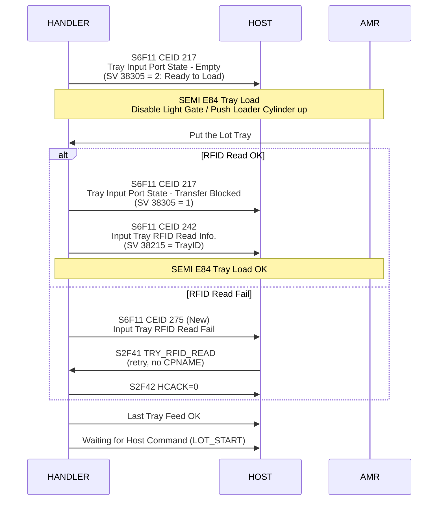

> **程式碼參考**：`IsATK_AMR()` 判斷條件：`USE_COVER_TRAYID==tCID_NFC && IniConfig.bA65_BundleIDList==true && CUSTOMER_CODE==CC_AMKOR_Korea`  
> Port 狀態掃描由 `bScanLoadPortState_ATK()` 定期更新，偵測到變化時自動呼叫 `EventReport(SECS_EVENT.PortStateUpdated)` 觸發 CEID 217。

---

### Phase 1（版本 B — Steven Suggest）

> 對應投影片：Slide 2｜**差異：使用 S1F3/S1F4 主動查詢 Loader 狀態，而非被動等 CEID 217**

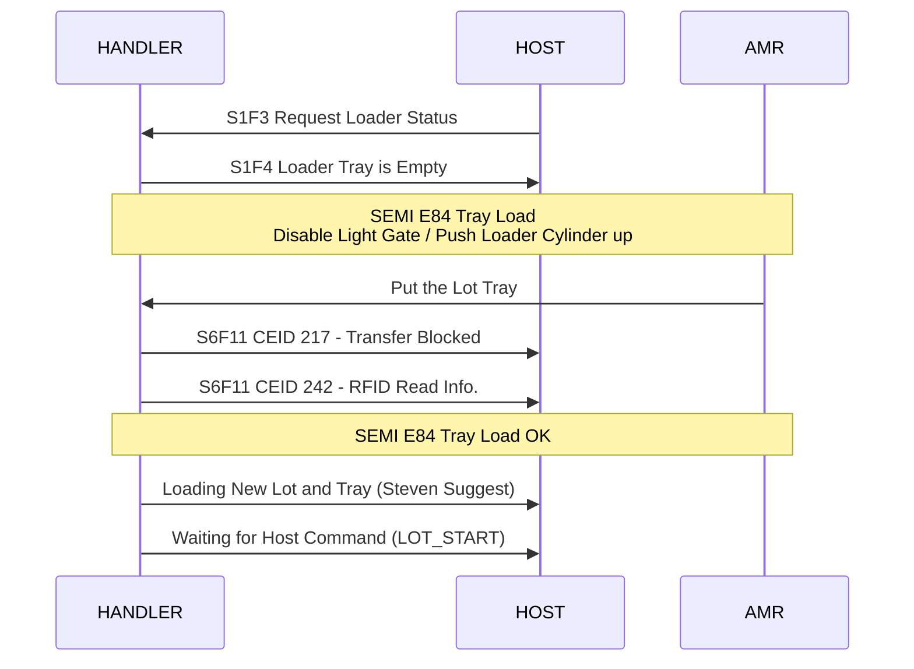

> ⚠️ **版本選擇討論**：Tyler 版直接用 CEID 217 推播；Steven Suggest 版改用 S1F3/S1F4 由 HOST 主動輪詢。  
> 目前 ATK 採用版本 A（CEID 217 推播）為準。

---

### Phase 2：Recipe 選擇與 Lot 啟動

> 對應投影片：Slide 3

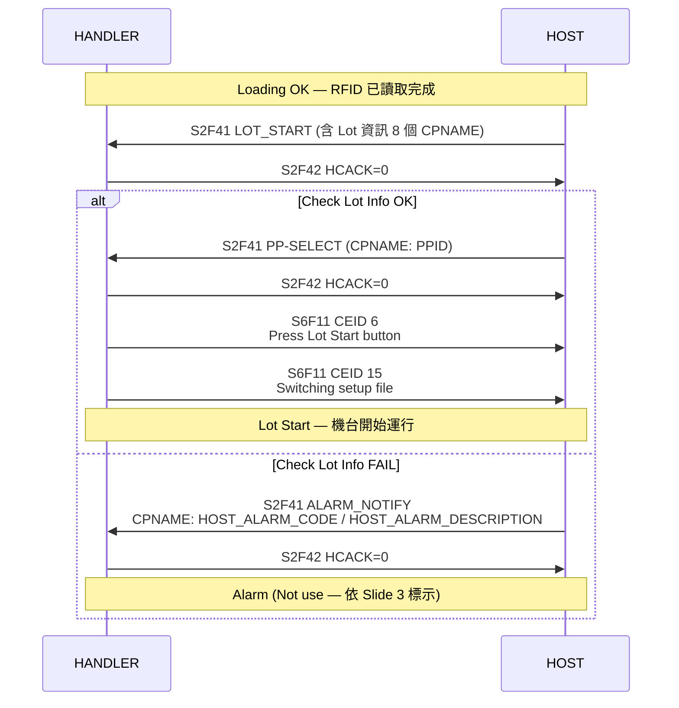

> **程式碼參考**：`LOT_START` 由 `uHGemHT9045.cpp` `S2F42_Host_Command_Acknowledge()` 處理，  
> 條件：`CUSTOMER_CODE==CC_AMKOR_Korea && S.AnsiPos("LOT_START")==1`  
> 成功後設定 `fAGV->bATK_AMR_DoHostLotStart=true`，呼叫 `fLotInfo->sbSECSLotStartClick()` 觸發啟動。

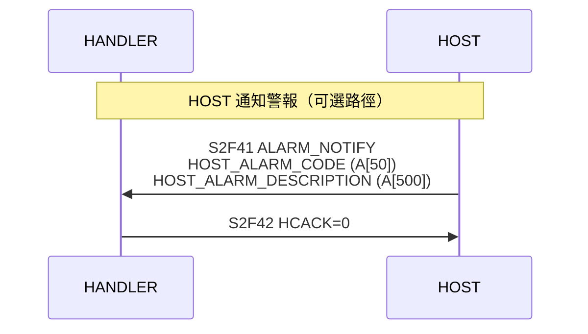

#### LOT_START 完整參數格式

| CPNAME | CPTYPE | 說明 | 範例值 |
|--------|--------|------|--------|
| `LOT_NO` | A[100] | Lot 編號 | `"AZ1FC5337LT-C5337M4.0101#SL3@k3tv93368"` |
| `DCC` | A[100] | DCC 資料（空白或字串，空值合法） | `""` |
| `OPERATION_CODE` | A[100] | 製程代碼 | `"7582"` |
| `UNIT_QTY` | A[100] | IC 數量 | `"5849"` |
| `TRAY_ID` | A[100] | Cover Tray ID | `"RT0000658"` |
| `LOT_YIELD` | A[100] | Lot 良率(%) | `"99.5"` |
| `HARD_BIN_INFO` | A[000] | BIN 資訊（格式：`BIN號;類型;良率%;判斷類型;Hold / ...`，多 BIN 以 `/` 分隔） | `"BIN01,BIN02,BIN03,..."` |
| `OUTPUT_TRAY_QTY` | A[100] | Output Tray 數量上限 | `"32"` |

> **DCC 說明**：Blank character 或字串，範例 `000FX4349CL.0140#E0N272.00@k3tv93231DCC01`

---

### Phase 3：Lot 執行中（Output Port 滿盤排出）

> 對應投影片：Slide 5（Fix Tray Full）、Slide 6（Auto Tray Full）

#### Slide 5 — Fix Tray 滿盤（Fix Tray → Auto Tray 搬運）

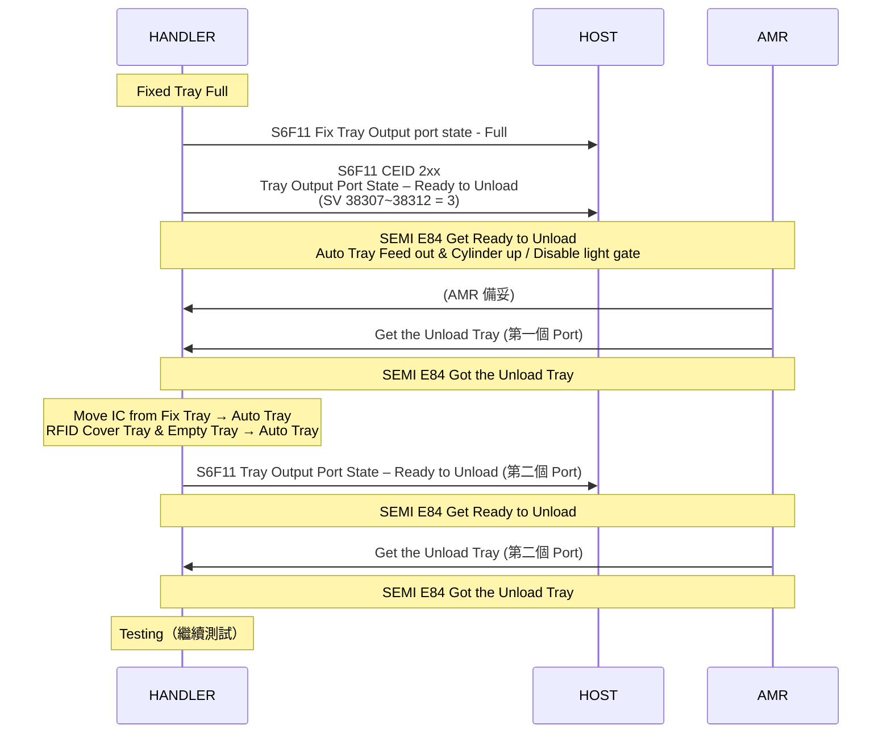

#### Slide 6 — Auto Tray 滿盤（正常排出）

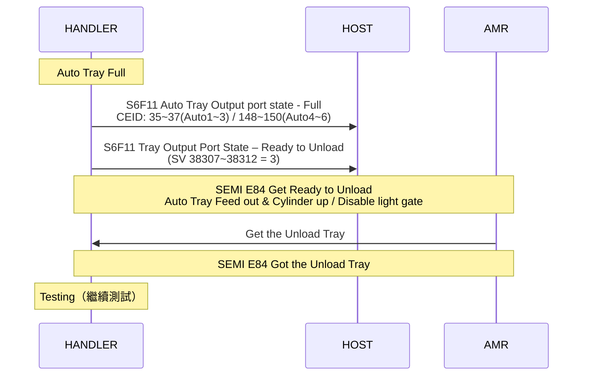

> **MAX Tray 達到時的 HOST 指令流程**（與上述 SEMI E84 並行）：

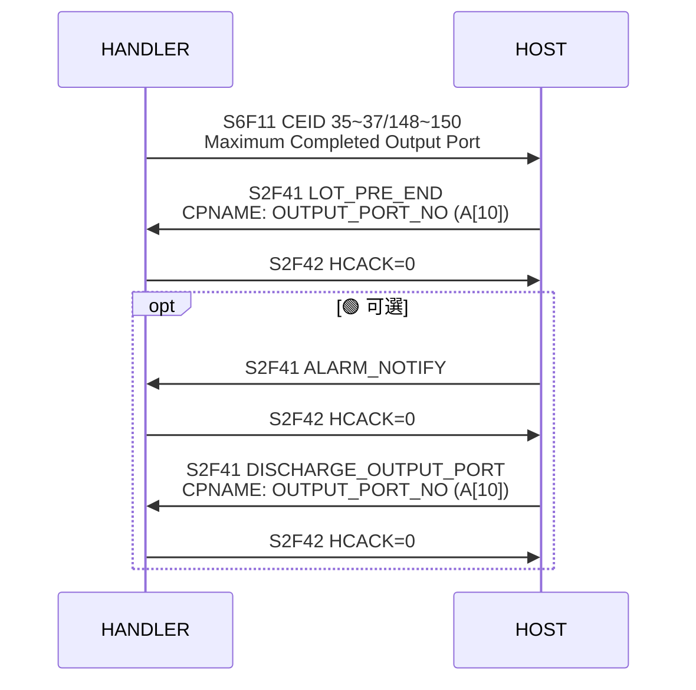

> **程式碼參考**：`bScanLoadPortState_ATK()` 掃描 Auto1~Auto6 的 `iTrayFeed` 與 `Sen[SnAutoIsFull]` 狀態，  
> `iCurrStateATK[i]=eATKReadyToUnload` 時觸發 `EventReport(SECS_EVENT.PortStateUpdated)` （CEID 220~228）。

---

### Phase 4：Lot 結束 — Output Tray 排出

> 對應投影片：Slide 7（Tyler Suggest 1）、Slide 8（Tyler Suggest 2）  
> 兩個版本的差異在於 LOT_END 的接收時序。

#### Slide 7 — Tyler Suggest 1（LOT_END 在所有 Tray 排出後）

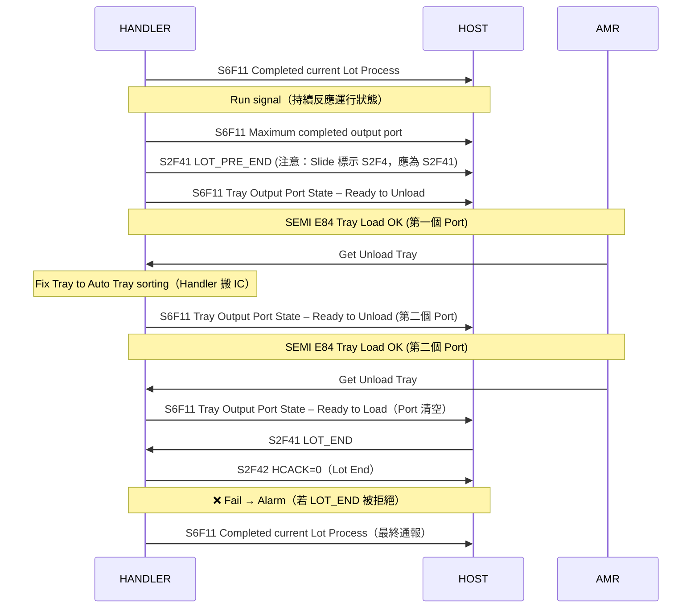

#### Slide 8 — Tyler Suggest 2（LOT_END 先到，再排出 Tray）

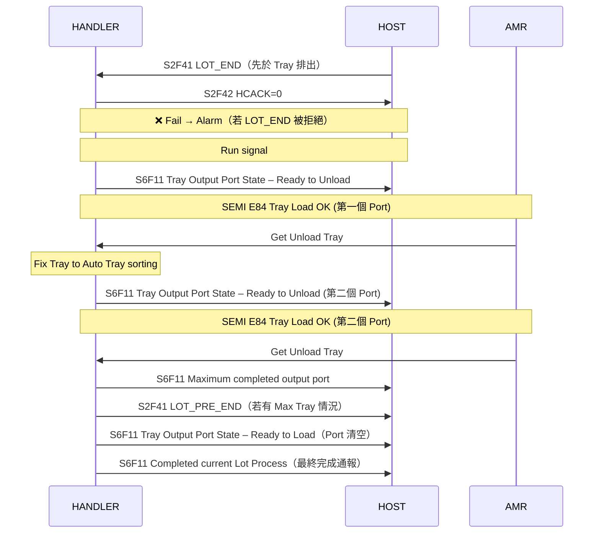

> ⚠️ **版本選擇討論**：
> - **Suggest 1**：等所有 Tray 排出後，HOST 才下 LOT_END（較保守）
> - **Suggest 2**：HOST 先下 LOT_END，Handler 再排出 Tray（較快速）
> 
> **程式碼參考**：`LOT_END` 處理位於 `CUSTOMER_CODE==CC_AMKOR_Korea && S.AnsiPos("LOT_END")==1` 區塊，  
> 旗標 `bATK_AMR_DoLotEndSent` 用於追蹤 Final Lot End 是否已送出。

---

### Phase 5：Empty Tray / Cover Tray 補充（SEMI E84 / AMR）

> 對應投影片：Slide 4

> ⚠️ **注意（PPTX 更正）**：Slide 4 顯示 Empty Tray 與 RFID（Cover）Tray 均透過 **SEMI E84** 介面進行，  
> 並非原 Excel 所標示的 SEMI E23（E23 為 OHT 介面）。請以此更正版為準。

```mermaid
sequenceDiagram
    participant H as HANDLER
    participant O as HOST
    participant A as AMR

    Note over H: Loading Empty Tray and RFID Tray

    rect rgb(230, 245, 255)
        Note over H,A: Empty Tray 補充流程
        H->>O: S6F11 CEID 218<br/>Empty Tray Input port state - Empty<br/>(SV 38306 = 2: Ready to Load)
        Note over A,H: SEMI E84 Empty Tray Load<br/>Disable Light Gate / Push Empty Tray Track Cylinder up
        A->>H: Put the Empty Tray
        H->>O: S6F11 CEID 21<br/>Empty Tray Input port state – Transfer Blocked<br/>(SV 38306 = 1)
        Note over A,H: SEMI E84 Empty Tray Load OK
    end

    rect rgb(230, 255, 230)
        Note over H,A: RFID（Cover）Tray 補充流程
        H->>O: S6F11 CEID 219<br/>RFID Tray Input port state - Empty<br/>(SV 38313 = 2: Ready to Load)
        Note over A,H: SEMI E84 RFID Tray Load<br/>Disable Light Gate / Push RFID Tray Track Cylinder up
        A->>H: Put the RFID Tray
        H->>O: S6F11 CEID 219<br/>RFID Tray Input port state – Transfer Blocked<br/>(SV 38313 = 1)
        Note over A,H: SEMI E84 RFID Tray Load OK
    end

    Note over H: Testing
```

> **程式碼參考**：`bScanLoadPortState_ATK()` 中：  
> - **Empty Port** (etEmpty)：`Sen[SnEmptyIsFull].IsOn()` → eATKReadyToUnload；`MOT[MMEmptyZ].fHasTray` 等 → eATKTransfer；否則 → eATKReadyToLoad  
> - **Color Port** (etColor)：`Sen[SnColorIsFull].IsOn()` → eATKReadyToUnload；`MOT[MMColorZ].fHasTray` 等 → eATKTransfer；否則 → eATKReadyToLoad  
> - **CEID 對照**：CEID 218 = Empty Port，CEID 219 = RFID（Color/Cover）Port  
> - **CEID 21**（Slide 4 標示）：可能為程式碼中的等效 Empty Tray Transfer Blocked 事件，需與 CEID 218 確認對應關係

---

### Phase 6：自動抑制模式（選擇性）

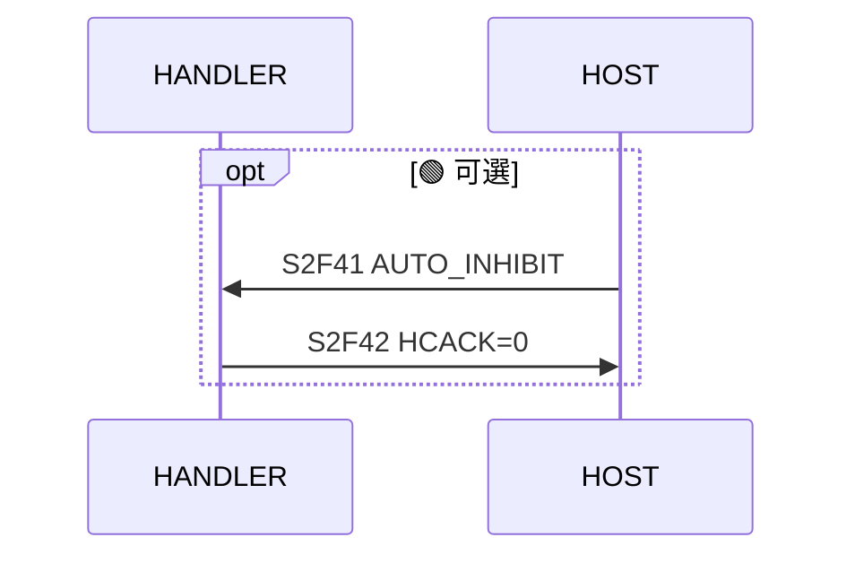

---

## ATK AMR 專用 RCMD 指令清單

| RCMD | 說明 | CPNAME | CPTYPE | 備註 |
|------|------|--------|--------|------|
| `TRY_RFID_READ` | 重新讀取 Input Cover Tray RFID | — | — | 無參數 |
| `PP-SELECT` | 載入 Recipe | `PPID` | A[200] | — |
| `LOT_START` | 啟動 Lot 處理 | 見 Phase 2 參數表 | — | 8 個 CPNAME |
| `ALARM_NOTIFY` | HOST 通知 Handler 警報 | `HOST_ALARM_CODE`<br>`HOST_ALARM_DESCRIPTION` | A[50]<br>A[500] | 可選 |
| `LOT_END` | 結束 Lot，排出所有 Tray | `TRAY_ID` | A[100] | — |
| `LOT_PRE_END` | Max Tray 達到時，預先結束指定 Port | `OUTPUT_PORT_NO` | A[10] | — |
| `CANCEL_INPUT_TRAY` | 排出 Input Tray（中斷 Lot） | `HOST_ALARM_CODE`<br>`HOST_ALARM_DESCRIPTION` | A[50]<br>A[500] | — |
| `DISCHARGE_OUTPUT_PORT` | 手動排出指定 Output Port | `OUTPUT_PORT_NO` | A[10] | 不需 Lot End |
| `AUTO_INHIBIT` | 自動抑制模式切換 | — | — | 可選 |

---

## ATK AMR 專用 CEID（含新增項目）

### Port 狀態變更事件

| Port | CEID | 說明 |
|------|:----:|------|
| Loader (Input) | 217 | Port state updated |
| Empty | 218 | Port state updated |
| Color/Cover | 219 | Port state updated |
| Auto1 | 220 | Port state updated |
| Auto2 | 221 | Port state updated |
| Auto3 | 222 | Port state updated |
| Auto4 | 226 | Port state updated |
| Auto5 | 227 | Port state updated |
| Auto6 | 228 | Port state updated |

### Tray ID 讀取事件

| Port | CEID | 說明 |
|------|:----:|------|
| Loader (Read OK) | 242 | Tray ID Read OK |
| Auto1 (Read OK) | 246 | Tray ID Read OK |
| Auto2 (Read OK) | 248 | Tray ID Read OK |
| Auto3 (Read OK) | 252 | Tray ID Read OK |
| Auto4 (Read OK) | 254 | Tray ID Read OK |
| Auto5 (Read OK) | 256 | Tray ID Read OK |
| Auto6 (Read OK) | 258 | Tray ID Read OK |
| Loader (Read Fail) | **275** 🆕 | Tray ID Read Fail |

### 計數/Output 完成事件

| Port | CEID (原) | 新 CEID 🆕 | ECID | 說明 |
|------|:---------:|:----------:|:----:|------|
| Completed Process Report | 8 | — | — | Lot 全部完成，含 Output 各 Port 結果 |
| Maximum Output Port Report | — | **276** 🆕 | — | Max Tray 達到時 per Port 排出 |
| Auto1 full | 35 | — | — | Auto1 output full, ready to discharge |
| Auto2 full | 36 | — | — | Auto2 output full |
| Auto3 full | 37 | — | — | Auto3 output full |
| Auto4 full | 148 | — | — | Auto4 output full |
| Auto5 full | 149 | — | — | Auto5 output full |
| Auto6 full | 150 | — | — | Auto6 output full |

### Tray/Unit 計數事件

| 說明 | CEID | ECID |
|------|:----:|:----:|
| Output Port 1 Tray & Unit Count | 136 | 1103 |
| Output Port 2 Tray & Unit Count | 137 | 1104 |
| Output Port 3 Tray & Unit Count | 138 | 1105 |
| Output Port 4 Tray & Unit Count | 145 | 1259 |
| Output Port 5 Tray & Unit Count | 146 | 1260 |
| Output Port 6 Tray & Unit Count | 147 | 1261 |
| Input Port Tray Count | 66 | 38222 |
| Empty Port Tray Count | 159 | 38223 |
| Cover Tray Port Tray Count | 163 | 38224 |

### BIN Code / Material Mode 事件（新增）

| 說明 | 新 CEID 🆕 | ECID |
|------|:---------:|:----:|
| Output Port 1 Bin Code | **277** | 1451 |
| Output Port 2 Bin Code | **278** | 1452 |
| Output Port 3 Bin Code | **279** | 1453 |
| Output Port 4 Bin Code | **280** | 1460 |
| Output Port 5 Bin Code | **281** | 1461 |
| Output Port 6 Bin Code | **282** | 1462 |
| Material Mode Change | **283** | 1517 |

---

## ATK AMR 專用 SV/EC（VID）

### Port 狀態 SV

| SVID | 名稱 | Type | 說明 |
|:----:|------|:----:|------|
| 38305 | Input Port State | INT_4 | 見下方狀態值定義 |
| 38306 | Empty Port State | INT_4 | — |
| 38307 | Output 1 Port State | INT_4 | — |
| 38308 | Output 2 Port State | INT_4 | — |
| 38309 | Output 3 Port State | INT_4 | — |
| 38310 | Output 4 Port State | INT_4 | — |
| 38311 | Output 5 Port State | INT_4 | — |
| 38312 | Output 6 Port State | INT_4 | — |
| 38313 | CoverTray Port State | INT_4 | — |

**Port State 數值定義：**

| 值 | 意義 |
|:--:|------|
| 0 | No State（狀態未知）|
| 1 | Transfer Blocked（Tray 已放入 Port）|
| 2 | Ready to Load（Port 空，可放入 Tray）|
| 3 | Ready to Unload（Tray 已卸載，可取走）|

### Tray ID SV

| SVID | 名稱 | Type | 說明 |
|:----:|------|:----:|------|
| 38215 | Input Port Tray ID | A | RFID 讀取之 Tray ID |
| 38205 | Output 1 Tray ID | A | — |
| 38206 | Output 2 Tray ID | A | — |
| 38207 | Output 3 Tray ID | A | — |
| 38199 | Output 4 Tray ID | A | — |
| 38200 | Output 5 Tray ID | A | — |
| 38201 | Output 6 Tray ID | A | — |

### Tray / Unit 計數 SV

| SVID (原) | SVID (新) | 名稱 | Type |
|:----------:|:---------:|------|:----:|
| 37001 | 38222 | Input port tray count | INT_4 |
| 38303 | 38223 | Empty port tray count | INT_4 |
| 37003 | 38224 | Output 1 Tray Count | INT_4 |
| 37004 | 38226 | Output 2 Tray Count | INT_4 |
| 37005 | 38227 | Output 3 Tray Count | INT_4 |
| 37013 | 38234 | Output 4 Tray Count | INT_4 |
| 37014 | 38235 | Output 5 Tray Count | INT_4 |
| 37015 | 38236 | Output 6 Tray Count | INT_4 |
| 37006 | 38228 | Input port device count | INT_4 |
| 1103 | 38231 | Output 1 Device Count | INT_4 |
| 1104 | 38232 | Output 2 Device Count | INT_4 |
| 1105 | 38233 | Output 3 Device Count | INT_4 |
| 1259 | 38237 | Output 4 Device Count | INT_4 |
| 1260 | 38238 | Output 5 Device Count | INT_4 |
| 1261 | 38239 | Output 6 Device Count | INT_4 |
| 37007 | — | Output Tray Count (total) | INT_4 |
| 1102 | — | Output Device Count (total) | INT_4 |

### BIN Code SV

| SVID | 名稱 | Type | 說明 |
|:----:|------|:----:|------|
| 1451 | Output 1 BIN | A | 每個 Output 對應的 BIN（例："1,2,3,..."） |
| 1452 | Output 2 BIN | A | — |
| 1453 | Output 3 BIN | A | — |
| 1460 | Output 4 BIN | A | — |
| 1461 | Output 5 BIN | A | — |
| 1462 | Output 6 BIN | A | — |

### Material Mode SV

| SVID | 名稱 | Type | 數值說明 |
|:----:|------|:----:|---------|
| 1513 | Material Mode | INT_4 | 0: Off-Line；1: On-Line；2: 2DID Sort；4: LMC Mode；5: LMCA Mode |

> **LMCA 模式**：AMR 自動 Lot 投入（無需 Operator 手動作業）  
> **LMC 模式**：Operator 手動 Lot 投入

### DV（動態變數，由 S6F11 傳遞）

| ECID | 名稱 | Type | 說明 |
|:----:|------|:----:|------|
| 38300 | Port No | U1 | Port 號碼（由 Input Port 開始依序遞增） |
| 38301 | Port State | U1 | 同 Port State 數值定義 |
| 38215 | Tray ID | A | RFID 讀取之 Tray ID |
| 1006 | Lot No | A | Lot 編號 |
| 38302 | Dcc | A | DCC 資料 |

---

## Completed Process Report S6F11 格式（CEID 8）

> 詳見：[Output port Event Sample](../../../ATK%20Automation/Handler-Host%20Scenario_EN.xlsx)

CEID 8 觸發時，S6F11 包含所有 Output Port 的詳細結果，格式如下：

```sml
<S6F11 W
  <L
    <U2 1>          // DataID
    <U2 5003>       // CEID: Completed Process Report
    <L              // RPT List
      <L            // Report 5003
        <U2 5003>   // RPTID
        <L          // Data List (per output port)
          <L        // OUTPUT1
            <A OUTPUT1 Port No>
            <A OUTPUT1 Cover Tray ID>
            <A OUTPUT1 Lot No>
            <A OUTPUT1 DCC>
            <A OUTPUT1 BIN Code>
            <A OUTPUT1 Tray Quantity>
            <A OUTPUT1 Unit Quantity>
          >
          <L        // OUTPUT2 ... OUTPUT6 (同上格式)
            ...
          >
        >
      >
      <L            // Report 5004: Maximum Output Port Report（若適用）
        <U2 5004>
        <L
          <A OUTPUT Port No>
          <A OUTPUT Cover Tray ID>
          <A OUTPUT Lot No>
          <A OUTPUT DCC>
          <A OUTPUT Tray Quantity>
          <A OUTPUT Unit Quantity>
          <A OUTPUT BIN Code>
        >
      >
    >
  >
>
```

---

## S2F33/S2F35 Link Report 定義範例

```sml
<S2F33 W
  <L
    <U4 1>          // DataID
    <L
      <L
        <U4 5003>   // RPTID: Completed Process Report
        <L <U4 30043>>   // SVID: Completed Output Port Information
      >
      <L
        <U4 5004>   // RPTID: Maximum Output Port Report
        <L <U4 30000> <U4 30002> <U4 30003> <U4 30004>
           <U4 30040> <U4 30041> <U4 30042>>
             // Port ID / Cover Tray ID / Lot No / DCC / Tray Count / Unit Count / BIN Code
      >
    >
  >
>
```

---

## 注意事項

1. **新增 CEID（275~283）**：此批為 ATK AMR 新增需求，需在 `uHGemHT9045.h` 的 `ETypeStruct` 列舉中補充，並在 `uHGemHT9045.cpp` 建構式中加入描述與 `AddReport()/AddCEID()` 呼叫。

2. **SEMI E84 vs E23 更正（PPTX 確認）**：
   - **SEMI E84**：所有 Port 的搬運動作（Input Lot Tray、Output Tray、Empty Tray、RFID/Cover Tray）均使用 SEMI E84
   - ~~SEMI E23~~ —— Slide 4 確認 Empty Tray 與 RFID Tray 均為 SEMI E84，非 E23

3. **Material Mode（SVID 1513）**：
   - `LMCA`（Mode=5）時，Lot 投入由 AMR 自動執行
   - `LMC`（Mode=4）或 `Manual`（Mode=0）時，需 Operator 手動操作

4. **LOT_START 的 HARD_BIN_INFO**：多 BIN 以 `/` 分隔，格式為：  
   `BIN號;類型;良率限制%;良率判斷類型;Hold / BIN號;...`

5. **CANCEL_INPUT_TRAY**：HOST 發現 Tray ID 異常時，可用此 RCMD 中止並退回 Input Tray，需同時傳遞 HOST_ALARM_CODE 與 HOST_ALARM_DESCRIPTION 說明原因。

6. **LOT_END 時序版本（待確認）**：Tyler Suggest 1（等 Tray 排完再 LOT_END）vs Suggest 2（LOT_END 先到），需向 ATK 確認採用哪個版本。

7. **S1F3/S1F4 輪詢（Steven Suggest）**：目前 ATK 採用 CEID 217 推播方式，S1F3/S1F4 輪詢為備選方案，非目前實作。

---

## PPTX 投影片對應總覽

| 投影片 | 標題/主題 | 對應 Phase |
|:------:|----------|-----------|
| Slide 1 | Input Tray 載入（Tyler 原始版） | Phase 1 版本 A |
| Slide 2 | Input Tray 載入（Steven Suggest：S1F3/S1F4） | Phase 1 版本 B |
| Slide 3 | LOT_START / PP_SELECT 流程 | Phase 2 |
| Slide 4 | Empty Tray 與 RFID Tray 補充（SEMI E84） | Phase 5 |
| Slide 5 | Fix Tray Full → Auto Tray 搬運 | Phase 3（Fix） |
| Slide 6 | Auto Tray Full → 正常排出 | Phase 3（Auto） |
| Slide 7 | LOT_END（Tyler Suggest 1：LOT_END 在排出後） | Phase 4 版本 1 |
| Slide 8 | LOT_END（Tyler Suggest 2：LOT_END 在排出前） | Phase 4 版本 2 |
