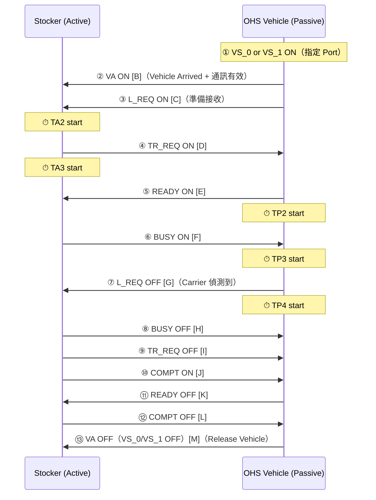
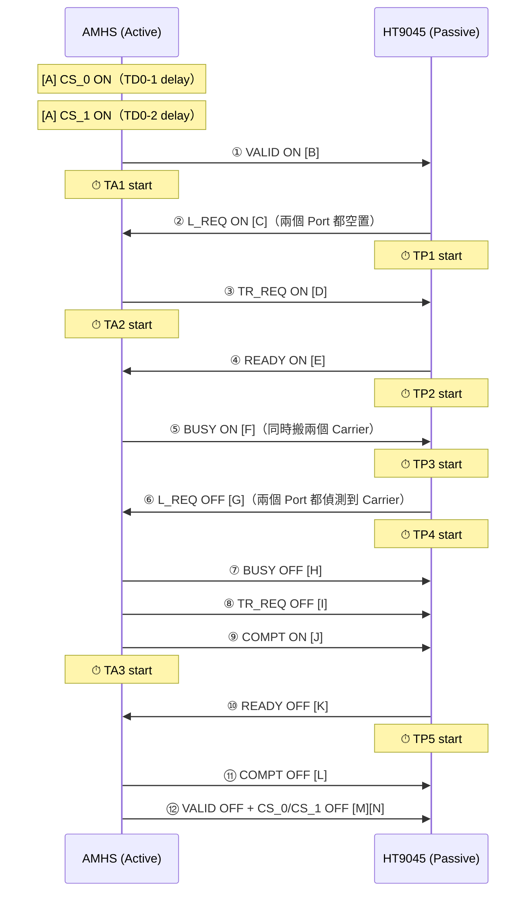
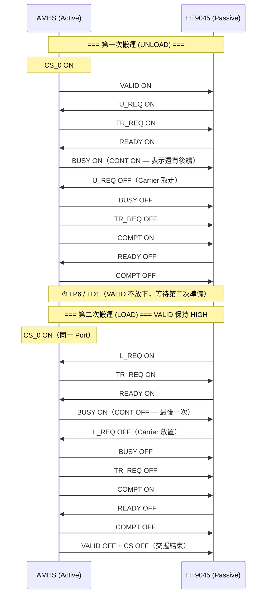
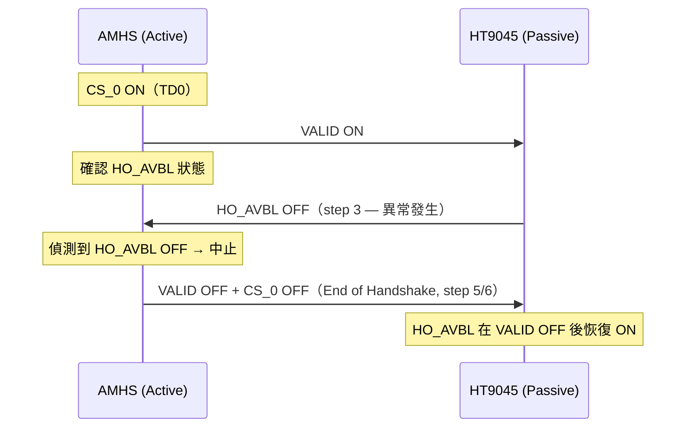
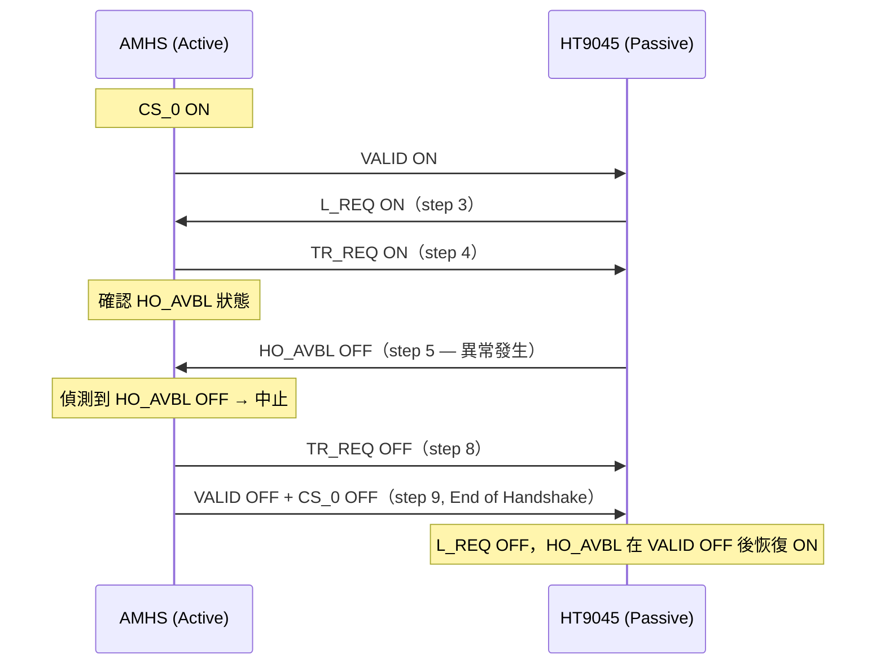

# SEMI E84-0304 Advanced Signal Time Diagrams

> 參考：SEMI E84_0304.pdf（SEMI E84-0304 版權 SEMI 1999, 2004）
> 最後更新：2026-04-15
> 主參考文件：[SEMI-E84-Reference.md](SEMI-E84-Reference.md)

---

## 1. Figure 14 & 15: Single Handoff — Interbay Passive OHS（PDF p.16–17）

適用於 **OHS (passive type)** 與 **Stocker (active type)** 之間。
使用 `VA / VS_0 / VS_1` 取代 `VALID / CS_0 / CS_1`。

### 1.1 Figure 14: OHS LOAD

| 差異點 | Figure 12（標準 AGV） | Figure 14（OHS passive） |
|:---|:---|:---|
| Port 指定 | Active 送 CS_0/CS_1 | **Passive** OHS 送 VS_0/VS_1 |
| 通訊啟始訊號 | Active 送 VALID | **Passive** OHS 送 VA |
| AM_AVBL | 無 | Active Stocker 需送 AM_AVBL ON |
| 結束訊號 | Active 放下 VALID + CS | **Passive** OHS 放下 VA + VS |

### 1.2 Figure 15: OHS UNLOAD

與 Figure 14 相同，L_REQ → U_REQ，Step 7 為 Carrier 移除。

---

## 2. Figure 16 & 17: Simultaneous Handoff（PDF p.18）

### 2.1 Figure 16: Simultaneous LOAD（標準 AGV）

兩個 Load Port **同時** 交換，Active 使用 **CS_0 AND CS_1 同時 ON**。

| 項目 | Single Handoff | Simultaneous Handoff |
|:---|:---|:---|
| CS 設定 | CS_0 OR CS_1 | CS_0 AND CS_1 同時 ON |
| L_REQ ON 條件 | 一個 Port 空置 | **兩個** Port 都空置 |
| L_REQ OFF 條件 | 一個 Port 偵測到 Carrier | **兩個** Port 都偵測到 Carrier |

---

## 3. Figures 18 & 19: Continuous Handoff（PDF p.19–20）

AMHS 連續搬運兩個以上 Carrier，VALID 不放下，CONT 訊號標示持續模式。

### 3.1 Figure 18: Continuous Handoff（UNLOAD → LOAD）

### 3.2 Figure 19: Continuous Handoff（LOAD → LOAD，不同 Port）

與 Figure 18 相同，但第二次搬運指定不同 Port（CS_0 → CS_1）。

---

## 4. Figures 20–26: HO_AVBL Signal Examples（PDF p.21–24）

HO_AVBL 可在不同時間點變為 OFF，Active 偵測到後必須中止交握。

### 4.1 HO_AVBL 觸發時機分類

| Figure | HO_AVBL OFF 時機 | AGV 反應 |
|:---:|:---|:---|
| Fig.20 | VALID ON 後，L_REQ ON **前**（Active 確認中） | 放下 VALID + CS，結束 |
| Fig.21 | VALID ON **之後**（L_REQ ON 前） | 放下 VALID + CS，結束 |
| Fig.22 | Active 到達**之前** HO_AVBL 就已 OFF | 偵測後不開始，結束 |
| Fig.23 | Active 到達**之前** HO_AVBL 已 OFF | 同上 |
| Fig.24 | **TR_REQ ON 後**，READY ON 前（Active 確認中） | 放下 TR_REQ + VALID + CS |
| Fig.25 | TR_REQ ON **之後** | 放下 TR_REQ + VALID + CS |
| Fig.26 | L_REQ ON **之後**，TR_REQ 送出後 | 放下 TR_REQ + VALID + CS |

### 4.2 Figure 20–23 共同流程（VALID 到 L_REQ 間）

### 4.3 Figure 24–26 共同流程（TR_REQ 送出後）

---

## 5. Figures 27–29: HO_AVBL Examples (Interbay OHS)（PDF p.25–26）

OHS (passive) 場景下的 HO_AVBL 異常，與 Figures 24–26 邏輯相同，但訊號改用 VA/VS_0/VS_1/AM_AVBL。

| Figure | HO_AVBL OFF 時機 | Active Stocker 反應 |
|:---:|:---|:---|
| Fig.27 | TR_REQ ON 後，Active 確認中 | 放下 AM_AVBL，TR_REQ OFF，等 VA OFF |
| Fig.28 | TR_REQ ON **之後** | 同 Fig.27 |
| Fig.29 | VA ON **之後** | 同 Fig.27 |

共同結束條件：Passive OHS 放下 VS_0/VS_1 後再放下 VA；Active 放下 AM_AVBL。

---

## 6. 關鍵規則摘要

| 規則 | 說明 |
|:---|:---|
| L_REQ ON 前提 | Load Port 必須空置（BUSY OFF 確認） |
| BUSY ON 前提 | READY 必須已 ON |
| BUSY OFF 前提 | Active 必須確認 L_REQ（U_REQ）已 OFF |
| COMPT ON 後 | Passive 才可放下 READY |
| READY OFF 後 | Active 才可放下 COMPT |
| HO_AVBL OFF | Passive 設備優先下降，Active 必須中止並退出 |
| ES OFF | Passive 緊急停止，Active 必須立即停止物理動作 |
