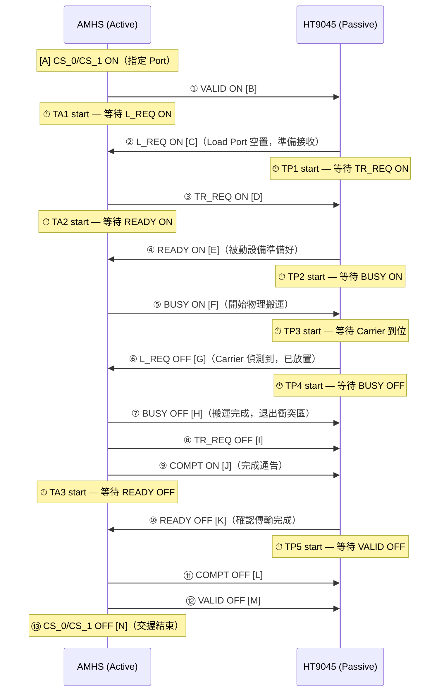
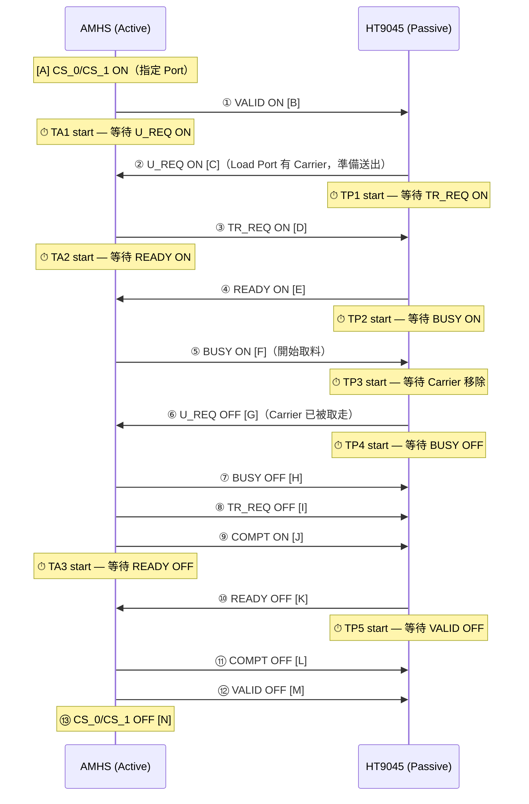
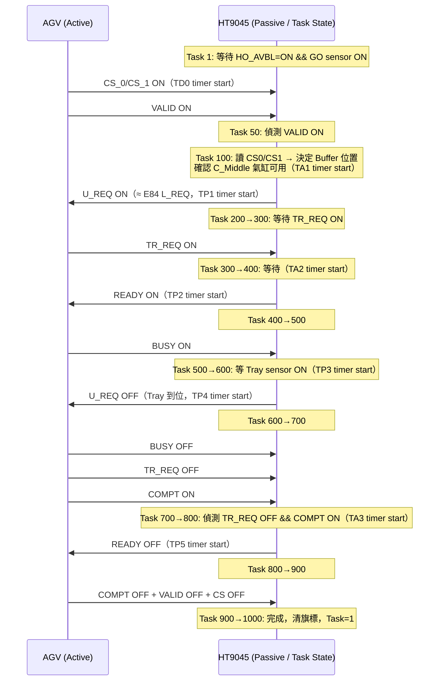
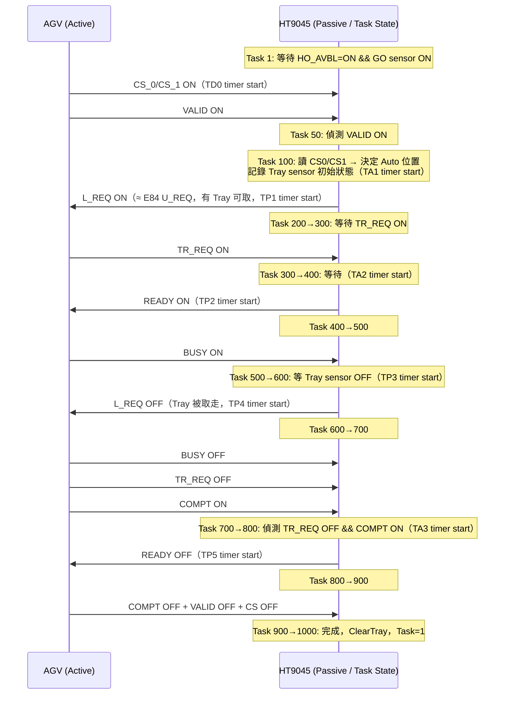

# SEMI E84-0304 Enhanced Carrier Handoff Parallel I/O Interface

> 參考：SEMI E84_0304.pdf（SEMI E84-0304 版權 SEMI 1999, 2004）
> 最後更新：2026-04-15
> 進階時序圖：[SEMI-E84-Diagrams-Advanced.md](SEMI-E84-Diagrams-Advanced.md)

---

## 1. 概述

SEMI E84 定義標準 **Enhanced Carrier Handoff Parallel I/O Interface**，用於被動設備 (Passive Equipment) 與主動物料搬運系統 (AMHS, Active Equipment) 之間載具 (Carrier/FOUP) 的交換與傳遞。
- **Active Equipment**：AGV / RGV / OHT / OHS 等主動介入搬運的設備。
- **Passive Equipment**：半導體機台 / Stocker 等被動接收載具的設備。HT9045 屬於此類。

### 支援功能

- 同時支援送料 (Load) 與出料 (Unload) 的 PI/O 交換。
- 支援單次交換 (Single Handoff)、同時交換 (Simultaneous Handoff)、連續交換 (Continuous Handoff)。
- 確保設備與搬運車輛間的安全交握。異常狀態偵測與復原處理機制。
- 支援 300 mm Load Port 規格要求（SEMI E15.1）。

---

## 2. 訊號定義

### 2.1 主動設備 (Active → Passive) 訊號

| 訊號名稱 | 方向 | 說明 |
|:---|:---:|:---|
| **VALID** | A→P | 介面通訊有效。ON = 有效；OFF = 無效。須在 CS_0/CS_1 設定後才拉起。 |
| **CS_0** | A→P | 指定左側 Load Port（1 PI/O per 2 load ports）；單一 Port 時固定 ON。 |
| **CS_1** | A→P | 指定右側 Load Port；CS_0 & CS_1 同時 ON = Simultaneous Handoff。 |
| **TR_REQ** | A→P | Transfer Request，AMHS 要求進行載具交換。BUSY OFF 後才可 OFF。 |
| **BUSY** | A→P | 物理搬運進行中。READY 必須 ON 才能拉起。 |
| **COMPT** | A→P | Transfer Complete。BUSY OFF 後拉起，READY OFF 後放下。 |
| **CONT** | A→P | Continuous Handoff 模式。第一次 BUSY ON 時拉起；最後一次 BUSY ON 時放下。 |
| **AM_AVBL** | A→P | Transfer Arm Available（僅 interbay OHS / Stocker）。 |

### 2.2 被動設備 (Passive → Active) 訊號

| 訊號名稱 | 方向 | 說明 |
|:---|:---:|:---|
| **L_REQ** | P→A | Load Port 準備好接收載具（Active→Passive 搬運）。Carrier 偵測到後 OFF。 |
| **U_REQ** | P→A | Load Port 準備好送出載具（Passive→Active 搬運）。Carrier 移除後 OFF。 |
| **READY** | P→A | 被動設備準備好物理交換。COMPT ON 後 OFF。 |
| **HO_AVBL** | P→A | Handoff Available。正常時 ON；異常（手動模式 / Carrier 偵測錯誤等）時 OFF。 |
| **ES** | P→A | Emergency Stop。正常時 ON；EMO / 安全門開啟時 OFF。 |
| **VA** | P→A | Vehicle Arrived（僅 interbay passive OHS）。 |
| **VS_0 / VS_1** | P→A | Load Port 選擇（僅 interbay passive OHS）。 |

### 2.3 Load Port 指定（CS_0 / CS_1）

| CS_0 | CS_1 | 功能 |
|:---:|:---:|:---|
| ON | OFF | 單一 Port 或左側 Port |
| OFF | ON | 右側 Port |
| ON | ON | Simultaneous Handoff（兩 Port 同時交換） |

---

## 3. 交握區間 (Zones) 與邊界 (Boundaries)

### 3.1 Boundary 定義（PDF Table 5）

| Boundary | 說明 |
|:---:|:---|
| **A** | Active 設定 Port（CS_0/CS_1 ON） |
| **B** | Active 拉起 VALID，嘗試建立通訊 |
| **C** | Passive 回應 L_REQ 或 U_REQ，表示接受通訊 |
| **D** | Active 拉起 TR_REQ，同意傳輸方向 |
| **E** | Passive 拉起 READY |
| **F** | 物理搬運開始（BUSY ON）/ 指定 Continuous Handoff |
| **G** | Passive 偵測到 Carrier 已放置 / 移除 |
| **H** | 物理搬運結束（BUSY OFF） |
| **I** | Active 放下 TR_REQ |
| **J** | Active 拉起 COMPT |
| **K** | Passive 放下 READY |
| **L** | Active 放下 COMPT |
| **M** | Active 放下 VALID |
| **N** | Active 放下 CS_0/CS_1 |

### 3.2 Zone 定義（PDF Table 6）

| Zone | 範圍 | 開始 | 結束 |
|:---|:---:|:---|:---|
| Handshake Active | B → M | VALID ON | VALID OFF（Continuous 為最後一次） |
| Handshake Engaged | C → L | L_REQ/U_REQ ON | COMPT OFF |
| Handoff Request | C → L | L_REQ/U_REQ ON | COMPT OFF |
| Handoff Active | E → J | READY ON | COMPT ON |
| Physical Handoff | F → H | BUSY ON | BUSY OFF |

---

## 4. 計時器與逾時 (Timers)

### 4.1 Active Equipment Timer（PDF Table 7）

| 計時器 | 監測區間 | 範圍 | TYP |
|:---:|:---|:---:|:---:|
| **TA1** | VALID ON → L_REQ ON 或 U_REQ ON | 1–999 s | 2 s |
| **TA2** | TR_REQ ON → READY ON | 1–999 s | 2 s |
| **TA3** | COMPT ON → READY OFF | 1–999 s | 2 s |

### 4.2 Passive Equipment Timer（PDF Table 8）

| 計時器 | 監測區間 | 範圍 | TYP |
|:---:|:---|:---:|:---:|
| **TP1** | L_REQ ON → TR_REQ ON（U_REQ 同） | 1–999 s | 2 s |
| **TP2** | READY ON → BUSY ON | 1–999 s | 2 s |
| **TP3** | BUSY ON → Carrier 偵測（Load）或移除（Unload） | 1–999 s | **60 s** |
| **TP4** | L_REQ OFF → BUSY OFF（U_REQ 同） | 1–999 s | **60 s** |
| **TP5** | READY OFF → VALID OFF | 1–999 s | 2 s |
| **TP6** | VALID OFF → VALID ON（Continuous 間隔） | 1–999 s | 2 s |

### 4.3 Delay Timer（PDF Table 9）

| 計時器 | 監測區間 | 範圍 | TYP |
|:---:|:---|:---:|:---:|
| **TD0** | CS ON → VALID ON | 0.1–0.2 s | 0.1 s |
| **TD1** | VALID OFF → VALID ON（Continuous） | 1–999 s | 1 s |

---

## 5. 交握時序圖 (Signal Time Diagrams)

### 5.1 Figure 12: Single Handoff — LOAD（PDF p.15）

AMHS 將 Carrier **放上** HT9045 Load Port（Active → Passive 方向搬運）。

#### 步驟對照表（Figure 12 LOAD）

| 步驟 | Boundary | 訊號 | 執行方 | 說明 | Timer 啟動 | AGV.cpp Task |
|:---:|:---:|:---:|:---:|:---|:---|:---:|
| 1 | A | CS_0/CS_1 ↑ | Active | 指定 Load Port | TD0（CS→VALID） | Task 1 |
| 2 | B | VALID ↑ | Active | 通訊有效（TD0 後） | TA1（等 L_REQ） | Task 50 |
| 3 | C | L_REQ ↑ | Passive | Load Port 空，準備接收 | TP1（等 TR_REQ） | Task 200 ¹ |
| 4 | D | TR_REQ ↑ | Active | 要求傳輸 | TA2（等 READY） | Task 300 |
| 5 | E | READY ↑ | Passive | 準備好物理交換 | TP2（等 BUSY） | Task 400 |
| 6 | F | BUSY ↑ | Active | 開始物理搬運 | TP3（等 Carrier） | Task 500 |
| 7 | G | L_REQ ↓ | Passive | Carrier 到位 | TP4（等 BUSY OFF） | Task 600 |
| 8 | H | BUSY ↓ | Active | 完成，退出衝突區 | — | Task 700 |
| 9 | I | TR_REQ ↓ | Active | BUSY OFF 後緊接 | — | Task 700 |
| 10 | J | COMPT ↑ | Active | 完成通告 | TA3（等 READY OFF） | Task 700 |
| 11 | K | READY ↓ | Passive | 確認完成 | TP5（等 VALID OFF） | Task 800 |
| 12 | L | COMPT ↓ | Active | READY OFF 後 | — | Task 900 |
| 13 | M | VALID ↓ | Active | 放下通訊 | — | Task 900 |
| 14 | N | CS_0/CS_1 ↓ | Active | 交握結束 | — | Task 900 |

> ¹ AGV.cpp 中使用 `SwE84_1_UREQ`（非 L_REQ），詳見 Section 8.1。

---

### 5.2 Figure 13: Single Handoff — UNLOAD（PDF p.16）

AMHS 將 Carrier **從** HT9045 Load Port 取走（Passive → Active 方向搬運）。
時序結構與 Figure 12 完全相同，僅三處不同：

#### Figure 12 vs Figure 13 差異

| 項目 | Figure 12 (LOAD) | Figure 13 (UNLOAD) |
|:---|:---|:---|
| 方向 | Active → Passive（放入 Carrier） | Passive → Active（取出 Carrier） |
| Step 3 訊號 | **L_REQ** ON | **U_REQ** ON |
| Step 7 觸發條件 | Carrier 到位（sensor ON） | Carrier 被取走（sensor OFF） |
| Step 7 訊號 | **L_REQ** OFF | **U_REQ** OFF |
| AGV.cpp 使用 | `SwE84_1_UREQ`（命名反轉） | `SwE84_2_LREQ`（命名反轉） |

---

### 5.3 進階時序圖（Figures 14–29）

詳見 **[SEMI-E84-Diagrams-Advanced.md](SEMI-E84-Diagrams-Advanced.md)**：

| 圖號 | 內容 | 適用場景 |
|:---|:---|:---|
| Fig.14–15 | OHS (Passive) Single Handoff | interbay Stocker ↔ OHS |
| Fig.16 | Simultaneous Handoff (LOAD) | 雙 Port 同時交換 |
| Fig.17 | OHS Simultaneous Handoff | OHS 雙 Port |
| Fig.18–19 | Continuous Handoff | 連續交換（UNLOAD→LOAD / LOAD→LOAD） |
| Fig.20–26 | HO_AVBL Signal Examples | 各種 HO_AVBL OFF 場景 |
| Fig.27–29 | OHS HO_AVBL Examples | OHS 場景 HO_AVBL |

---

## 6. 錯誤指示與偵測 (Error Indication and Detection)

### 6.1 Error Indication（PDF Section 6.3.1）

| 類型 | 機制 | 說明 |
|:---|:---|:---|
| Handoff Unavailable | HO_AVBL OFF | 手動模式 / Carrier 感測錯誤 / 設備未就緒 |
| Emergency Stop | ES OFF | EMO 按下 / 安全門開啟 / Carrier 機器人故障 |
| Timeout Error | Timer 逾時 | TA1-3 / TP1-6 / TD0-1 各計時器逾時 |

### 6.2 Timeout Error Messages（PDF Tables A1-8, A1-9, A1-10）

| Timer | 示範錯誤訊息 |
|:---:|:---|
| TA1 | TA1 Timeout — L_REQ/U_REQ did not turn ON within specified time. |
| TA2 | TA2 Timeout — READY did not turn ON within specified time. |
| TA3 | TA3 Timeout — READY did not turn OFF within specified time. |
| TP1 | TP1 Timeout — TR_REQ did not turn ON within specified time. |
| TP2 | TP2 Timeout — BUSY did not turn ON within specified time. |
| TP3 | TP3 Timeout — Carrier was not detected/removed within specified time. |
| TP4 | TP4 Timeout — BUSY did not turn OFF within specified time. |
| TP5 | TP5 Timeout — VALID did not turn OFF within specified time. |
| TP6 | TP6 Timeout — VALID did not turn ON within specified time. |
| TD0 | TD0 Timeout — VALID did not turn ON within specified time. |
| TD1 | TD1 Timeout — VALID did not turn ON within specified time. |

### 6.3 HO_AVBL 觸發條件（PDF Table A1-6）

| HO_AVBL 狀態 | 場景 |
|:---:|:---|
| OFF | Presence Sensor ON 但 Placement Sensor OFF（或反之） |
| OFF | 設備切換至 Manual Access Mode |
| OFF | FOUP 已 Docked 或移至 FIMS 介面 |
| OFF | Input Port 有 Carrier（internal buffer / stocker） |
| OFF | SEMI E15.1 Option 1 Light Curtain 錯誤 |
| OFF | Auto Access Mode 下手動放置 FOUP |
| OFF | ES Signal OFF |
| ON | SEMI E15.1 Option 3 Light Curtain 錯誤（non-automated） |
| ON | 機器人異常但不在目標 Load Port |

---

## 7. 接頭與腳位 (Connector & Pin Assignment)

- Passive 側接頭：DB-25 Socket (Female)，ISO 4902
- 電源：+24 Vdc Nominal（Min +18V, Max +30V）
- ON State：≤ 1.8 Vdc；OFF State：≤ 30 Vdc
- 詳見 PDF Table 11 / Figure 35（Passive 側）/ Figure 36（Active 側）

---

## 8. HT9045 AGV.cpp 程式碼流程對應

> `AGV.cpp` 中 `DoE84Loader()` / `DoE84Unloader()` 為狀態機架構。
> HT9045 = **Passive Equipment**，AGV/AMR = **Active Equipment**。

### 8.1 訊號命名差異（重要）

HT9045 實作中 L_REQ / U_REQ 命名與 E84 規格**反轉**：

| HT9045 函式 | 物理方向 | E84 規格應用訊號 | HT9045 實際訊號 | 備註 |
|:---|:---|:---:|:---:|:---|
| `DoE84Loader()` | AGV 放 Tray 到 Buffer | **L_REQ** | `SwE84_1_UREQ` | 命名反轉 |
| `DoE84Unloader()` | AGV 從 Auto 取走 Tray | **U_REQ** | `SwE84_2_LREQ` | 命名反轉 |

> 硬體接線已配合此命名，交握流程本身與規格邏輯一致。

### 8.2 DoE84Loader()（Port 1 — AGV 放料對應 Figure 12 LOAD）

### 8.3 DoE84Unloader()（Port 2 — AGV 取料對應 Figure 13 UNLOAD）

### 8.4 Task 狀態機完整對照表

| Task | E84 Boundary | 等待條件 | 動作 | Timer | 超時 → |
|:---:|:---:|:---|:---|:---|:---:|
| **1** | — | `HO_AVBL=ON` && `GO` sensor ON | — | TD0 | Task 50 |
| **50** | B | VALID ON | — | TD0 timeout | Task 5000 |
| **100** | C | CS0/CS1 讀取，C_Middle OFF | 決定目標 Buffer | TA1 | — |
| **200** | C | — | 設定 U_REQ / L_REQ ON | TP1 | Task 5000 |
| **300** | D | TR_REQ ON | — | TP1 timeout → TA2 | Task 5000 |
| **400** | E | — | 設定 READY ON | TP2 | Task 5000 |
| **500** | F | BUSY ON | — | TP2 timeout → TP3 | Task 5000 |
| **600** | G | Tray sensor ON/OFF | 設定 U_REQ / L_REQ OFF | TP3 timeout → TP4 | Task 5000 |
| **700** | H–J | TR_REQ OFF && COMPT ON | — | TP4 timeout → TA3 | Task 5000 |
| **800** | K | — | 設定 READY OFF | TP5 | Task 5000 |
| **900** | L–N | VALID OFF && COMPT OFF && CS OFF | — | TP5 timeout | Task 5000 |
| **1000** | — | — | 清旗標，Task=1 | — | — |
| **5000** | — | — | Auto Recover（btInital Click） | — | — |

### 8.5 Timer 陣列對照（AGV.ini → `iE84TimeOut_K12[]`）

| Index | Timer | 監測區間 | 預設值 | E84 規格 TYP |
|:---:|:---:|:---|:---:|:---:|
| `[0]` | TP1 | L/U_REQ ON → TR_REQ ON | 2 s | 2 s |
| `[1]` | TP2 | READY ON → BUSY ON | 2 s | 2 s |
| `[2]` | TP3 | BUSY ON → Carrier 偵測 | 60 s | 60 s |
| `[3]` | TP4 | L/U_REQ OFF → BUSY OFF | 60 s | 60 s |
| `[4]` | TP5 | READY OFF → VALID OFF | 2 s | 2 s |
| `[5]` | TP6 | VALID OFF → VALID ON（Continuous） | 2 s | 2 s |
| `[6]` | TA1 | VALID ON → L/U_REQ ON | 2 s | 2 s |
| `[7]` | TA2 | TR_REQ ON → READY ON | **120 s** | 2 s |
| `[8]` | TA3 | COMPT ON → READY OFF | **60 s** | 2 s |
| `[9]` | TD0 | CS ON → VALID ON | **60 s** | 0.1 s |
| `[10]` | TD1 | VALID OFF → VALID ON | **60 s** | 1 s |

> **備註**：TA2/TA3/TD0 預設值遠大於規格。
> 這是為了允許 HT9045 Buffer 氣缸動作、AGV 行走時間等現場需求。

### 8.6 程式碼與 E84 規格差異摘要

| # | 項目 | E84 規格 | HT9045 實作 | 影響 |
|:---:|:---|:---|:---|:---|
| 1 | L_REQ / U_REQ 命名 | L_REQ=Load, U_REQ=Unload（由 Passive 送出） | **反轉**：Loader 用 UREQ，Unloader 用 LREQ | 硬體接線配合，功能等效 |
| 2 | Step 8–10 檢查方式 | BUSY OFF → TR_REQ OFF → COMPT ON（依序） | Task 700 同時檢查 `TR_REQ OFF && COMPT ON` | 等效，但跳過 BUSY OFF 獨立確認 |
| 3 | HO_AVBL / ES 控制 | Passive 依實際狀態控制 | `#ifndef SOFT_SIMULTE` 強制 ON | 非模擬模式下始終 ON，需另行管理 |
| 4 | Continuous Handoff | CONT 訊號，VALID 保持 HIGH | 未實作 | 只支援 Single Handoff |
| 5 | VA / VS_0 / VS_1 | interbay OHS 專用 | Switch 已定義，主流程未使用 | 預留介面，未啟用 |

---

## 9. 相關標準

- SEMI E5 — SECS-II Message Content
- SEMI E15.1 — Specification for 300 mm Tool Load Port
- SEMI E23 — Specification for Cassette Transfer Parallel I/O Interface
- SEMI E30 — GEM (Generic Equipment Model)
- SEMI E37 — HSMS
- SEMI E87 — Carrier Management (CMS)
