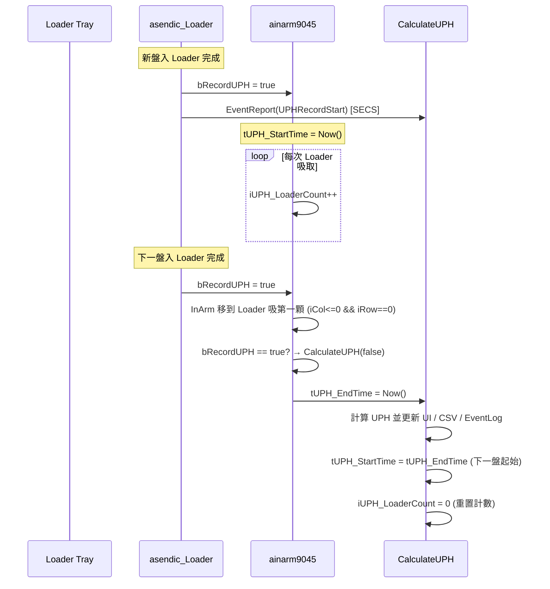

> 保存來源：`.claude/skills/ht9045-uph-model/references/uph-existing-realtime-method.md`，main `76dd45f37`。原文機型、版本與日期維持原標註；原程式碼行號僅為歷史定位，新查證依function／關鍵變數；目前共同項與差異先看 [共用對照](../../common.md)。

<!-- preserved-content:start -->
# 機台既有 UPH 計算方式（Per-Tray Real-Time UPH）

## 概述

機台目前的 UPH 計算是 **「每盤實測 UPH」**：
從 Loader 第一次吸料開始計時，到**下一盤**第一顆吸料時結束計時，
用這段時間推算「每小時可處理幾顆 IC」。

$$\text{Per-Tray UPH} = \frac{3600}{\text{耗時（秒）} - \text{暫停時間}} \times \text{吸盤數量}$$

這是 **後驗式**（事後量測），不是預測，只能在跑完一整盤後才知道 UPH。

---

## 時序流程



---

## 關鍵變數

| 變數 | 型別 | 定義位置 | 說明 |
|------|------|---------|------|
| `bRecordUPH` | bool | cmydef.h | UPH 計算觸發旗標。asendic_Loader 在新盤入位後設為 true |
| `tUPH_StartTime` | TDateTime | ainarm9045.cpp | 本盤起始時間（`Now()`） |
| `tUPH_EndTime` | TDateTime | ainarm9045.cpp | 本盤結束時間（`Now()`） |
| `tUPH_PauseTime` | TDateTime | ainarm9045.cpp | 累計暫停時間（Pause 期間累加） |
| `iUPH_LoaderCount` | int | ainarm9045.cpp | 本盤 Loader 吸取次數（每吸一次 Loader ++） |
| `RunInfo.iUPH` | int | 全域 | 本盤 UPH 結果 |
| `RunInfo.iAvgUPH` | AnsiString | 全域 | 最近 10 盤平均 UPH |
| `bOneTimes` | bool | ainarm9045.cpp | 首盤標記（第一盤只初始化不計算） |

---

## 程式碼來源

### 觸發點：`asendic_Loader.cpp` line ~1190

當 Loader 補入新盤完成後，設定旗標並發 SECS 事件：

```cpp
bRecordUPH = true;
// ...
if (IniConfig.bEnable_SECS_GEM == true)
    EventReport(SECS_EVENT.UPHRecordStart);   // CEID 53: UPH Record Start
```

### 計數點：`ainarm9045.cpp` line ~2755

每次 InArm 從 Loader 成功吸取一排 IC 後累計：

```cpp
iUPH_LoaderCount++;
```

### 計算觸發：`ainarm9045.cpp` line ~5226

InArm 移到 Loader 準備吸**下一盤第一顆** (iCol<=0 && iRow==0) 時，
檢查 `bRecordUPH == true` 則呼叫計算：

```cpp
if (bRecordUPH && iCol <= 0 && iRow == 0)
{
    bRecordUPH = false;
    CalculateUPH(false);
}
```

> 32-Site 模式（`ainarm9045_2x8_32.cpp` line ~1163）有同樣的呼叫。

### 核心計算：`CalculateUPH(bool bReset)` — ainarm9045.cpp line ~4912

```cpp
void __fastcall CalculateUPH(bool bReset)
{
    // bReset=true：首次 / Lot Start → 只初始化，不算
    // bReset=false：正常盤結束 → 計算

    tUPH_EndTime = Now();
    tConsumeSecond = (tUPH_EndTime - tUPH_StartTime);  // 總耗時（含暫停）
    tConsumeSecond = tConsumeSecond - tUPH_PauseTime;   // 扣掉暫停

    // 把 TDateTime 差值拆成秒數
    DecodeTime(tConsumeSecond, Hour, Min, Sec, MSec);
    fConsumeSecond = Hour*3600.0 + Min*60.0 + Sec + MSec/1000.0;

    if (fConsumeSecond > 0)
        fTimerMultiple = 3600 / fConsumeSecond;     // 一小時有幾個這樣的區間
    else
        fTimerMultiple = 0;

    RunInfo.iUPH = fTimerMultiple * iUPH_LoaderCount;   // UPH = 倍率 × 吸盤數

    // 重置：下一盤的起點 = 本盤的終點
    tUPH_StartTime = tUPH_EndTime;
    tUPH_PauseTime = 0;
    iUPH_LoaderCount = 0;

    // 計算最近 10 盤平均 UPH
    for (i = 1..10) iTotalUPH += Grid[3][i];
    RunInfo.iAvgUPH = iTotalUPH / iCount;
}
```

---

## UI 顯示

### UPH_StringGrid（位於 fShowBinSelect 表單）

| 欄 | 內容 | 來源 |
|----|------|------|
| Col 0 | Start Time (hh:nn:ss) | `tUPH_StartTime.FormatString()` |
| Col 1 | End Time (hh:nn:ss) | `tUPH_EndTime.FormatString()` |
| Col 2 | Pause Time (hh:nn:ss) | `tUPH_PauseTime.FormatString()` |
| Col 3 | UPH | `RunInfo.iUPH` |
| Col 4 | Elaps. Time | 純耗時（VTEST 限定） |
| Col 5 | Total Units | `iUPH_LoaderCount`（VTEST 限定） |
| Col 6 | Site | 開放 Site 數（VTEST 限定） |

- Row 0：標頭
- **Row 1**：最新一盤
- Row 2~10：歷史（FIFO 上移）
- Row 12：平均 UPH

### StatusBar

```cpp
fMain->StatusBar1->Panels->Items[2]->Text = "UPH = " + UPH值;
```

---

## CSV 記錄

### 標準格式（`IniConfig.bP11RecordUPH`）

路徑：`as9045UPH\<LotID>_UPH.csv`

```
Start Time, End Time, Pause Time, UPH
08:30:15, 08:32:45, 00:00:00, 2880
```

### FOREHOPE 格式（CC_FOREHOPE_NINGBO）

路徑：`as9045UPH\YYYY\M\D\YYMMDD_UPH.csv`

```
Start Time, End Time, Pause Time, UPH, Tray Count, Site Count
08:30:15, 08:32:45, 00:00:00, 2880, 2, 8
```

### EventLog

每盤結束呼叫 `MyDBIUPH(RunInfo.iUPH)` 寫入 Handler.db3 EventLog。

---

## SECS/GEM 通知

| CEID | 事件 | 觸發時機 |
|------|------|---------|
| `SECS_EVENT.UPHRecordStart` (53) | UPH Record Start | 新盤入 Loader 完成時 |
| `SECS_EVENT.UPHRecordEnd` (54) | UPH Record End | CalculateUPH 計算完成後 |

---

## 與解析式 UPH 公式的差異

| 特性 | 機台實測 UPH | 解析式公式 |
|------|------------|-----------|
| 計算時機 | 事後（跑完一盤才知道） | 事前（輸入條件即可預測） |
| 精度 | 包含所有真實因素（JAM、retry、idle） | 穩態理論值，不含異常 |
| 用途 | 客戶驗收、生產監控 | 客戶報價、規格承諾 |
| 暫停扣除 | 有（`tUPH_PauseTime`） | 不適用 |
| 量測單位 | 一盤 IC 的完整 cycle | 單顆 IC 的 cycle time × site |
| 首盤 | 不計算（`bOneTimes` / `bReset`） | 不區分 |

### 驗證互補

- 解析式公式給出理論 UPH
- 機台實測 UPH 作為對照
- 誤差 > 5% → 排查異常（JAM rate、Auto Clean 頻率、Loader empty idle、ATC 等溫）

<!-- preserved-content:end -->
