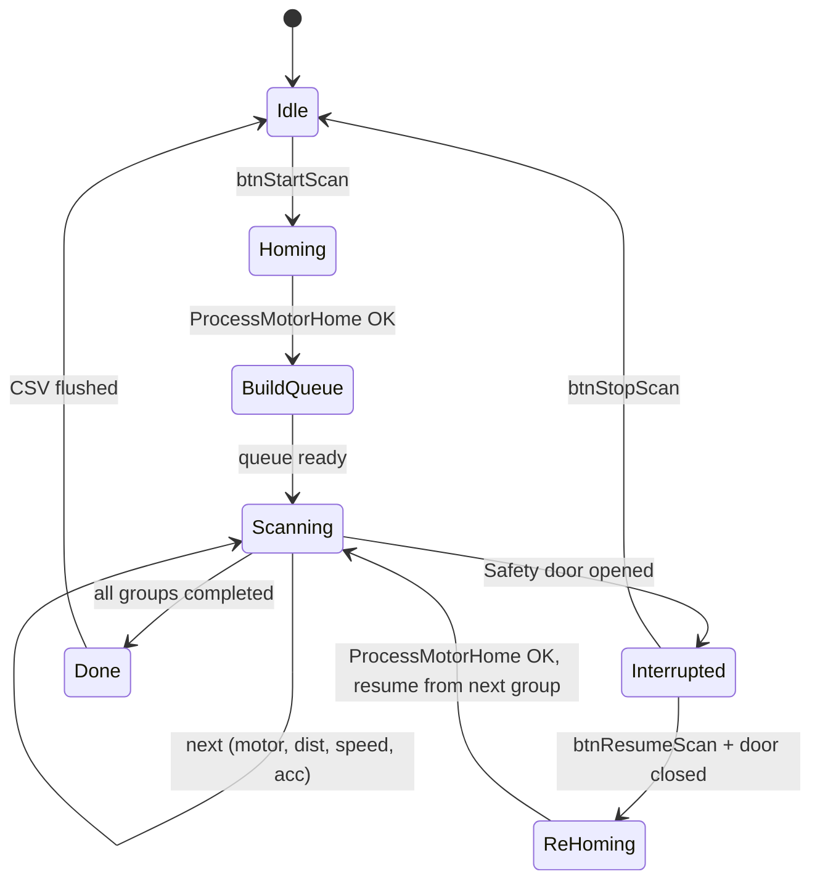

> 保存來源：`.claude/skills/ht9045-uph-model/references/uph-motor-time-table.md`，main `76dd45f37`。原文機型、版本與日期維持原標註；原程式碼行號僅為歷史定位，新查證依function／關鍵變數；目前共同項與差異先看 [共用對照](../../../common.md)。

<!-- preserved-content:start -->
## 7. 安全門中斷 → 重新初始化

### 每 Task step 入口檢查

```cpp
case UPHSCAN_MOVE:
    if (CheckSafeDoorIsClosed() == false) {
        StopAndReinitUPHScan("Safety door opened");
        return;
    }
    // ... 正常移動邏輯
```

### 中斷後流程

安全門被開啟時：

1. **立即停止**所有馬達：`MOT[i].PCIL132_StopMotor()` / `Gali_Command("ST")`
2. **Flush CSV**：已完成的資料寫入磁碟不丟失
3. **狀態重新初始化**：
   - `iUPHScanTask = UPHSCAN_INTERRUPTED`
   - 清除當前馬達的本次 run 暫存（不含已完成馬達）
   - 保留已完成馬達的 CSV 資料
4. **顯示警告 Memo**：`"Safety door opened at M11 Speed 45%, scan paused"`
5. **等待使用者操作**：
   - 安全門關閉後，`btnResumeScan` 可用
   - Resume → **重新歸零** (`ProcessMotorHome(0)`) → **從中斷點的下一組繼續**
   - 或 `btnStopScan` → 終止 scan、Flush CSV

### 為何必須重新歸零

安全門開啟 → 技術人員可能手動移動機構 → 馬達 encoder 位置可能漂移或不可信
→ 必須重新 Home 才能確保後續移動距離正確。

### 狀態流程圖



---


<!-- preserved-content:end -->
