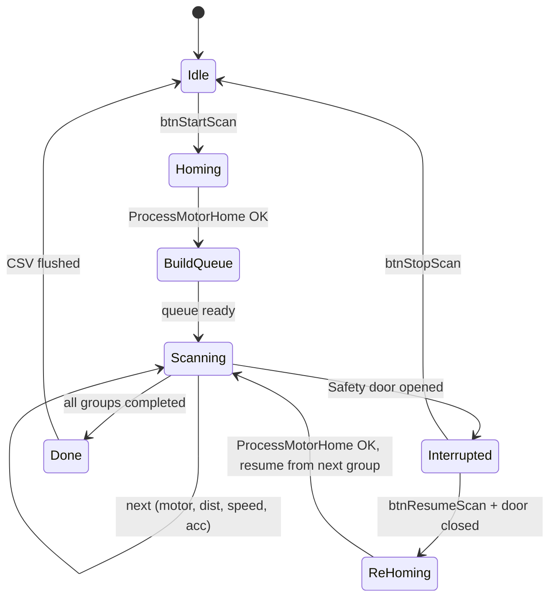

# MotorProfiler 校正表規格

## 0. 架構總覽（三方混合：埋點 + uMotorTest 補位 + Excel）

本系統由三個元件協作收集 / 視覺化 / 計算 UPH 校正資料，**共用同一份 CSV schema** 與輸出目錄。

| 元件 | 角色 | 觸發 | 風險 | 涵蓋率 |
|------|------|------|------|--------|
| **Phase 1A — 流程埋點** | 量產被動收集真實 cycle 時間 | 量產自動（IniConfig 開關） | 極低（read-only，只加 `LatchCycleTime` + CSV append） | 取決於客戶實跑條件 |
| **Phase 1B — uMotorTest UPH Profiler Tab** | (1) 控制 1A 開關 (2) Coverage Map 視覺化 (3) Smart 補位掃描缺資料的格子 (4) UPH 即時試算 | Service mode 手動 | 補位掃描沿用 `InArmContinuousMove_9045` / `OutArmContinuousMove_9045`，撞機風險可控 | 補滿 1A 漏的格子 |
| **Phase 2 — Excel UPH 計算器** | 把 CSV 灌入做擬合與預測 | 離線分析 | 零 | 全條件矩陣 |

### 為何三方混合最強

| 痛點 | 解法 |
|------|------|
| 純埋點：客戶條件固定，高 Speed%/低 Acc% 永遠收不到 | uMotorTest 補位填洞 |
| 純掃描：占機 2 天 + 撞機風險 | 80% 資料來自真實流程，補位通常 30 分內完成 |
| 純掃描：每次都從頭跑 | Coverage 持續累積，越用越少 |
| 客戶要新條件預測 | Coverage Map 一看就知有無資料 |

### 共用資料介面

```
D:\HT9045_Log\UPH_Profile\
  YYYY\MM\
    UPH_<MachineModel>_<MachineSN>_<YYYYMMDD>.csv   ← 1A 與 1B 都 append 到這份
  latest.csv                                          ← 指向最新主檔
```

CSV schema 詳見 §2；同一份檔可同時被 1A 量產寫入、1B Coverage Map 讀取、Excel 計算器分析。

### 實作優先順序

| 順序 | 內容 | 預估 | 立即價值 |
|------|------|------|---------|
| 1 | **Phase 1A** 流程埋點（InArm/OutArm/Index/Shuttle/TrayArm 呼叫點 + `uUPHProfileLog.h/.cpp` + `IniConfig.bP11_1_RecordFlowProcessTime`） | 1~2 天 | 量產即收資料 |
| 2 | **Phase 1B-1** uMotorTest Tab Coverage Map（純讀 CSV 顯示熱圖） | 1 天 | 立即看到資料密度 |
| 3 | **Phase 1B-3** UPH 即時試算（查表 + 線性內插 + 三平行規則） | 1 天 | 客戶問即時答 |
| 4 | **Phase 2** Excel UPH_Calculator.xlsx | 0.5 天 | 離線報告 |
| 5 | **Phase 1B-2** Smart 補位掃描（沿用 ContinuousMove + interlock，**只掃 coverage=0 格子**） | 2~3 天 | 跑 1~2 週後再評估必要性 |

**建議先做 1→4**（共 ~4 天），跑一段時間後再決定是否實作 Phase 1B-2 補位掃描。

---

## 1. 校正策略（適用於 Phase 1B 補位掃描）

> **注**：本節描述的 Teach 座標 + 多段距離掃描方式，主要服務 **Phase 1B Smart 補位掃描**。
> Phase 1A 流程埋點不需建立 scan queue，只在既有呼叫點插入計時即可（詳見 §11）。

### 距離模式：Teach 座標導出（取代固定距離）

**不使用固定 10mm/100mm/全行程**，改從每顆馬達的實際 Teach 座標
+ 機台固定尺寸導出 **1~4 段**移動距離，讓量測結果直接反映真實生產行程。

| 距離段 | 來源 | 舉例 |
|--------|------|------|
| Short | Teach 最短段 | Z Safe ↔ Z Pick (≈5~15mm) |
| Mid | Teach 中段 | X Loader ↔ HotPlate |
| Long | Teach 全行程 | X Loader ↔ Shuttle |

各馬達距離對照表：

### InArm（使用 `InArmContinuousMove_9045` 完整移動原語）

InArm 真實生產時每一次移動都呼叫 `InArmContinuousMove_9045()`，
此函式是**完整的 Arm 移動原語**，內含：

1. `MoveInArmZToPlateSafe()` — 所有 Z 軸先回安全高度
2. `InArmPitchMove(Vari, YVari)` — X/Y Pitch 調整
3. `PCIL112_InArmXYMove(X, Y)` — X+Y 同動到目標
4. `InArmZMoveDown(ZDownSel, iZPos)` — Z 下行到指定位置
5. SoftLimit / Servo Alarm / 磁性尺修正 / Cylinder Delay

函式簽章：
```cpp
bool InArmContinuousMove_9045(int X, int Y,
    int Vari[X_PITCH_COUNT], int YVari,
    bool ZDownSel[MAX_ARM_Row][MAX_ARM_Col],
    int iZPos[MAX_ARM_Row][MAX_ARM_Col],
    bool ZNeedDown, bool bLoader=false);
```

**Profiler 必須使用此函式量測**，而非個別 `MOT[i].MotorMove()`，
因為個別馬達移動會**漏掉** Z-Safe overhead、Pitch 調整、Cylinder delay，
導致低估真實 $T_{IA}$、高估 UPH。

**機台固定尺寸**（取自規格指示書）：

| 機台尺寸 | 數值 | 用途 |
|---------|------|------|
| HotPlate 長度（Y 向） | 360 cm | InArm Y 在 HotPlate 區段最長行程 |
| Loader 區 X 寬度 | 130 cm | InArm X 在 Loader 側來回 |
| HotPlate 區 X 寬度 | 220 cm | InArm X 跨兩個 HotPlate 來回 |
| Loader Y 最後方 | 約 30 cm | Loader 末排 ↔ Shuttle2 補料路徑 |

需量測的 InArm 路徑段（每段用 `InArmContinuousMove_9045` 量完整移動時間）：

| 路徑段 | 目標 (X, Y) 來源 | ZNeedDown | CSV tag |
|--------|-----------------|-----------|---------|
| IA-1 Loader Pick | `Prod.XInArm_Tray_Pick`, `Prod.YInArm_Tray_Pick` | true (Pick Z) | `IA_LoaderPick` |
| IA-2 Loader → HotPlate1 | `Prod.iInArmRotateToHotPlateX`, HP1-Y | true (Place Z) | `IA_Loader2HP1` |
| IA-3 HotPlate1 → HotPlate2 | HP2-X, HP2-Y | true (Place Z) | `IA_HP1toHP2` |
| IA-4 HotPlate → Shuttle1 | `Prod.XInArm_Shuttle1_Place`, `Prod.YInArm_Shuttle1_Place` | true (Place Z) | `IA_HP2Shuttle1` |
| IA-5 Loader 末排 → Shuttle2 | Loader-Y-Rear, `Prod.YInArm_Shuttle2_Place` | true (Place Z) | `IA_LoaderR2Sh2` |
| IA-6 Loader → Shuttle1 全程 | `Prod.XInArm_Shuttle1_Place`, `Prod.YInArm_Shuttle1_Place` | true | `IA_Loader2Sh1_Full` |
| IA-7 Loader → Shuttle2 全程 | `Prod.XInArm_Shuttle2_Place`, `Prod.YInArm_Shuttle2_Place` | true | `IA_Loader2Sh2_Full` |

每段量測 = 從 Home → 目標位 (XY + ZDown) 的**完整時間**，
包含 Z-Safe + Pitch + XY同動 + ZDown + Cylinder Delay 所有 overhead。

### Index（MTestY1/Y2 + MTestZ1/Z2 + MInShuttle1/2，**8 步交替 cycle**）

Index 真實 cycle **不是** 單純的 Z 雙軸聯動，而是 8 步交替序列。
**必須拆解量測**才能反映真實 $T_{IDX}$，且**所有 Z 行程必須以 cContact 高度為準**避免撞機。

#### 真實 cycle 序列（Arm1 / Arm2 交替）

```
a. Arm1 → OutShuttle1 放料 (Y到位 → Z↓Release → 放料 → Z↑Safe)
b. Shuttle1 → 右移 (測試位)
c. Arm1 → InShuttle1 吸料 (Y到位 → Z↓Pick → 吸料 → Z↑Safe)
d. Z1DownZ2Up               ← 執行測試 (Arm1 下壓 + Arm2 上吸 同步)
e. Arm2 → OutShuttle2 放料 (Y到位 → Z↓Release → 放料 → Z↑Safe)
f. Shuttle2 → 右移 (測試位)
g. Arm2 → InShuttle2 吸料 (Y到位 → Z↓Pick → 吸料 → Z↑Safe)
h. Z1UpZ2Down               ← 執行測試 (Arm1 上吸 + Arm2 下壓 同步)
i. → 回到 a
```

#### 對應量測項

| 步驟 | 動作 | 量測函式 | 起終高度（來源） |
|------|------|---------|---------------|
| a | Arm1 Y→OutSh1 + Z 放料 | `MOT[MTestY1].MotorMove()` + `MOT[MTestZ1].MotorMove()` | Y: Test Front→Rear；Z: Safe ↔ `IndexPlace[0]` (`edReleaseHeight1`) |
| b | Shuttle1 → 測試位 | `MOT[MInShuttle1].MotorMove()` | Home ↔ Test position (teach) |
| c | Arm1 Y→InSh1 + Z 吸料 | `MOT[MTestY1].MotorMove()` + `MOT[MTestZ1].MotorMove()` | Y: Rear→Front；Z: Safe ↔ Pick height (cContact) |
| **d** | **Z1DownZ2Up (測試)** | `MOT[MTestY1].Z1DownZ2Up(Speed, TMode, false)` | Z1: Safe → `IndexContact[0]` (`edContactHeight1`)；Z2: Contact → Safe |
| e | Arm2 Y→OutSh2 + Z 放料 | `MOT[MTestY2].MotorMove()` + `MOT[MTestZ2].MotorMove()` | Y: Front→Rear；Z: Safe ↔ `IndexPlace[1]` (`edReleaseHeight2`) |
| f | Shuttle2 → 測試位 | `MOT[MInShuttle2].MotorMove()` | Home ↔ Test position (teach) |
| g | Arm2 Y→InSh2 + Z 吸料 | `MOT[MTestY2].MotorMove()` + `MOT[MTestZ2].MotorMove()` | Y: Rear→Front；Z: Safe ↔ Pick height (cContact) |
| **h** | **Z1UpZ2Down (測試)** | `MOT[MTestY1].Z1UpZ2Down(Speed, TMode, false)` | Z1: Contact → Safe；Z2: Safe → `IndexContact[1]` (`edContactHeight2`) |

CSV `MotorName` 寫對應步驟 tag：`IDX_a_Arm1OutSh1`、`IDX_b_Sh1`、`IDX_c_Arm1InSh1`、
`IDX_d_Z1DnZ2Up`、`IDX_e_Arm2OutSh2`、`IDX_f_Sh2`、`IDX_g_Arm2InSh2`、`IDX_h_Z1UpZ2Dn`。

最終 $T_{IDX}$ = a + b + c + d + e + f + g + h（依序累加；無平行）。

#### Z 高度來源（cContact.cpp DeviceForm_File）

| 用途 | 變數 | UI 欄位 |
|------|------|---------|
| Arm1 接觸測試 | `DeviceForm_File.IndexContact[0]` | `edContactHeight1` |
| Arm1 放料高度 | `DeviceForm_File.IndexPlace[0]` | `edReleaseHeight1` |
| Arm2 接觸測試 | `DeviceForm_File.IndexContact[1]` | `edContactHeight2` |
| Arm2 放料高度 | `DeviceForm_File.IndexPlace[1]` | `edReleaseHeight2` |
| Pick 高度 | `DeviceForm_File.IndexContactShuttlePickUp[0/1]` | Shuttle Pick BackUp 欄位 |
| Safe 高度 | `Prod.TestZ1_Safe` / `Prod.TestZ2_Safe` | (Prod) |

**撞機防護（必要！）**：
- Z 下行極限 = `IndexContact[i]`，**禁止超過**（即使使用者在 sgTeachPos 改距離也裁切）
- Y 移動前 **強制檢查 Z 在 Safe 高度**，否則拒絕該組量測並 log Warning
- Shuttle 移動前**強制檢查兩臂 Z 都在 Safe**（避免 Z 還在 Pick 高度時 Shuttle 撞 IC）
- 量測 d/h 步前**強制檢查兩臂 Y 都在 Contact 位**，Shuttle 都已就定位
- Scan loop 前 `ProcessMotorHome(0)` 已建立安全初始條件

```cpp
// BuildScanQueue() Index 區塊範例
double safeZ1 = Prod.TestZ1_Safe;
double contactZ1 = DeviceForm_File.IndexContact[0];  // 撞機下限
double placeZ1 = DeviceForm_File.IndexPlace[0];      // Release 高度

dist_a_Z = abs(safeZ1 - placeZ1);                    // Arm1 Z 放料行程
dist_c_Z = abs(safeZ1 - PICK_HEIGHT_Arm1);           // Arm1 Z 吸料行程
// d 步固定呼叫 Z1DownZ2Up，內部用 Prod.TestZ1_Test - TestZ1_Drop_Offset
```

### 為何不能簡化成單軸 Z 量測
1. d 與 h 是**雙軸聯動**，Galil controller 內互鎖、雙馬達 settling，單軸時間 ≠ 聯動時間
2. a/c/e/g 四個 Y+Z 組合是**獨立移動**，不能只量 Z（Y 也佔 cycle 時間）
3. b/f 兩個 Shuttle 移動**串接**在 cycle 內，不在 Index/InArm/OutArm 任一條平行路徑外
4. 8 步全部加總才等於真實 $T_{IDX}$，少任何一步都會低估 cycle time、高估 UPH

### OutArm（使用 `OutArmContinuousMove_9045` 完整移動原語）

**比照 InArm**，OutArm 真實生產呼叫 `OutArmContinuousMove_9045()`：

```cpp
bool OutArmContinuousMove_9045(int X, int Y,
    int Vari[X_PITCH_COUNT], int YVari,
    bool ZDownSel[MAX_ARM_Row][MAX_ARM_Col],
    int iZPos[MAX_ARM_Row][MAX_ARM_Col],
    bool ZNeedDown, bool bLoader=false);
```

同樣內含 Z-Safe → Pitch → XY 同動 → Z-Down → Cylinder Delay 完整流程。

需量測的 OutArm 路徑段（每段用 `OutArmContinuousMove_9045` 量完整移動時間）：

| 路徑段 | 目標 (X, Y) 來源 | ZNeedDown | CSV tag |
|--------|-----------------|-----------|---------|
| OA-1 Shuttle1 Pick | `Prod.XOutArm_Shuttle1_Pick`, `Prod.YOutArm_Shuttle1_Pick` | true (Pick Z) | `OA_Sh1Pick` |
| OA-2 Shuttle1 → Auto Tray | `Prod.XOutArm_AutoTray_Place`, `Prod.YOutArm_AutoTray_Place` | true (Place Z) | `OA_Sh1toAuto` |
| OA-3 Shuttle2 Pick | `Prod.XOutArm_Shuttle2_Pick`, `Prod.YOutArm_Shuttle2_Pick` | true (Pick Z) | `OA_Sh2Pick` |
| OA-4 Shuttle → Fix Tray | Fix Tray X/Y (teach) | true (Place Z) | `OA_ShtoFix` |
| OA-5 Shuttle → Magazine | Magazine X/Y (teach) | true (Place Z) | `OA_ShtoMag` |
| OA-6 Shuttle1 → Auto 末排 | Auto Tray 末排 Y (teach) | true | `OA_Sh1toAutoEnd` |

### TrayArm / Loader/Unloader Z / Rotate

| 馬達 | 區間來源 | 備註 |
|------|---------|------|
| **MTrayX (M30)** | Teach 點 **+ 6.5 cm 偏移** ↔ Auto1/2/3 位置 | TrayArm X 實際停位 = Teach + 65mm 補償，需在 BuildScanQueue 內加偏移 |
| MLoaderZ / MAutoZ | 上位 ↔ 下位 (teach) | Loader/Unloader Z |
| MInRotate / MOutRotate | 0° ↔ 90°/180°/270° | 旋轉行程 |

部分馬達行程短（如 Z 軸），可能只有 1~2 個有效距離，程式自動判斷跳過重複。

UI 上每顆馬達的移動區間可手動覆蓋（如同 uMotorTest 既有 `edPos1/edPos2`）。

由多點解：

$$T(d) = 2 T_{acc} + \frac{d - d_{acc}}{v_{max}}\quad (\text{當 } d > d_{acc})$$

### Speed 維度
預設 5% ~ 100%，步進 5%，共 20 點。使用者可從 UI 自訂起始/終止/步進。

### Acc 維度（Phase 1 即支援）
使用者可設定 Acc 起始/終止/步進，**預設 100/100/20** → 固定 Acc 不掃描。
改為 20/100/20 即跑 5 點 Acc × 20 Speed = 100 組合。**不需改 code 或 #define**。

### 重複次數
每組 (motor, distance, speed, acc) 跑 **3 次取平均**，計算 std 過濾雜訊。

### 總量（Speed-only 範例）
43 motor × 3 distance × 20 speed × 3 run ≈ **7700 筆**。
（含 Acc 5 點則 ×5 ≈ 38500 筆。）

---

## 2. CSV 檔案規格

### 主檔欄位

```
MachineModel,MachineSN,FirmwareVer,
MotorID,MotorName,CardModel,GearRatio,
SoftLimitN_mm,SoftLimitP_mm,
DistanceMode,Distance_mm,
Speed_Percent,RawSpeed,
Accel_Percent,RawAccel,RawDecel,
Run1_ms,Run2_ms,Run3_ms,Avg_ms,Std_ms,
TimestampISO,Note
```

| 欄位 | 來源 | 範例 |
|------|------|------|
| MachineModel | MachineType.h | `HT9046LS` |
| MachineSN | 機台序號 ini | `SN12345` |
| FirmwareVer | EXE Version | `V3.33.905.0` |
| MotorID | Mot_Table M-number | `M00` |
| MotorName | Mot_Table Alias | `MInArmX` |
| CardModel | Mot_Table CardModel | `SMC` |
| GearRatio | Mot_Table | `0.2363` |
| DistanceMode | `Short`/`Mid`/`Long` | `Short` |
| Distance_mm | 實際移動距離 | `10.00` |
| Speed_Percent | 5~100，步進 5 | `50` |
| RawSpeed | 換算後 pulse/sec | `7500` |
| Accel_Percent | Phase 1 = 100（固定） | `100` |
| RawAccel | Mot_Table Acc | `90` |
| Run1~3_ms | 三次實測時間 | `127.4` |
| Avg_ms | 平均 | `127.6` |
| Std_ms | 標準差 | `0.3` |
| TimestampISO | ISO 8601 | `2026-05-30T14:30:22` |
| Note | 異常標記 | `OK` 或 `SP_LIMIT_HIT` |

### 檔名規則

```
UPH_MotorTime_<MachineModel>_<MachineSN>_<YYYYMMDD_HHMMSS>.csv
```

例：`UPH_MotorTime_HT9046LS_SN12345_20260530_143022.csv`

### 過程 Log

```
UPH_MotorTime_<MachineModel>_<MachineSN>_<YYYYMMDD_HHMMSS>.log
```

記錄每組起訖 timestamp、異常（撞 SP、Servo Alarm、Timeout）。

### 存放路徑

```
D:\HT9045_Log\UPH_MotorTime\
  YYYY\
    MM\
      UPH_MotorTime_HT9046LS_SN12345_20260530_143022.csv
      UPH_MotorTime_HT9046LS_SN12345_20260530_143022.log
  latest.csv      ← 每次掃描完成自動覆寫，指向最新主檔
```

依年月分資料夾，避免單一資料夾爆量。

### 不寫入 MDB / Eventlog
完全獨立檔案系統，避免污染量產資料庫 / Eventlog Analyzer。

---

## 3. 程式架構

### 整合方式：新增 Tab 進 uMotorTest（不新增獨立 Form）

`uMotorTest` 已有完整骨架，直接複用：

| 既有資源 | 複用方式 |
|---------|---------|
| `CheckSafeDoorIsClosed()` | Scan 前置 + 每步檢查 + 中斷重新初始化 |
| `ProcessMotorHome(bool Flag2)` (uhome.cpp) | Scan 開始前 + 安全門重啟後全軸自動歸零 |
| `TQPF_Timer tLoopMoveTimer` | 量測每段馬達移動時間 (`LatchCycleTime(true/false)`) |
| Task 狀態機 (`DoLoopMove` switch 模式) | 非阻塞 scan loop（不 block UI） |
| `InArmContinuousMove_9045()` | InArm 完整移動原語（Z-Safe→Pitch→XY同動→ZDown→Delay） |
| `OutArmContinuousMove_9045()` | OutArm 完整移動原語（同上鏡像） |
| `MOT[MTestY1].Z1DownZ2Up()` / `Z1UpZ2Down()` | Index 雙軸聯動量測 |
| `MOT[i].MotorMove()` | Shuttle / TrayArm / Loader Z / Rotate 等單軸移動 |
| `Prod` 結構 (cprod.h) | 取得各 teach 點位（Loader/HotPlate/Shuttle/Index Z 等） |
| `DeviceForm_File` (cContact.cpp) | Index Z 高度極限（Contact/Place/Pick Height） |

### 修改範圍

```
uMotorTest.dfm  ← 新增 TTabSheet tsUPHProfiler（在 PageControl1 下）
                   所有 Caption / 元件名稱全用英文，避免 Big5 風險
uMotorTest.h    ← 新增元件宣告 + scan queue 結構 + DoUPHScan() 宣告
uMotorTest.cpp  ← 新增 BuildScanQueue() + DoUPHScan() 狀態機 + CSV writer
```

**不新增**：Form、define、main.cpp、.bpr

### 不需要 `#define`

功能整合在 `uMotorTest`，uMotorTest 本來就只在 Service mode 下使用，
已具備天然隔離，不需要編譯開關。

---

## 4. 全軸自動歸零

啟動 Scan 時程式**自動全軸歸零**（使用者不需手動按 Home）：

### 歸零策略

```
Scan 啟動 → Phase A: 呼叫 ProcessMotorHome(0) → 等待完成 → Phase B: Scan loop
```

直接呼叫 `ProcessMotorHome(bool Flag2)`（uhome.cpp line 1179），此函式已內建：
- **Z 軸優先**歸零順序（InArm Z → OutArm Z → Index Z → 其餘水平軸）
- EMG / Safety Door 檢查
- Galil vs SYNTEK vs MN200 馬達卡分流
- Home Fail alarm 處理

### Task 狀態機嵌入

```cpp
case UPHSCAN_HOME:
    if (ProcessMotorHome(0))    // true = Home 完成
        iUPHScanTask = UPHSCAN_BUILD_QUEUE;
    break;
```

---

## 5. 移動區間：Teach 座標 + 手動覆蓋

### 距離來源

利用每顆馬達的**實際 Teach 座標**（`Prod` 結構 + `edPos1/edPos2`）
作為移動區間，量測結果直接對應真實生產距離。

### Teach 帶入邏輯

`BuildScanQueue()` 時，程式自動從 `Prod` 帶入各移動路徑段的 XY 目標與 Z 位置。

**InArm** — 使用 `InArmContinuousMove_9045` 量測完整移動時間：
```cpp
// 每段量測：從 Home (或前一個位置) → 目標位，包含 Z-Safe + Pitch + XY + ZDown + Delay
case UPHSCAN_IA_LOADER_PICK:
    tLoopMoveTimer.LatchCycleTime(true);
    // 設定 ZDownSel & iZPos 陣列（從 Prod 帶入 Z-Pick 位置）
    SetInArmZArrays(ZDownSel, iZPos, Prod.ZInArm_Tray_Pick);
    if (InArmContinuousMove_9045(
            Prod.XInArm_Tray_Pick[iInArmYBase][iInArmXBase],
            Prod.YInArm_Tray_Pick[iInArmYBase][iInArmXBase],
            iXVariable, iYVariable, ZDownSel, iZPos, true /*ZNeedDown*/))
    {
        RecordSample("IA_LoaderPick", dist_mm, speed, acc,
                     tLoopMoveTimer.LatchCycleTimeUS()/1000.0);
        iUPHScanTask = UPHSCAN_IA_LOADER2HP1;
    }
    break;

case UPHSCAN_IA_LOADER2HP1:
    tLoopMoveTimer.LatchCycleTime(true);
    SetInArmZArrays(ZDownSel, iZPos, Prod.ZInArm_HotPlate_Place);
    if (InArmContinuousMove_9045(
            Prod.iInArmRotateToHotPlateX,
            Prod.iInArmRotateToHotPlateY,
            iXVariable, iYVariable, ZDownSel, iZPos, true))
    {
        RecordSample("IA_Loader2HP1", dist_mm, speed, acc, ...);
        iUPHScanTask = UPHSCAN_IA_HP2SHUTTLE1;
    }
    break;
// ... 其餘路徑段類推
```

**OutArm** — 使用 `OutArmContinuousMove_9045`，結構完全比照：
```cpp
case UPHSCAN_OA_SH1_PICK:
    tLoopMoveTimer.LatchCycleTime(true);
    SetOutArmZArrays(ZDownSel, iZPos, Prod.ZOutArm_Shuttle1_Pick);
    if (OutArmContinuousMove_9045(
            Prod.XOutArm_Shuttle1_Pick[iOutArmYBase][iOutArmXBase],
            Prod.YOutArm_Shuttle1_Pick[iOutArmYBase][iOutArmXBase],
            iXVariable, iYVariable, ZDownSel, iZPos, true))
    {
        RecordSample("OA_Sh1Pick", dist_mm, speed, acc, ...);
        iUPHScanTask = UPHSCAN_OA_SH1_TO_AUTO;
    }
    break;
// ... 其餘路徑段類推
```

**為何不能用個別 `MOT[i].MotorMove()` 替代**：
1. `InArmContinuousMove_9045` 內含 Z-Safe overhead（所有 Z 軸先回安全高度）→ 真實每次移動都有這個時間
2. Pitch 調整 (`InArmPitchMove`) 佔額外時間 → 個別馬達移動不會觸發
3. X+Y 是同動 (`PCIL112_InArmXYMove`) 而非逐軸移動 → 個別量 X、量 Y 再加總會高估
4. Cylinder Delay (`InArmCylinderDelayTimer`) → 真實流程中每次 Z 動作後等待
5. 使用真實函式 = 包含磁性尺修正、SoftLimit 檢查、Servo Alarm → **零撞機風險**

**Index 8 步交替 cycle** — 必須完整量測 a~h，且 Z 高度以 cContact 為準：
```cpp
// 撞機防護：Z 下限鎖在 cContact 高度
double safeZ1   = Prod.TestZ1_Safe;
double contactZ1= DeviceForm_File.IndexContact[0];   // edContactHeight1 (下限)
double placeZ1  = DeviceForm_File.IndexPlace[0];     // edReleaseHeight1
double pickZ1   = DeviceForm_File.IndexContactShuttlePickUp[0];

// a 步：Arm1 → OutSh1 放料 (Y + Z 分段量測)
RecordMove("IDX_a_Arm1Y",  MOT[MTestY1], Y_OutSh1_pos, Y_InSh1_pos);
RecordMove("IDX_a_Arm1Z",  MOT[MTestZ1], safeZ1, placeZ1);

// b 步：Shuttle1 移動
RecordMove("IDX_b_Sh1",    MOT[MInShuttle1], SH1_Home, SH1_Test);

// c 步：Arm1 → InSh1 吸料
RecordMove("IDX_c_Arm1Y",  MOT[MTestY1], Y_InSh1_pos, Y_Test_pos);
RecordMove("IDX_c_Arm1Z",  MOT[MTestZ1], safeZ1, pickZ1);

// d 步：Z1DownZ2Up 雙軸聯動 (測試)
case UPHSCAN_IDX_D:
    tLoopMoveTimer.LatchCycleTime(true);
    if (MOT[MTestY1].Z1DownZ2Up(MOT[MTestZ1].GailSpeed, false, false))
        RecordSample("IDX_d_Z1DnZ2Up", 0 /*pair*/, speed, acc,
                     tLoopMoveTimer.LatchCycleTimeUS()/1000.0);
    break;

// e/f/g 比照 a/b/c (改 Arm2 / Sh2 / placeZ2 / pickZ2)
// h 步：Z1UpZ2Down
case UPHSCAN_IDX_H:
    if (MOT[MTestY1].Z1UpZ2Down(MOT[MTestZ2].GailSpeed, false, false))
        RecordSample("IDX_h_Z1UpZ2Dn", 0, speed, acc, ...);
    break;
```

**安全互鎖**（每步入口檢查，失敗則終止 scan）：
```cpp
// Y 移動前 → 兩臂 Z 必須在 Safe
if (abs(MOT[MTestZ1].ReadPos() - safeZ1) > Z_SAFE_TOL ||
    abs(MOT[MTestZ2].ReadPos() - safeZ2) > Z_SAFE_TOL) {
    StopAndReinitUPHScan("Index Z not in Safe before Y move");
    return;
}
// Shuttle 移動前 → 兩臂 Z 必須在 Safe
// d/h 步前 → 兩臂 Y 必須在 Contact 位、Shuttle 必須在 Test 位
```

**TrayArm X (M30)** — Teach 點 + 6.5 cm 補償偏移（使用個別 `MOT[MTrayX].MotorMove()`）：
```cpp
const int TRAY_X_OFFSET_PULSE = (int)(65.0 /*mm*/ * GearRatio);  // 6.5 cm offset
dist[0] = abs((Prod.XTrayLoader + TRAY_X_OFFSET_PULSE) - (Prod.XTrayAuto1 + TRAY_X_OFFSET_PULSE));
dist[1] = abs((Prod.XTrayLoader + TRAY_X_OFFSET_PULSE) - (Prod.XTrayAuto3 + TRAY_X_OFFSET_PULSE));
// 注意：實際移動起終點都要加上 6.5cm 偏移，否則撞機
```

### 使用者可覆蓋

UI 上 `sgTeachPos` (TStringGrid) 顯示每顆馬達 3 段距離：
- **預設**：程式自動從 Prod teach 點位帶入
- **手動**：使用者可直接修改 Grid cell 覆蓋
- 顯示實際距離 mm（pulse ÷ GearRatio 換算）
- 超出 SoftLimit 範圍自動裁切

---

## 6. Speed 與 Acc 區間選擇

### Phase 1 即同時支援 Speed + Acc

| 設定項 | 預設 | UI 元件 |
|--------|------|---------|
| Speed 起始 % | 5 | `edSpeedStart` |
| Speed 終止 % | 100 | `edSpeedEnd` |
| Speed 步進 % | 5 | `edSpeedStep` |
| Acc 起始 % | 100 | `edAccStart` |
| Acc 終止 % | 100 | `edAccEnd` |
| Acc 步進 % | 20 | `edAccStep` |
| 重複次數 | 3 | `edRepeat` |

預設 Acc 起始=終止=100% → Speed-only（使用者不動即 Speed-only）。
改為 20/100/20 即自動跑 Acc 維度，**不需改 code**。

### Scan 迴圈結構

```
for each selected_motor (or motor_pair for Index Z1Z2):
  for each distance segment (Short/Mid/Long/Full，依該馬達定義):
    for acc = AccStart to AccEnd step AccStep:
      for speed = SpeedStart to SpeedEnd step SpeedStep:
        for run = 1 to Repeat:
          → move + measure + record
```

**特殊馬達處理**：
- **InArm 路徑段**：使用 `InArmContinuousMove_9045()` 量測完整移動時間（含 Z-Safe + Pitch + XY 同動 + ZDown + Cylinder Delay），CSV tag 如 `IA_LoaderPick`、`IA_Loader2HP1`
- **OutArm 路徑段**：使用 `OutArmContinuousMove_9045()` 同上鏡像，CSV tag 如 `OA_Sh1Pick`、`OA_Sh1toAuto`
- **Index Z1/Z2 雙軸聯動 (d、h 步)**：呼叫 `Z1DownZ2Up()` / `Z1UpZ2Down()`，CSV tag `IDX_d_Z1DnZ2Up` / `IDX_h_Z1UpZ2Dn`
- **Index 8 步交替 cycle**：a→b→c→d→e→f→g→h 全部量測，$T_{IDX}$ = 各步加總；Z 行程以 cContact 為極限；Y/Shuttle 移動前 ZSafe 互鎖
- **TrayArm X**：所有起終點自動加 6.5 cm 偏移
- **Shuttle / Loader Z / Rotate**：使用個別 `MOT[i].MotorMove()`（這些馬達不涉及多軸聯動或 Arm overhead）

---

## 7. 安全門中斷 → 重新初始化

### 每 Task step 入口檢查

```cpp
case UPHSCAN_MOVE:
    if (CheckSafeDoorIsClosed() == false) {
        StopAndReinitUPHScan("Safety door opened");
        return;
    }
    // ... 正常移動邏輯
```

### 中斷後流程

安全門被開啟時：

1. **立即停止**所有馬達：`MOT[i].PCIL132_StopMotor()` / `Gali_Command("ST")`
2. **Flush CSV**：已完成的資料寫入磁碟不丟失
3. **狀態重新初始化**：
   - `iUPHScanTask = UPHSCAN_INTERRUPTED`
   - 清除當前馬達的本次 run 暫存（不含已完成馬達）
   - 保留已完成馬達的 CSV 資料
4. **顯示警告 Memo**：`"Safety door opened at M11 Speed 45%, scan paused"`
5. **等待使用者操作**：
   - 安全門關閉後，`btnResumeScan` 可用
   - Resume → **重新歸零** (`ProcessMotorHome(0)`) → **從中斷點的下一組繼續**
   - 或 `btnStopScan` → 終止 scan、Flush CSV

### 為何必須重新歸零

安全門開啟 → 技術人員可能手動移動機構 → 馬達 encoder 位置可能漂移或不可信
→ 必須重新 Home 才能確保後續移動距離正確。

### 狀態流程圖



---

## 8. 操作介面元件（tsUPHProfiler Tab — 四個子分頁）

```
tsUPHProfiler (主 Tab)
└── PageControl_UPH
    ├── tabLogger      ← 1A 流程埋點開關 + 即時統計
    ├── tabCoverage    ← Coverage Map 熱圖（看缺什麼）
    ├── tabPredict     ← UPH 即時試算（查表 + 內插）
    └── tabSupplement  ← Smart 補位掃描（沿用原 scan queue）
```

### 8.1 tabLogger — Phase 1A 控制面板

| 元件 | 型別 | 說明 |
|------|------|------|
| `chkP11_1` | TCheckBox | ON/OFF（寫入 `IniConfig.bP11_1_RecordFlowProcessTime`，已放在 cConfiguration.dfm [P11-1]） |
| `lblTodaySamples` | TLabel | 今日累積樣本數 |
| `lblFileSize` | TLabel | 當前 CSV 檔大小 |
| `lblBufFlush` | TLabel | 緩衝區狀態（pending / flushed） |
| `lbRecentFiles` | TListBox | 最近 30 天 CSV 清單 |
| `btnOpenCSV` | TButton | 開啟選中 CSV |
| `btnOpenFolder` | TButton | 開啟 `D:\HT9045_Log\UPH_Profile\` |

### 8.2 tabCoverage — Coverage Map 熱圖

| 元件 | 型別 | 說明 |
|------|------|------|
| `cbMotorSel` | TComboBox | 選擇要看的 Motor / 路徑段 |
| `sgCoverage` | TStringGrid | (Speed% × Acc%) 矩陣，cell 顯示樣本數，0 = 紅色 |
| `lblTotalCells` | TLabel | 總格數 / 已覆蓋格數 / 覆蓋率 % |
| `btnRefresh` | TButton | 重新讀 CSV 計算 coverage |

Coverage Map 範例：
```
           5% 10% 15% 20% ... 100%
 A 100%   120  85  73 ...  450
 c  80%    12   0   0 ...    0
 c  60%     0   0   0 ...    0   ← 紅色：補位掃描目標
```

### 8.3 tabPredict — UPH 即時試算

| 元件 | 型別 | 說明 |
|------|------|------|
| `edPkg/edTrayX/edTrayY/edSites` | TEdit × 4 | Package、Tray X×Y、Sites |
| `edSoak/edTT/edYield` | TEdit × 3 | Soak、TestTime、Yield% |
| `edSpeedPct/edAccPct` | TEdit × 2 | Speed%、Acc% |
| `btnCalcUPH` | TButton | 查表 + 內插 + 三規則計算 |
| `lblTcycle/lblUPH` | TLabel × 2 | 結果：T_cycle' 與 UPH |
| `memoBreakdown` | TMemo | 顯示 T_IA / T_IDX / T_OA / T_LT / T_ULT 拆解 |

### 8.4 tabSupplement — Smart 補位掃描（沿用原 scan queue）

| 元件 | 型別 | 說明 |
|------|------|------|
| `lbMotorList` | TCheckListBox | 馬達清單（從 MotorTestClass 載入，打勾選取） |
| `btnSelectAll` | TButton | 全選 / 全不選 |
| `edSpeedStart/End/Step` | TEdit × 3 | Speed 範圍（預設 5/100/5） |
| `edAccStart/End/Step` | TEdit × 3 | Acc 範圍（預設 100/100/20） |
| `edRepeat` | TEdit | 每組重複次數（預設 3） |
| `edMinSamples` | TEdit | 視為已覆蓋的最小樣本數（預設 3） |
| `chkSmartMode` | TCheckBox | 勾選 = 只跑 coverage < MinSamples 的格子；不勾 = 全掃 |
| `sgTeachPos` | TStringGrid | 每顆馬達的移動區間（Teach 帶入，可手動改） |
| `lblEstTime` | TLabel | 預估剩餘時間（Smart 模式會少很多） |
| `lblOutputPath` | TLabel | 輸出 CSV 路徑 |
| `pbTotal` | TProgressBar | 總進度 |
| `pbCurrentMot` | TProgressBar | 當前馬達進度 |
| `memoLog` | TMemo | 即時進度 + 中斷訊息 |
| `btnStartScan` | TButton | 開始（自動歸零 → 掃描） |
| `btnResumeScan` | TButton | 中斷後繼續（重新歸零 → 接續） |
| `btnStopScan` | TButton | 立即停止（Flush CSV） |

**Smart 模式邏輯**：
```cpp
void btnStartScanClick(...) {
    if (chkSmartMode->Checked) {
        LoadExistingCoverage();                  // 讀現有 CSV
        auto missing = FindUncoveredCells(edMinSamples);
        BuildScanQueue(missing);                 // 只掃缺資料的格子
    } else {
        BuildScanQueue(/*all combinations*/);    // 原全掃模式
    }
    iUPHScanTask = UPHSCAN_HOME;
}
```

### 啟動按鈕邏輯

```cpp
void btnStartScanClick(TObject *Sender)
{
    // 1. 安全門
    if (!CheckSafeDoorIsClosed()) { ShowMsg(...); return; }

    // 2. 非 Auto 模式
    if (bAutoRun) { ShowMsg(...); return; }

    // 3. 初始化 → 自動歸零 → BuildScanQueue → Scan
    iUPHScanTask = UPHSCAN_HOME;   // 自動歸零（不需手動先 Home）
}
```

---

## 9. Excel 端 UPH 計算器（不寫 code）

建立 Workbook `UPH_Calculator.xlsx`：

| Sheet | 內容 |
|-------|------|
| `RawData` | 把 N 個 CSV 灌入此 sheet |
| `Pivot_MotorTime` | 樞紐 `(MotorID, Distance, Accel%) × Speed%` → Avg_ms |
| `Interp` | 用多點解 $T_{acc}$、$v_{max}$，建立 `Time(MotorID, Distance, Speed%, Acc%)` 函式 |
| `Stages` | 各段公式：$T_{IA}, T_{IDX}, T_{OA}, T_{LT}, T_{ULT}$ |
| `UPH_Calc` | 輸入區（Package、Tray、Sites、Soak、TT、Speed%、Acc%、Yield）→ 輸出 UPH |
| `MatrixOut` | 一鍵展開「條件矩陣」（Soak × TT × 2D × Site × Acc） |

公式定版後可考慮內嵌到 HT9045 Observer，但 Phase 1 不做。

---

## 10. 後續擴充（Phase 3+）

| Phase | 內容 |
|-------|------|
| Phase 3 | 加 Vacuum Delay、Cylinder 動作時間（含 mycylin 量測） |
| Phase 4 | 把 Excel 計算器移植到 HT9045 內（tabPredict 已是雛形），直接出 UPH 表 |
| Phase 5 | SECS/GEM 上傳 UPH 預測結果到客戶 MES |

---

## 11. Phase 1A 流程埋點實作

### 11.1 設計原則

- **Read-only**：不改任何既有邏輯，只在呼叫點前後加 `LatchCycleTime` + 寫 CSV
- **零當機風險**：寫檔走 1000-sample buffer，背景 thread flush，主流程不阻塞
- **可關閉**：`IniConfig.bP11_1_RecordFlowProcessTime` = false 時所有埋點變成 inline noop
- **共用 CSV**：與 Phase 1B 補位掃描寫同一份檔（同 schema、同目錄）

### 11.2 新增檔案

```
uUPHProfileLog.h    ← 介面：UPHProfileLog::Begin(tag) / End(tag, speed, acc, dist)
uUPHProfileLog.cpp  ← 1000-sample ring buffer + 每 100 樣本 flush
```

核心 API：
```cpp
namespace UPHProfileLog {
    void Begin(const char* tag);            // 記錄起始 QPF tick
    void End(const char* tag,               // 計算 elapsed_ms 並 append
             int speedPct, int accPct,
             double distance_mm,
             const char* note = "OK");
    void Flush();                            // 強制寫檔（程式結束時呼叫）
}
```

Macro 包裝（IniConfig OFF 時編譯成 noop）：
```cpp
#define UPH_LOG_BEGIN(tag) \
    do { if (IniConfig.bP11_1_RecordFlowProcessTime) UPHProfileLog::Begin(tag); } while(0)
#define UPH_LOG_END(tag, speed, acc, dist) \
    do { if (IniConfig.bP11_1_RecordFlowProcessTime) UPHProfileLog::End(tag, speed, acc, dist); } while(0)
```

### 11.3 IniConfig 欄位（已完成）

| 欄位 | 編號 | 預設 | 說明 |
|------|------|------|------|
| `bP11_1_RecordFlowProcessTime` | P11-1 | false | Record flow process time for UPH profiling |

已完成：
1. `Config.h` — `bool bP11_1_RecordFlowProcessTime;`（在 `bP11RecordUPH` 後）
2. `cConfiguration.cpp` — `elConfig->Add(chkP11_1, &IniConfig.bP11_1_RecordFlowProcessTime, ...)`
3. `cConfiguration.dfm` — `chkP11_1` TCheckBox（Caption = `[P11-1] Record flow process time information`）
4. `cConfiguration.h` — `TCheckBox *chkP11_1;`
3. `cConfiguration.cpp::InitConfigEdtList` 對應 UI
4. `CheckConfigurationBeforeSave` 驗證

### 11.4 埋點位置清單

| 模組 | 呼叫點 | tag | speed/acc 來源 |
|------|--------|-----|---------------|
| InArm | `ainarm9045.cpp` 所有 `InArmContinuousMove_9045()` 呼叫前後 | `IA_<caller>` | `Prod.iInArmXSpeed` / `iInArmXAcc` |
| OutArm | `aoutarm9045.cpp` 所有 `OutArmContinuousMove_9045()` 呼叫前後 | `OA_<caller>` | `Prod.iOutArmXSpeed` / `iOutArmXAcc` |
| Index Z | `atester.cpp:11184/11233/11381/11430` `Z1DownZ2Up` / `Z1UpZ2Down` | `IDX_Z1DnZ2Up` / `IDX_Z1UpZ2Dn` | `MOT[MTestZ1].GailSpeed` |
| Index Y | `atester.cpp` `DoTestY*` 內 `MOT[MTestY*].MotorMove()` | `IDX_a_Y` / `IDX_c_Y` / `IDX_e_Y` / `IDX_g_Y` | Motor 當前 speed |
| Shuttle | `acarry.cpp` `MOT[MInShuttle*].MotorMove()` | `SHT1_Move` / `SHT2_Move` | Motor 當前 speed |
| TrayArm | `acatchtray.cpp` `MOT[MTrayX].MotorMove()` | `TRAY_X_Move` | Motor 當前 speed |
| Loader Z | `ainarm9045.cpp` Loader Pick/Place Z | `LOADER_Z` | Motor 當前 speed |

**埋點數量估計**：約 15~25 個呼叫點，每點 5 行（2 行 macro + 3 行參數準備）。

### 11.5 埋點範例（InArm）

```cpp
// ainarm9045.cpp:5223 (DoInArm_9045 內)
// 原本：
if (InArmContinuousMove_9045(targetX, targetY, iVar, iYVar,
                             ZDownSel, iZPos, true))
{
    iArmTask = ARM_NEXT_STEP;
}

// 改成：
UPH_LOG_BEGIN("IA_LoaderPick");
if (InArmContinuousMove_9045(targetX, targetY, iVar, iYVar,
                             ZDownSel, iZPos, true))
{
    double dist_mm = CalcInArmDistance(targetX, targetY);  // 簡單 X+Y 距離
    UPH_LOG_END("IA_LoaderPick", iInArmXSpeedPct, iInArmXAccPct, dist_mm);
    iArmTask = ARM_NEXT_STEP;
}
```

### 11.6 CSV append 與 buffer 策略

- Ring buffer 1000 樣本，滿則 flush
- 額外條件：每 60 秒 flush 一次（不論滿否）
- 量產 EXE 結束 (`FormDestroy`) 強制 `Flush()`
- 寫檔失敗（磁碟滿 / 權限）→ Log Eventlog Warning，**不影響量產流程**

### 11.7 與 Phase 1B 的互動

- Phase 1B Coverage Map 直接讀同一份 CSV → 自動反映 1A 累積
- Phase 1B Smart 補位先 `LoadExistingCoverage()` → 跳過 1A 已覆蓋的格子
- Phase 1B 補位掃描寫入時，CSV `Note` 欄位填 `SUPPLEMENT_SCAN`，與量產資料區分

### 11.8 風險評估

| 風險 | 機率 | 影響 | 緩解 |
|------|------|------|------|
| Buffer flush 拖慢主流程 | 低 | UPH 微降 | 1000-sample buffer + 背景 thread |
| 磁碟寫滿 | 低 | 寫檔失敗 | 寫檔失敗只 Log warning，主流程繼續 |
| `IniConfig.bP11_1_RecordFlowProcessTime` 預設誤開 | 低 | 客戶 D 槽多檔 | 預設 false，需 Service 手動開 |
| 埋點漏改 / 多改 | 中 | 資料偏差 | code review + 對照本節清單 |
| Tag 命名不一致 | 中 | Coverage Map 看不懂 | 統一用本節 §11.4 表內 tag |
