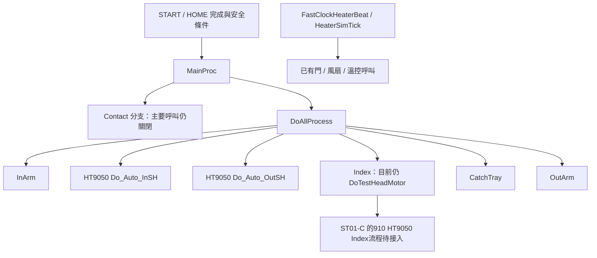

# HT9050 `#if 0` 分析與動作流程交接

角色：**NB2-GPT_CLI**。時間：20261006_150119（Asia/Taipei）。工作卡：**NBG-IF0-001**。
交付：[GitLab MR !254](https://gitlab.honprec.com/honprec/rd/rd5/ht9045/-/merge_requests/254)。

## 1. 結論與本批範圍

**不能全面解除 `#if 0`。** 本批完成全樹文字盤點與既有 **228 候選**的逐項靜態本體審查，並對 HT9050 主要流程做優先交叉檢查。
全量 **2,323 個 / 209 檔**；228 候選有 **49 個 `#else`**，會切換現行替代行為。
「全量」範圍是移植樹非 tests、非 `.svn` 的 `*.cpp` / `*.h` 字面 `#if 0`；不含 `*.gen.inc`、其他副檔名與命名巨集 gate。數量不能代表所有未啟用功能。
目前可提出實作順序與明確驗收条件，**沒有任何一列由本報告授權直接解 gate 上機**。

- 候選中 4 個需補完整本體：3 個是纯註解，1 個留了不完整 alignment placeholder。
- 兩個含 `AnsiString` 物件的原始 `memcpy` 已有 value assignment 替代，應保持關閉。
- 加熱 thread 的 3 個舊 caller 已由 FastClock/SIM tick 代替，不能再報成機台沒執行門/風扇檢查。
- Contact 本體已由 E-042 翻譯，但 MainProc 的主要呼叫仍關閉；需接線與模式/互鎖驗收，不是重翻整支。
- 其餘 **2,095 個**有全量位置/條件/歷史理由索引，**尚未逐一人工做完整行為審查**。這是第一批深度交接，不把文字盤點稱為全功能驗收。

本次只新增分析工具/文件；未修改移植樹原始碼、driver header、機台設定，未解除 gate、未啟動 Handler。

## 2. 證據與重現基準

| 來源 | 固定版本/用途 |
|---|---|
| 本次現行原始碼 | `3871f2f5832daa47ceecf52b0ca8f76d71486b4b`，port tree `38b64be1be56958122abba87ec83f24942a9054a` |
| 最新同步 main 基線 | `84233b648e0c74cb490797e6fef1939a75717bba`；相對初讀 `9d9dfa9c`，C++/header/CMakeLists 無差異，只有 build 工具/快照更新 |
| 歷史 Ifor census | `IF0_CENSUS_20261006.md/.tsv`；原始碼 `97aec829ce37c26dd1b38cb4feecbaff2483069d` |
| 906 行為參考 | `D:/HT9045/HT9011UC_Code_V3.33.906.0_20260618`，CP950 唯讀；本機在根層，文件中的 backup 路徑不在本機 |
| 溫控/裁決例外參考 | `D:/HT9045/HT9011UC_Code_V3.33.912.0_20260908_Jimmy`，CP950 唯讀；以當期裁決決定採用範圍 |
| HT9050 Index/Shuttle/Tray | Frank 910 `origin/ref/frank-910-9050` `2275f78c895b923642ce04cbf78ca9d16493794d`，目錄 `HT9011UC_Code_V3.33.910.0_20260820_beforeFinePitch` |
| Frank 回覆 | `origin/v906/frank-handoff` `2a7ae8508c32608829a6307be88c83d9b85592a7` 的 FROM_FRANK §2/§3，1006 10:02/10:23/10:57 |
| ST01 回覆 | `origin/v906/steven-handoff` `f01e8c0e0` 的 FROM_STEVEN；先讀 `d0162f1cc` 的 E-042/E-038/ST01-C，再核新增加的12列。沒有 NBG-Q1～Q5 的新答案；14:1x通知 ST01今天17:00下線 |

228 個歷史候選全數重新定位：184 個本體唯一，38 個本體+上下文+位置，6 個本體+上下文；**0 個未定位或含糊配對**。
本體及 `#else` 都與歷史候選一致；`atester_ProcessCount.cpp` 一列歷史行號漂移以唯一內容重新定位。
172 個候選在所查 906/912/910 檔找到完整 token 片段，53 個沒有完整 token 匹配，3 個只有註解。
此數字只證明文本，不證明原參考有啟用、ABI相同、caller有接或機台可達；不可以任選匹配版本作行為權威。

工具命令、固定 Python 解析器版本及限制見 [工具 README](../../../tools/if0_audit/README.md)。
本工具 7 個單元測試通过：巢狀 else、父gate else、`0 || FEATURE`、字串/註解區別、49個else候選不誤排、未配對拒絕、跳過.svn/tests。
本次每個掃到的 gate 都是精確常數0；13個另被父常數0包住，只解內層仍不會啟用。
66個檔的 Tree-sitter 有解析錯誤，273個全量位置找不到確定function，均留明確標記；不猜 task。
候選的32個UNKNOWN已人工分為22個檔案層級macro/宣告與10個函式位置，保留原 parser欄與人工欄供覆核。

**未跑當前兩組態 compile/link、CTest、SIM golden replay 或機台測試。** 舊probe結果只在 historical欄保留。
machine_sync規則適用下一步Handler runtime驗證；本次只是源碼與工具暫存文字測試，未執行 apply、未改快照、未聲稱機台參數有問題。

## 3. HT9050 主要流程與優先缺口

圖為原始碼調度關係；不是跑過的機台動作紀錄。

| 區域 | 本次查到的事實與優先處理 | 接案/問答 |
|---|---|---|
| 正式 Shuttle | csystem:1916–1925 已分流 Type_HT9050 至 In/Out SH，acarry 0個字面if0仍不表示所有macro/路由均啟用 | Frank；沿用既有修正、不另重翻 |
| Index 正式流程 | csystem:1952 仍直接 DoTestHeadMotor；910 HT9050 用 DoTestHeadMotorFP，ST01-C已認領；Generic不代表適配單Z1/無IndexY | Frank + ST01；沿用W-77/F-1..F-7与既有裁決，追真交付commit |
| Contact | csystem:31452仍關fContact->DoTestContactFunction；forms/fContact_ContactSM:209已有真本體，fContact全域仍須做實例/接線 | ST01 E-042 B6；Frank核對動作/安全前置 |
| 手臂讀位 | 候選89/90/93/94讀位還省略；IsMotorArrival:2216–2223以0比較。InspectInArmPosition只註解；InspectOutArmPosition:2205是空gate，後者不在228清單 | Frank + ST01；真PCI1203讀位/座標/group，比對實際caller |
| Index真空 | 候選179 DoSystem:16879仍關caller；atester_shims:423/464已實作ProcessIndexSuckDestroy1/2，原缺member理由過期 | Frank + ST01；重用同一狀態機，查bIndexCheck真排程与group |
| 冷溫門檢查 | TriTemp:586/799關兩caller，csystem:15959已有LowTempIdleCheckSafeDoor；不是discard return就沒副作用 | Frank + ST01；確認功能是否適用與真door sensor |
| 加熱排程 | FastClockJobs:66/68/70已接SHIP三檢查，HeaterSimTick:48/50/52已接SIM；MachineType:1854定義W906_FASTCLK_HEATER | 保留舊thread gate，更新理由；不可重開成雙控制來源 |
| Tray | 已收Frank F9050-FIX2，Loader空盤→Empty、MMTrayY、Tray移動時Arm ZA上位保護；不是通用Conveyor配置 | Frank；沿用今日答案与MR !237 |
| 特殊維護流程 | csystem:31635 Shuttle maintain caller still gated；ShuttleSensorContinuousMove（正確名稱）Motor/mymotor:2633仍固定false，acarry:7882使用它 | Frank + ST01；問是否屬本次必要流程，不把它說成正式SH主流程一定不能跑 |
| 計數/主機命令 | 候選24、30、60、63–66、171/172等存在「回成功但副作用沒做」或依賴已存在但caller沒接 | ST01；先對命令ACK與實際state，不只測回碼 |

### 已有答案，不再重新問

Frank F9050-FIX2 `3f3b4807` 已在本次main基線祖先中（MR !237 已整合）：

1. InSH左、OutSH右為安全區；**安全邊界不一定等於0或只看ORG**，Shake也要留界內（W-97）。數值界線仍需實測/規格，不能自行設0。
2. Z1安全高度用 `Prod.TestZ1_Safe ±10`；OutSH退出Index且有料時，Out Shuttle Y（MOutShuttle2）去Right，OutArm等Y到位。
3. Loader空盤一律Empty；Tray臂移動時In/Out ZA要上位。現行用ReadPos>=0，Frank01特別保留「請Frank本人確認」語義；這不是新增Jimmy需求題。
4. HT9050先Single Site驗證，Tray Form以1x1/1x2/2x2；去OutSH先X後Y、往Auto1–3先Y後X。
5. HT9050沒有C_TrayY_Fixer，不可把原機型硬體直接補回。

## 4. 給 Frank / ST01 的具體問題（請主電腦轉達）

使用者指定「動作流程問題主要給Frank和ST01回答」。以下是工程規格/接線問題；若回答會改需求或既有裁決，再由主電腦提出Jimmy決策。
**這份MR是交付與轉達請求，尚未收到這些新問題的回答，不標已解決。**
最新 FROM_STEVEN 14:1x 已通知 ST01 17:00 下線（出差），請主電腦在下線前集中轉達可答的工程問題；17:00 後依既有交接規則不持續追問，Frank 仍為主要流程答覆對象。

| 問題 | 對象 | 先前答案與這次仍缺的內容 | 回答格式 |
|---|---|---|---|
| NBG-Q1 Contact | ST01主答，Frank校流程 | E-042 B1–B4已交，不再問有無本體。請指出B6認領卡、要接的真實例/入口、模式限制与Frank需確認的前置；不要只解除MainProc一行 | 卡/branch/commit；模式与入口；安全前置；建置/模擬/機台驗收證據 |
| NBG-Q2 讀位/座標 | Frank + ST01 | GetOutArmCellPos/ToSht、IsMotorArrival仍用0；InspectIn/Out檢查不完整。請確認HT9050實際命中哪些caller、MOT ReadPos是否經真1203、四嘴一IC的座標參照 | 各function caller→route→軸；target/encoder/gap規則；不適用理由 |
| NBG-Q3 Index真空 | Frank + ST01 | ProcessIndexSuckDestroy真本體已存在。請確認DoSystem候選179在9050哪種IndexCheck/Contact/AutoClean模式要跑、四嘴group與真SuckDestroy泵是否共用 | 模式/flag/task表、timeout/殘料規則、唯一tick owner及實作卡 |
| NBG-Q4 安全邊界 | Frank定義、ST01規格/程式 | 沿用W-97左/右安全區；不重問方向。請提供安全界線參數名稱、单位、位置比较/Shake边界，尚無量值先列需量項；Tray ZA上位>=0仍保留Frank01原待確認點 | 參數/單位/來源、比较式、無值時明確拒絕与現場量測项 |
| NBG-Q5 功能適用 | Frank + ST01 | 冷溫door caller与Shuttle維護helper並非全部機型共用必需；請確認本次9050驗證範圍是否使用。Index FP直接追既有ST01-C/W-77，不另立重寫卡 | 必需/可延後/不適用 + 配置或caller證據；引用既有卡與commit |

## 5. 228候選的處置與接續順序

| 處置 | 數量 | 解讀 |
|---|---:|---|
| REVIEW_EXISTING_DEPENDENCY | 55 | 已找到本體、型態或替代線索；還要驗caller綁定/ABI/target/排程，不等於立刻可解除 |
| IMPLEMENT_DEPENDENCY | 126 | 補真資料、通訊、事件或安全前置；同名facade不能當完成 |
| RESTORE_MISSING_BODY | 4 | 3純註解與1不完整alignment；先補實作再談gate |
| KEEP_REPLACEMENT | 21 | value assignment、hook、新heater tick、冗餘定義等，保留現行替代並更新註解 |
| KEEP_NO_RUNTIME | 21 | VCL焦點/排版/OS副作用等，依Web需求實作；不是把Windows視窗行為搬進engine |
| KEEP_STATIC_INIT | 1 | 保留HANA設定延後載入 |

P0 **17**、P1 **153**、P2 **58**；P0表示需優先核對安全/真狀態，不表示所有列在HT9050必定命中。

建議實作批次：

1. **先追已認領工作**：ST01-C的Index適配、E-042 B6；Frank今日互鎖與新答案。不平行重做別人的檔案。
2. **P0真狀態**：讀位/到位、Index真空、冷溫/過溫、換連線有料保護，先回答適用性和入口。
3. **資料/命令一致**：LotSummary、清計數、SECS ACK、模式/recipe；一個依赖族一批。
4. **客戶選配/旋轉/報表/UI**：確認客戶与安裝功能再排，現階段不由本機runtime參數推論機台有問題。
5. **其餘2,095列**：按全量清單的module/function/父gate分批審，先retired/duplicate与caller未接区；273個UNKNOWN必須補定位。不拿历史tier当新安全判定。

每批通過條件：確認權威golden/當期裁決→真type/instance/ABI→target/compile/link→模式與排程→模擬/對照→適用機台驗收。
開始HT9050 runtime驗證前更新GitLab main並依machine_sync check/apply/backup/restore规则操作。
需求取捨、範圍改变與唯讀規則變更留Jimmy裁決；此報告不發動任何機台動作。

## 6. 交接包

- [全量2,323列](RD5軟體_IF0全量清單_20261006_150119.tsv)：每個snapshot ID、file/line、function、父gate、runtime condition線索、body/else SHA256與historical hint。
- [候選228人工審查](RD5軟體_IF0候選228_20261006_150119.tsv)：每列flow owner、行為差、依赖、验收、priority、處置、人工function定位、golden token證據。
- [人工審查JSON](RD5軟體_IF0人工審查_20261006_150119.json)：file/historical-line/body-hash綁定，可重跑enrich；本體變了不可靜默沿用。
- [候選本體与else](RD5軟體_IF0候選本體_20261006_150119.md)：逐段C++文本，供接案人覆核；沒有複製HT160或未授權外部程式。
- [來源209檔雜湊](RD5軟體_IF0來源雜湊_20261006_150119.tsv)：固定分析輸入，後續主線變動先比manifest。
- [統計与版本](RD5軟體_IF0統計_20261006_150119.json)。

所有current_compile_link/hardware_verification欄均为NOT_RUN。此包完成第一批靜態審查与主電腦交接，保留待Frank/ST01回答與後續驗證工作。
